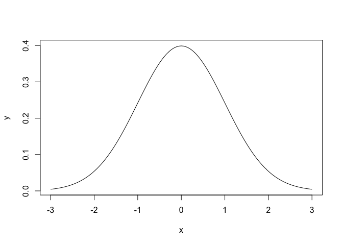
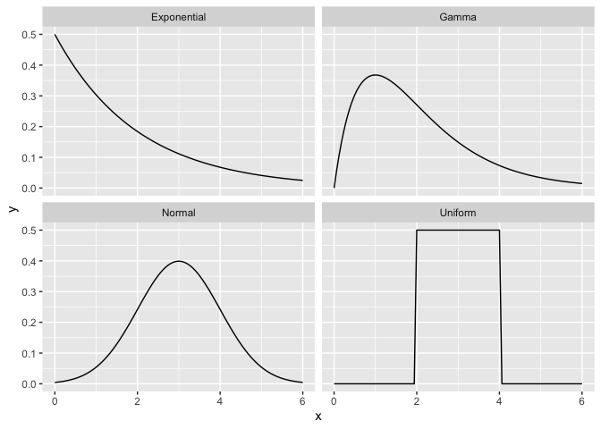
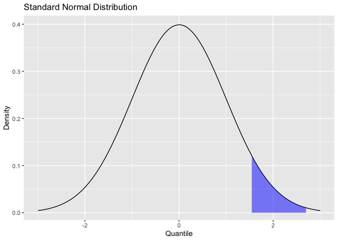

note08
================

# 8 확률

## 8.1 조합 수 계산

``` r
choose(5, 3)
```

    ## [1] 10

``` r
choose(50, 3)
```

    ## [1] 19600

``` r
choose(50, 30)
```

    ## [1] 4.712921e+13

## 8.2 조합 생성

``` r
items <- 2:5
k <- 2
combn(items, k)
```

    ##      [,1] [,2] [,3] [,4] [,5] [,6]
    ## [1,]    2    2    2    3    3    4
    ## [2,]    3    4    5    4    5    5

``` r
combn(1:5, 3)
```

    ##      [,1] [,2] [,3] [,4] [,5] [,6] [,7] [,8] [,9] [,10]
    ## [1,]    1    1    1    1    1    1    2    2    2     3
    ## [2,]    2    2    2    3    3    4    3    3    4     4
    ## [3,]    3    4    5    4    5    5    4    5    5     5

``` r
combn(c("T1", "T2", "T3", "T4", "T5"), 3)
```

    ##      [,1] [,2] [,3] [,4] [,5] [,6] [,7] [,8] [,9] [,10]
    ## [1,] "T1" "T1" "T1" "T1" "T1" "T1" "T2" "T2" "T2" "T3" 
    ## [2,] "T2" "T2" "T2" "T3" "T3" "T4" "T3" "T3" "T4" "T4" 
    ## [3,] "T3" "T4" "T5" "T4" "T5" "T5" "T4" "T5" "T5" "T5"

## 8.3 난수 생성

``` r
runif(1)
```

    ## [1] 0.3256922

``` r
runif(10)
```

    ##  [1] 0.4762877 0.5041123 0.1040416 0.9581981 0.2347196 0.2076238 0.7093868 0.1386904 0.8815492 0.1440133

``` r
runif(1, min = -3, max = 3)
```

    ## [1] 1.476089

``` r
rnorm(1)
```

    ## [1] 0.08307944

``` r
rnorm(1, mean = 100, sd = 15)
```

    ## [1] 60.67639

``` r
rbinom(1, size = 10, prob = 0.5)
```

    ## [1] 4

``` r
rpois(1, lambda = 10)
```

    ## [1] 5

``` r
rexp(1, rate = 0.1)
```

    ## [1] 0.8661434

``` r
rgamma(1, shape = 2, rate = 0.1)
```

    ## [1] 3.706926

``` r
rnorm(3, mean = c(-10, 0, 10), sd = 1)
```

    ## [1] -9.675336  1.105956  9.538405

``` r
means <- rnorm(30, mean = 0, sd = 0.2)
rnorm(30, mean = means, sd = 1)
```

    ##  [1]  0.56735303 -0.83634281 -1.78291801 -1.37585585 -0.80899568 -0.45362370  1.31819346 -0.50546248
    ##  [9]  0.72749651 -0.86455446  0.62245021 -0.58323528 -1.47501845 -0.80514642  1.26112804 -0.09727065
    ## [17]  1.36707942 -1.88005205  0.43144677  1.97544749  0.78918033  1.83211312 -1.04638614 -3.10773839
    ## [25]  1.43708256 -0.49131914  1.29485681  0.63097516  0.39995790 -0.36197361

## 8.4 재현 가능한 난수 생성

``` r
set.seed(42)
runif(10)
```

    ##  [1] 0.9148060 0.9370754 0.2861395 0.8304476 0.6417455 0.5190959 0.7365883 0.1346666 0.6569923 0.7050648

``` r
set.seed(165)
runif(10)
```

    ##  [1] 0.1159132 0.4498443 0.9955451 0.6106368 0.6159386 0.4261986 0.6664884 0.1680676 0.7878783 0.4421021

``` r
set.seed(42)
runif(10)
```

    ##  [1] 0.9148060 0.9370754 0.2861395 0.8304476 0.6417455 0.5190959 0.7365883 0.1346666 0.6569923 0.7050648

## 8.5 무작위 샘플 생성

``` r
sample(1950:2020, 10)
```

    ##  [1] 1996 1973 1986 1969 1975 1952 1990 1974 1976 1985

``` r
set.seed(42)
x <- rnorm(1000, 4, 10)
n <- 1000
medians <- numeric(n)
for (i in seq_along(medians)) {
  medians[i] <- median(sample(x, replace = TRUE))
}
mean(medians)
```

    ## [1] 3.801765

``` r
sd(medians)
```

    ## [1] 0.3264156

``` r
ci <- quantile(medians, c(0.025, 0.975))
cat("95% confidence interval is (", ci, ")\n")
```

    ## 95% confidence interval is ( 3.148673 4.504082 )

## 8.6 무작위 시퀀스 생성

``` r
sample(c("H", "T"), 10, replace = TRUE)
```

    ##  [1] "H" "H" "T" "H" "H" "H" "T" "H" "T" "T"

``` r
sample(c(FALSE, TRUE), 20, replace = TRUE)
```

    ##  [1]  TRUE FALSE  TRUE FALSE  TRUE FALSE  TRUE  TRUE  TRUE FALSE  TRUE FALSE  TRUE FALSE FALSE FALSE FALSE
    ## [18] FALSE FALSE FALSE

``` r
sample(c(FALSE, TRUE), 20, replace = TRUE, prob = c(0.2, 0.8))
```

    ##  [1]  TRUE  TRUE  TRUE  TRUE  TRUE  TRUE  TRUE FALSE  TRUE FALSE  TRUE  TRUE  TRUE FALSE  TRUE  TRUE  TRUE
    ## [18]  TRUE  TRUE FALSE

``` r
rbinom(10, 1, 0.8)
```

    ##  [1] 1 0 1 0 0 1 1 1 1 1

## 8.7 벡터의 무작위 치환

``` r
sample(1:10)
```

    ##  [1]  2  7 10  5  6  3  4  1  9  8

## 8.8 이산 분포에 대한 확률 계산

``` r
dbinom(7, size = 10, prob = 0.5)
```

    ## [1] 0.1171875

``` r
pbinom(5, size = 10, prob = 0.5)
```

    ## [1] 0.6230469

``` r
pbinom(7, size = 10, prob = 0.5, lower.tail = FALSE)
```

    ## [1] 0.0546875

``` r
pbinom(7, size = 10, prob = 0.5) - pbinom(3, size = 10, prob = 0.5)
```

    ## [1] 0.7734375

``` r
pbinom(c(3, 7), size = 10, prob = 0.5)
```

    ## [1] 0.1718750 0.9453125

## 8.9 연속 분포 확률 계산

``` r
pnorm(q = .8, mean = 0, sd = 1)
```

    ## [1] 0.7881446

``` r
pnorm(66, mean = 70, sd = 3)
```

    ## [1] 0.09121122

``` r
pexp(20, rate = 1 / 40)
```

    ## [1] 0.3934693

``` r
pexp(20, rate = 1 / 40, lower.tail = FALSE)
```

    ## [1] 0.6065307

``` r
pexp(50, rate = 1 / 40) - pexp(20, rate = 1 / 40)
```

    ## [1] 0.3200259

## 8.10 확률을 분위로 변환하기

``` r
qnorm(0.05, mean = 100, sd = 15)
```

    ## [1] 75.3272

``` r
qnorm(c(0.025, 0.975))
```

    ## [1] -1.959964  1.959964

## 8.11 밀도 함수 그리기

``` r
x <- seq(-3, 3, 0.05)
y <- dnorm(x)
plot(x, y, type = "l")
```

<!-- -->

``` r
library(ggplot2)
x <- seq(0, 6, length.out = 100)
ylim <- c(0, 0.6)

df <- rbind(
  data.frame(x = x, dist_name = "Uniform", y = dunif(x, min = 2, max = 4)),
  data.frame(x = x, dist_name = "Normal", y = dnorm(x, mean = 3, sd = 1)),
  data.frame(x = x, dist_name = "Exponential", y = dexp(x, rate = 1 / 2)),
  data.frame(x = x, dist_name = "Gamma", y = dgamma(x, shape = 2, rate = 1))
)
df |>
  ggplot(aes(x = x, y = y)) +
  geom_line() +
  facet_wrap(~dist_name)
```

<!-- -->

``` r
x <- seq(-3, 3, length.out = 100)
df <- data.frame(x = x, y = dnorm(x, mean = 0, sd = 1))
p <- ggplot(df, aes(x, y)) +
  geom_line() +
  labs(
    title = "Standard Normal Distribution",
    y = "Density",
    x = "Quantile"
  )
p
```

<!-- -->

``` r
q75 <- quantile(df$x, .75)
q95 <- quantile(df$x, .95)
p +
  geom_ribbon(
    data = subset(df, x > q75 & x < q95),
    aes(ymax = y),
    ymin = 0,
    fill = "blue",
    color = NA,
    alpha = 0.5
  )
```

<!-- -->
