note10
================

# 10 그래픽

``` r
library(tidyverse)
```

``` r
df <- data.frame(x = 1:5, y = 1:5)
ggplot(df, aes(x, y)) +
  geom_point()
```

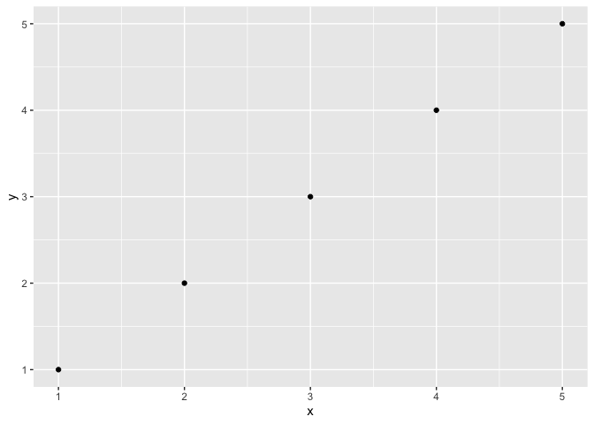<!-- -->

``` r
ggplot(df, aes(x, y)) +
  geom_point() +
  labs(
    title = "Simple Plot Example",
    subtitle = "with a subtitle",
    x = "x-values",
    y = "y-values"
  ) +
  theme(panel.background = element_rect(fill = "white", colour = "grey50"))
```

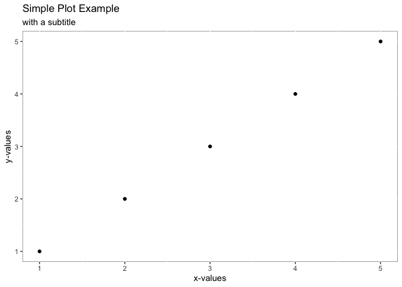<!-- -->

## 10.1 산점도 만들기

``` r
ggplot(mtcars, aes(hp, mpg)) +
  geom_point()
```

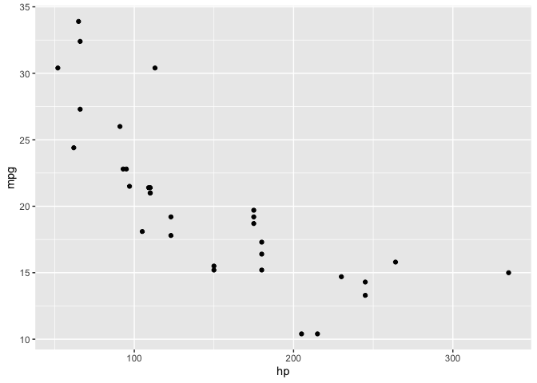<!-- -->

## 10.2 제목 및 레이블 추가

``` r
ggplot(mtcars, aes(hp, mpg)) +
  geom_point() +
  labs(
    title = "Cars: Horsepower vs. Fuel Economy",
    x = "HP",
    y = "Economy (miles per gallon)"
  )
```

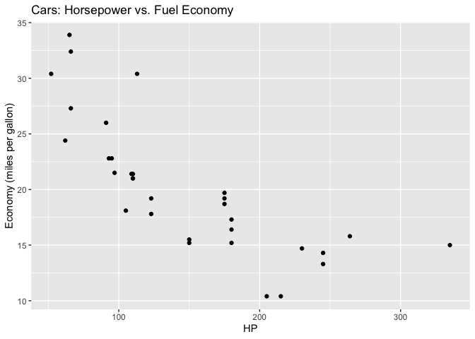<!-- -->

## 10.3 그리드 추가(또는 제거)

``` r
ggplot(df) +
  geom_point(aes(x, y)) +
  theme(panel.background = element_rect(fill = "white", color = "grey50"))
```

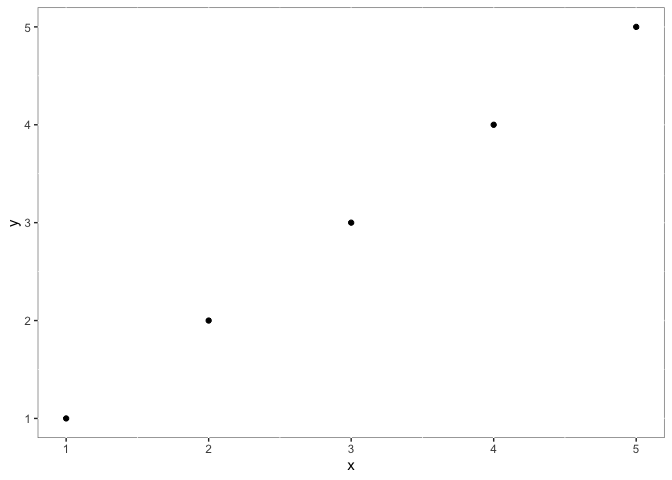<!-- -->

``` r
g1 <- ggplot(mtcars, aes(hp, mpg)) +
  geom_point() +
  labs(
    title = "Cars: Horsepower vs. Fuel Economy",
    x = "HP",
    y = "Economy (miles per gallon)"
  ) +
  theme(panel.background = element_blank())
g1
```

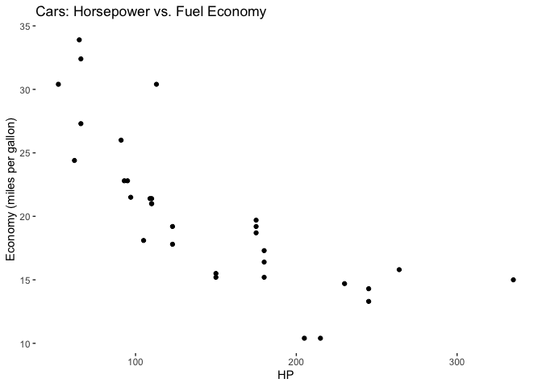<!-- -->

``` r
g2 <- g1 +
  theme(panel.grid.major = element_line(color = "black", linetype = 3)) +
  theme(panel.grid.minor = element_line(color = "darkgrey", linetype = 4))
g2
```

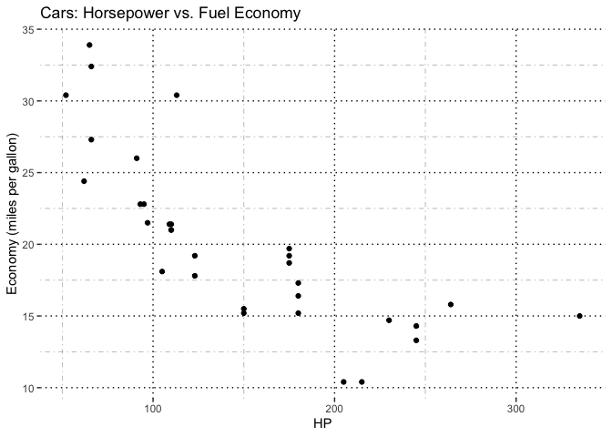<!-- -->

``` r
g1 +
  theme(panel.grid.major = element_line(color = "grey"))
```

<!-- -->

## 10.4 ggplot 그림에 테마 적용하기

``` r
p <- ggplot(mtcars, aes(disp, hp)) +
  geom_point() +
  labs(
    title = "mtcars: Displacement vs. Horsepower",
    x = "Displacement (cubic inches)",
    y = "Horsepower"
  )
p
```

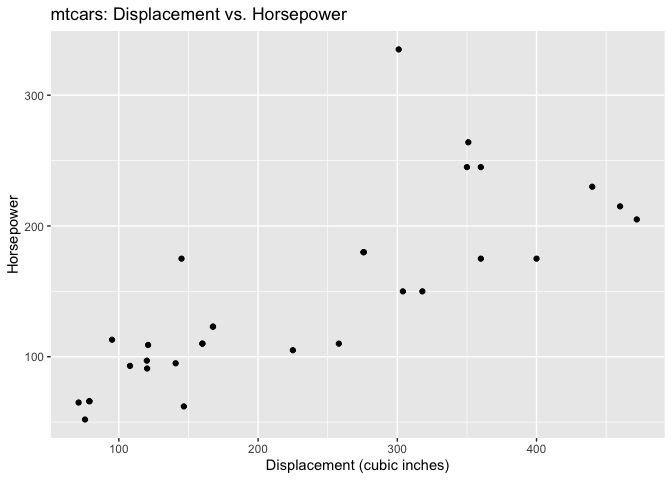<!-- -->

``` r
p + theme_bw()
```

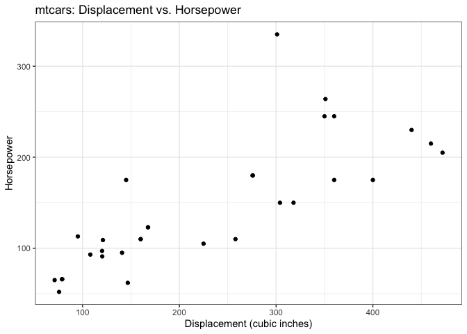<!-- -->

``` r
p + theme_classic()
```

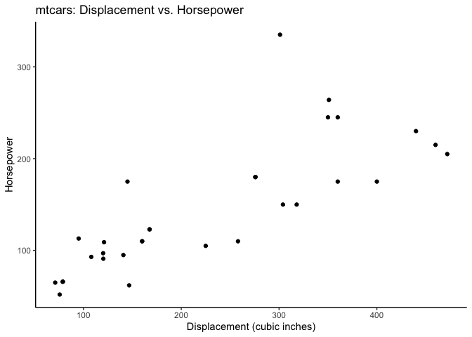<!-- -->

``` r
p + theme_minimal()
```

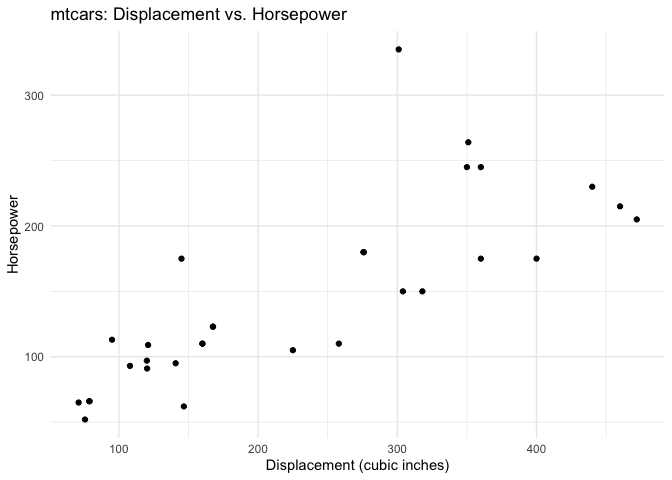<!-- -->

``` r
p + theme_void()
```

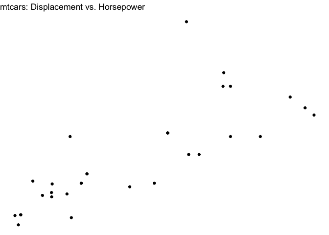<!-- -->

## 10.5 여러 그룹의 산점도 만들기

``` r
ggplot(iris, aes(Petal.Length, Petal.Width)) +
  geom_point()
```

<!-- -->

``` r
ggplot(iris, aes(
  Petal.Length,
  Petal.Width,
  shape = Species,
  color = Species
)) +
  geom_point()
```

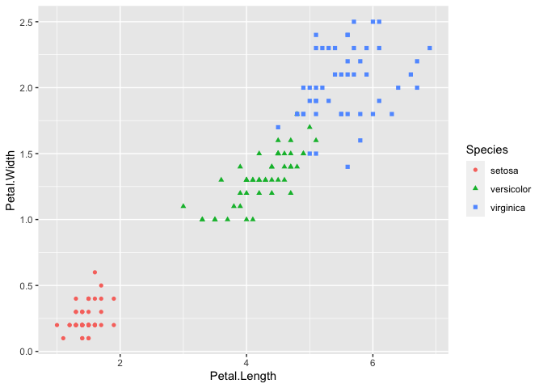<!-- -->

## 10.6 범례 추가(또는 제거)

``` r
g <- ggplot(
  data = iris,
  aes(
    x = Petal.Length,
    y = Petal.Width,
    shape = "Observation"
  )
) +
  geom_point() +
  guides(shape = guide_legend(title = "My Legend Title"))
g
```

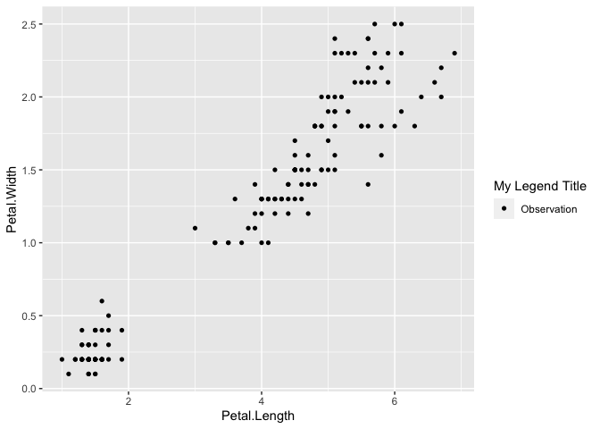<!-- -->

``` r
g <- ggplot(
  data = iris,
  aes(
    x = Petal.Length,
    y = Petal.Width,
    shape = Species,
    color = Species
  )
) +
  geom_point() +
  theme(legend.position = "none")
g
```

<!-- -->

``` r
g + theme(legend.position = "bottom")
```

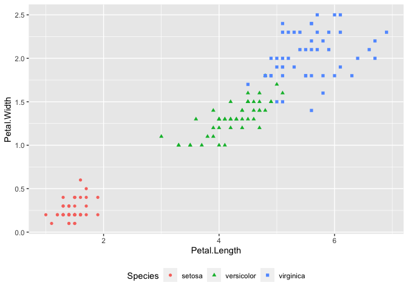<!-- -->

``` r
g + theme(legend.position = c(.8, .2))
```

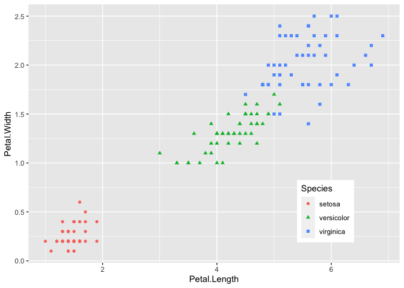<!-- -->

## 10.7 산점도의 회귀선 그리기

``` r
library(faraway)
data(strongx)
ggplot(strongx, aes(energy, crossx)) +
  geom_point()
```

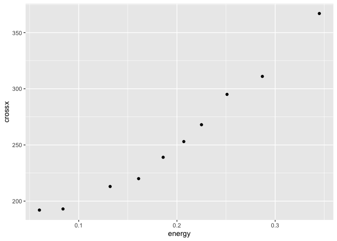<!-- -->

``` r
g <- ggplot(strongx, aes(energy, crossx)) +
  geom_point()

g + geom_smooth(method = "lm", formula = y ~ x)
```

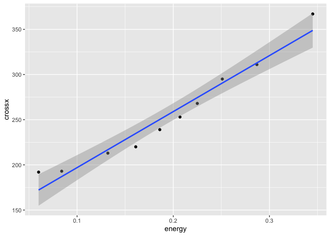<!-- -->

``` r
g + geom_smooth(
  method = "lm",
  formula = y ~ x,
  se = FALSE
)
```

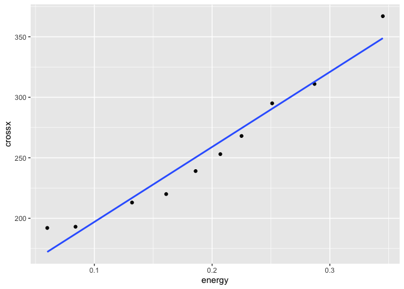<!-- -->

``` r
m <- lm(crossx ~ energy, data = strongx)

ggplot(strongx, aes(energy, crossx)) +
  geom_point() +
  geom_abline(
    intercept = m$coefficients[1], # coef(m)[1]
    slope = m$coefficients[2] # coef(m)[2]
  )
```

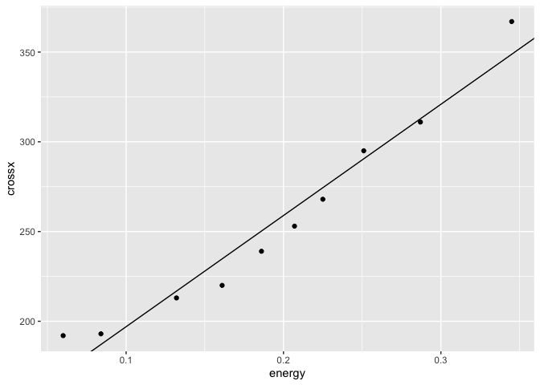<!-- -->

## 10.8 다른 모든 변수에 대해 모든 변수를 플로팅하기

``` r
library(GGally)
```

    ## Registered S3 method overwritten by 'GGally':
    ##   method from   
    ##   +.gg   ggplot2

    ## 
    ## Attaching package: 'GGally'

    ## The following object is masked from 'package:faraway':
    ## 
    ##     happy

``` r
ggpairs(iris)
```

    ## 

    ##  plot: [1,1] [==>------------------------------------------------------------------------------]  4% est: 0s  plot: [1,2] [=====>---------------------------------------------------------------------------]  8% est: 0s  plot: [1,3] [=========>-----------------------------------------------------------------------] 12% est: 0s  plot: [1,4] [============>--------------------------------------------------------------------] 16% est: 0s  plot: [1,5] [===============>-----------------------------------------------------------------] 20% est: 0s  plot: [2,1] [==================>--------------------------------------------------------------] 24% est: 0s  plot: [2,2] [======================>----------------------------------------------------------] 28% est: 0s  plot: [2,3] [=========================>-------------------------------------------------------] 32% est: 0s  plot: [2,4] [============================>----------------------------------------------------] 36% est: 0s  plot: [2,5] [===============================>-------------------------------------------------] 40% est: 0s  plot: [3,1] [===================================>---------------------------------------------] 44% est: 0s  plot: [3,2] [======================================>------------------------------------------] 48% est: 0s  plot: [3,3] [=========================================>---------------------------------------] 52% est: 0s  plot: [3,4] [============================================>------------------------------------] 56% est: 0s  plot: [3,5] [================================================>--------------------------------] 60% est: 0s  plot: [4,1] [===================================================>-----------------------------] 64% est: 0s  plot: [4,2] [======================================================>--------------------------] 68% est: 0s  plot: [4,3] [=========================================================>-----------------------] 72% est: 0s  plot: [4,4] [=============================================================>-------------------] 76% est: 0s  plot: [4,5] [================================================================>----------------] 80% est: 0s  plot: [5,1] [===================================================================>-------------] 84% est: 0s `stat_bin()` using `bins = 30`. Pick better value with `binwidth`.
    ##  plot: [5,2] [======================================================================>----------] 88% est: 0s `stat_bin()` using `bins = 30`. Pick better value with `binwidth`.
    ##  plot: [5,3] [==========================================================================>------] 92% est: 0s `stat_bin()` using `bins = 30`. Pick better value with `binwidth`.
    ##  plot: [5,4] [=============================================================================>---] 96% est: 0s `stat_bin()` using `bins = 30`. Pick better value with `binwidth`.
    ##  plot: [5,5] [=================================================================================]100% est: 0s                                                                                                              

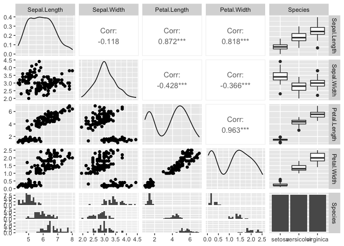<!-- -->

``` r
plot(iris)
```

<!-- -->

## 10.9 각 그룹에 대해 하나의 산점도 만들기

``` r
data(Cars93, package = "MASS")
ggplot(Cars93, aes(MPG.city, Horsepower)) +
  geom_point() +
  facet_wrap(~Origin)
```

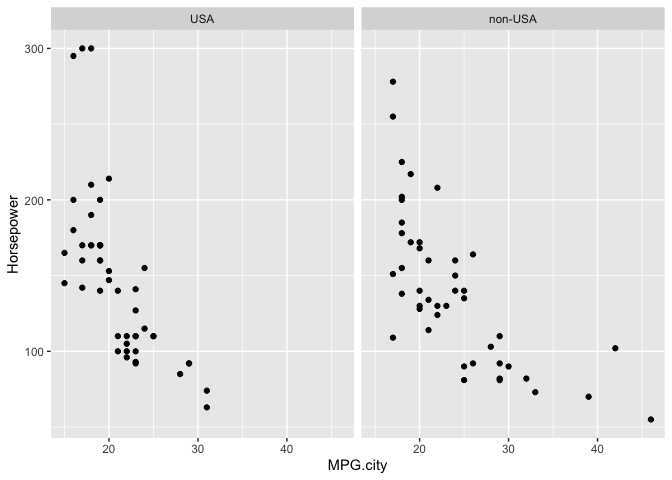<!-- -->

## 10.10 막대 차트 만들기

``` r
ford_cars <-
  Cars93 %>%
  filter(Manufacturer == "Ford")
ford_cars
```

    ##   Manufacturer          Model    Type Min.Price Price Max.Price MPG.city MPG.highway     AirBags DriveTrain
    ## 1         Ford        Festiva   Small       6.9   7.4       7.9       31          33        None      Front
    ## 2         Ford         Escort   Small       8.4  10.1      11.9       23          30        None      Front
    ## 3         Ford          Tempo Compact      10.4  11.3      12.2       22          27        None      Front
    ## 4         Ford        Mustang  Sporty      10.8  15.9      21.0       22          29 Driver only       Rear
    ## 5         Ford          Probe  Sporty      12.8  14.0      15.2       24          30 Driver only      Front
    ## 6         Ford       Aerostar     Van      14.5  19.9      25.3       15          20 Driver only        4WD
    ## 7         Ford         Taurus Midsize      15.6  20.2      24.8       21          30 Driver only      Front
    ## 8         Ford Crown_Victoria   Large      20.1  20.9      21.7       18          26 Driver only       Rear
    ##   Cylinders EngineSize Horsepower  RPM Rev.per.mile Man.trans.avail Fuel.tank.capacity Passengers Length
    ## 1         4        1.3         63 5000         3150             Yes               10.0          4    141
    ## 2         4        1.8        127 6500         2410             Yes               13.2          5    171
    ## 3         4        2.3         96 4200         2805             Yes               15.9          5    177
    ## 4         4        2.3        105 4600         2285             Yes               15.4          4    180
    ## 5         4        2.0        115 5500         2340             Yes               15.5          4    179
    ## 6         6        3.0        145 4800         2080             Yes               21.0          7    176
    ## 7         6        3.0        140 4800         1885              No               16.0          5    192
    ## 8         8        4.6        190 4200         1415              No               20.0          6    212
    ##   Wheelbase Width Turn.circle Rear.seat.room Luggage.room Weight Origin                Make
    ## 1        90    63          33           26.0           12   1845    USA        Ford Festiva
    ## 2        98    67          36           28.0           12   2530    USA         Ford Escort
    ## 3       100    68          39           27.5           13   2690    USA          Ford Tempo
    ## 4       101    68          40           24.0           12   2850    USA        Ford Mustang
    ## 5       103    70          38           23.0           18   2710    USA          Ford Probe
    ## 6       119    72          45           30.0           NA   3735    USA       Ford Aerostar
    ## 7       106    71          40           27.5           18   3325    USA         Ford Taurus
    ## 8       114    78          43           30.0           21   3950    USA Ford Crown_Victoria

``` r
ford_cars %>%
  ggplot(aes(Model, Horsepower)) +
  geom_bar(stat = "identity")
```

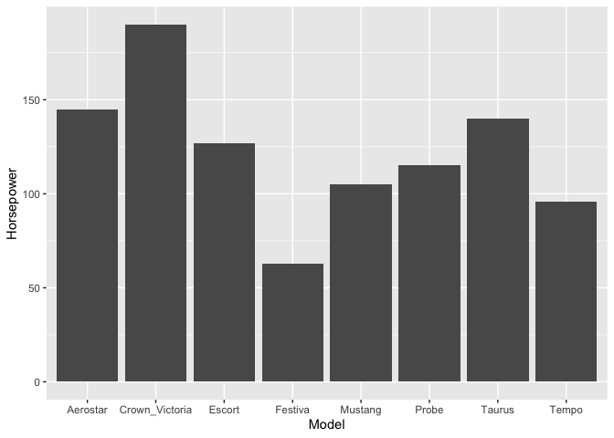<!-- -->

``` r
airquality %>%
  ggplot(aes(month.abb[Month], Temp)) +
  geom_bar(stat = "summary", fun = mean) +
  labs(
    title = "Mean Temp by Month",
    x = "",
    y = "Temp (deg. F)"
  )
```

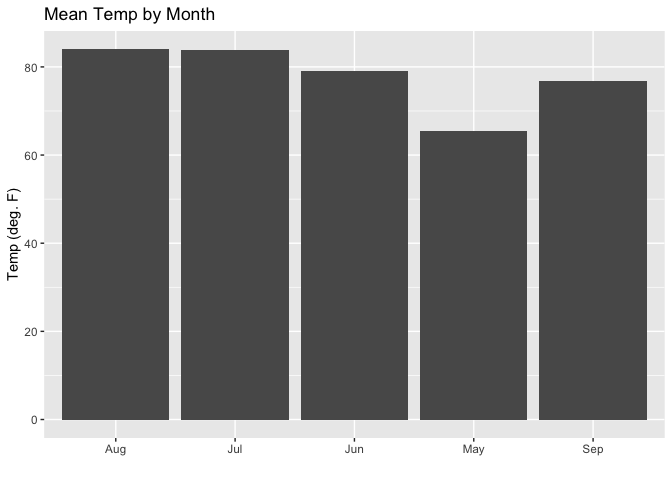<!-- -->

``` r
library(forcats)

aq_data <- airquality %>%
  arrange(Month) %>%
  mutate(month_abb = fct_inorder(month.abb[Month]))
aq_data %>%
  ggplot(aes(month_abb, Temp)) +
  geom_bar(stat = "summary", fun = mean) +
  labs(
    title = "Mean Temp by Month",
    x = "",
    y = "Temp (deg. F)"
  )
```

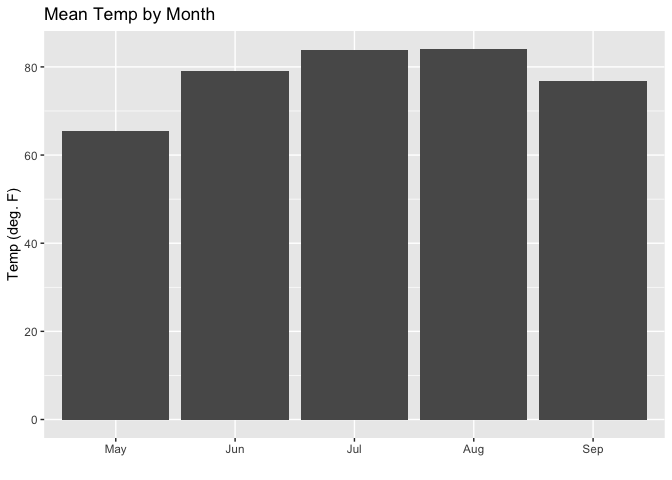<!-- -->

## 10.11 막대 차트에 신뢰 구간 추가하기

``` r
aq_data %>%
  ggplot(aes(month_abb, Temp)) +
  geom_bar(stat = "summary", fun = mean, fill = "cornflowerblue") +
  stat_summary(fun.data = mean_se, geom = "errorbar") +
  labs(
    title = "Mean Temp by Month",
    x = "",
    y = "Temp (deg. F)"
  )
```

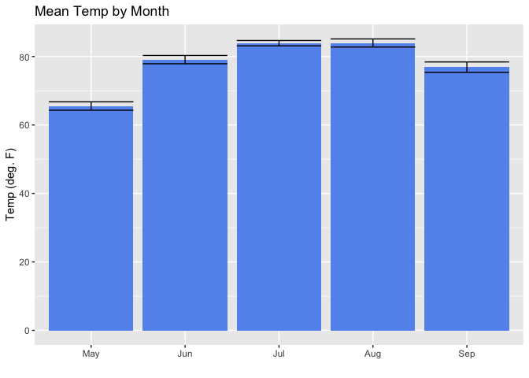<!-- -->

``` r
aq_data %>%
  ggplot(aes(reorder(month_abb, -Temp, mean), Temp)) +
  geom_bar(stat = "summary", fun = mean, fill = "tomato") +
  stat_summary(fun.data = mean_se, geom = "errorbar") +
  labs(title = "Mean Temp by Month", x = "", y = "Temp (deg. F")
```

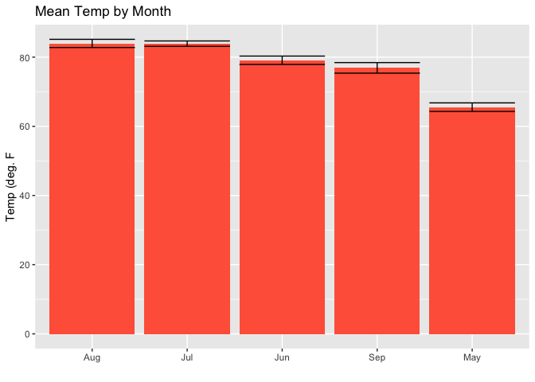<!-- -->

## 10.12 막대 차트 색칠하기

``` r
aq_data %>%
  ggplot(aes(month_abb, Temp, fill = month_abb)) +
  geom_bar(stat = "summary", fun = mean) +
  labs(
    title = "Mean Temp by Month",
    x = "",
    y = "Temp (deg. F)"
  ) +
  scale_fill_brewer(palette = "Paired")
```

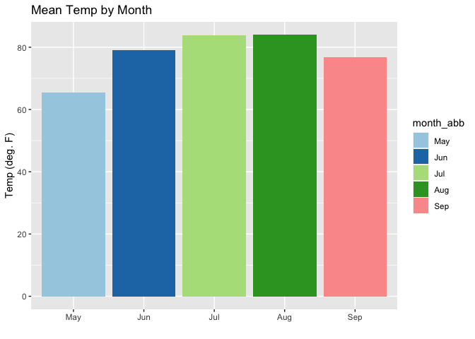<!-- -->

``` r
ggplot(airquality, aes(month.abb[Month], Temp, fill = ..y..)) +
  geom_bar(stat = "summary", fun.y = "mean") +
  labs(
    title = "Mean Temp by Month",
    x = "",
    y = "Temp (deg. F)",
    fill = "Temp"
  )
```

    ## Warning: Ignoring unknown parameters: fun.y

    ## No summary function supplied, defaulting to `mean_se()`

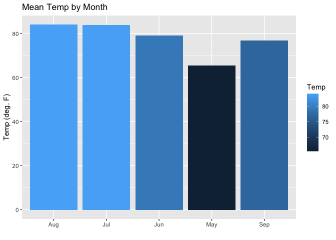<!-- -->

## 10.13 x 및 y 점에서 선 그리기

``` r
economics %>%
  ggplot(aes(date, unemploy)) +
  geom_point() +
  geom_line()
```

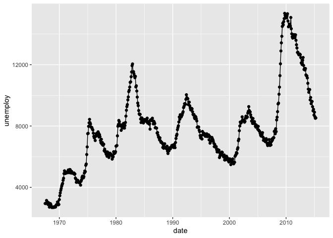<!-- -->

## 10.14 선의 유형, 너비 또는 색상 변경

``` r
x <- 1:10
y1 <- x**1.5
y2 <- x**2
y3 <- x**2.5
df <- data.frame(x, y1, y2, y3)
```

``` r
df_long <- pivot_longer(df, c(y1, y2, y3), names_to = "bucket", values_to = "y")
df_long
```

    ## # A tibble: 30 × 3
    ##        x bucket     y
    ##    <int> <chr>  <dbl>
    ##  1     1 y1      1   
    ##  2     1 y2      1   
    ##  3     1 y3      1   
    ##  4     2 y1      2.83
    ##  5     2 y2      4   
    ##  6     2 y3      5.66
    ##  7     3 y1      5.20
    ##  8     3 y2      9   
    ##  9     3 y3     15.6 
    ## 10     4 y1      8   
    ## # … with 20 more rows
    ## # ℹ Use `print(n = ...)` to see more rows

``` r
df_long %>%
  ggplot(aes(x, y, col = bucket)) +
  geom_line()
```

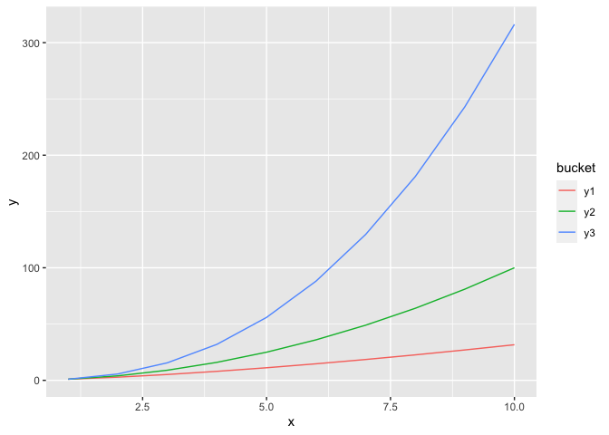<!-- -->

``` r
ggplot(df, aes(x, y1, size = y2)) +
  geom_line() +
  scale_size(name = "Thickness based on y2")
```

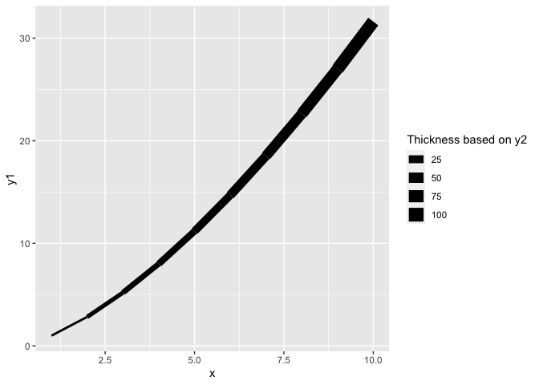<!-- -->

## 10.15 여러 데이터 집합 그리기

``` r
n <- 20
x1 <- 1:n
y1 <- rnorm(n, 0, .5)
df1 <- data.frame(x1, y1)

x2 <- (.5 * n):((1.5 * n) - 1)
y2 <- rnorm(n, 1, .5)
df2 <- data.frame(x2, y2)
```

``` r
ggplot() +
  geom_line(data = df1, aes(x1, y1), color = "darkblue") +
  geom_line(data = df2, aes(x2, y2), linetype = "dashed")
```

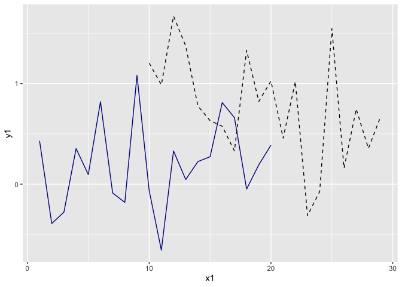<!-- -->

## 10.16 세로선 또는 가로선 추가 하기

``` r
df1 %>%
  ggplot(aes(x1, y1)) +
  geom_point() +
  geom_vline(
    xintercept = 10,
    color = "red",
    linetype = "dashed",
    size = 1.5
  ) +
  geom_hline(yintercept = 0, color = "blue")
```

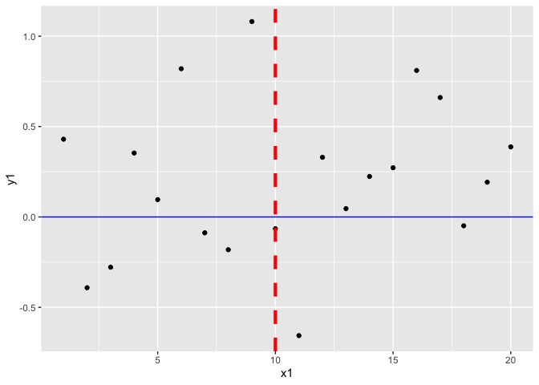<!-- -->

``` r
samp <- rnorm(1000)
samp_df <- data.frame(samp, x = 1:length(samp))

mean_line <- mean(samp_df$samp)
sd_lines <- mean_line + c(-2, -1, 1, 2) * sd(samp_df$samp)

samp_df %>%
  ggplot(aes(x, samp)) +
  geom_point() +
  geom_hline(yintercept = mean_line, color = "darkblue") +
  geom_hline(yintercept = sd_lines, linetype = "dotted")
```

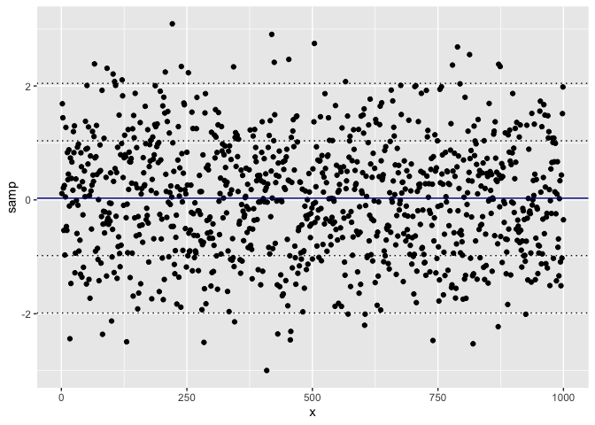<!-- -->

## 10.17 상자 그림 만들기

``` r
samp_df %>%
  ggplot(aes(y = samp)) +
  geom_boxplot()
```

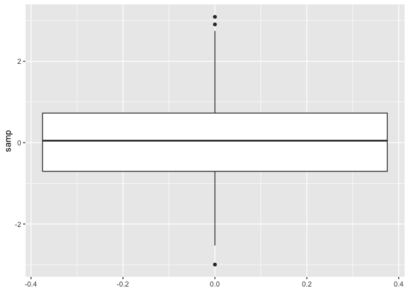<!-- -->

``` r
ggplot(samp_df) +
  aes(y = samp) +
  geom_boxplot() +
  coord_flip()
```

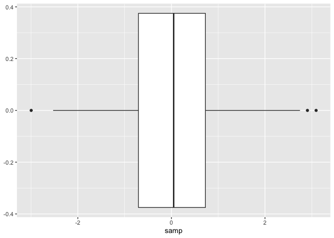<!-- -->

## 10.18 각 요인 수준에 대해 하나의 상자 그림 만들기

``` r
data(UScereal, package = "MASS")
UScereal %>%
  ggplot(aes(x = as.factor(shelf), y = sugars)) +
  geom_boxplot() +
  labs(
    title = "Sugar Content by Shelf",
    x = "Shelf",
    y = "Sugar (grams per portion)"
  )
```

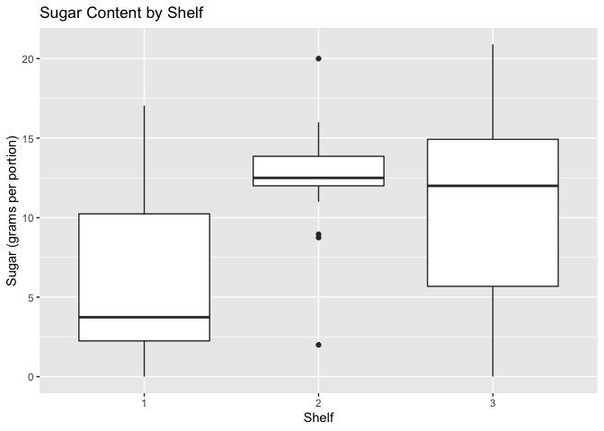<!-- -->

## 10.19 히스토그램 생성

``` r
data(Cars93, package = "MASS")

ggplot(Cars93) +
  geom_histogram(aes(x = MPG.city))
```

    ## `stat_bin()` using `bins = 30`. Pick better value with `binwidth`.

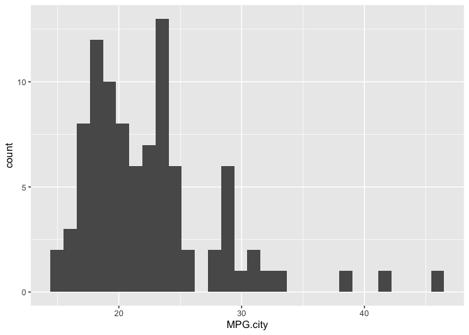<!-- -->

``` r
ggplot(Cars93) +
  geom_histogram(aes(x = MPG.city), bins = 13)
```

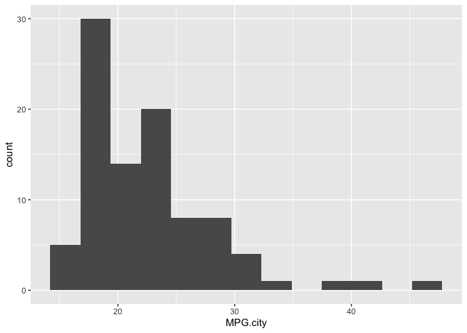<!-- -->

## 10.20 히스토그램에 밀도 추정값 추가하기

``` r
Cars93 %>%
  ggplot(aes(x = MPG.city)) +
  geom_histogram(aes(y = ..density..), bins = 21) +
  geom_density()
```

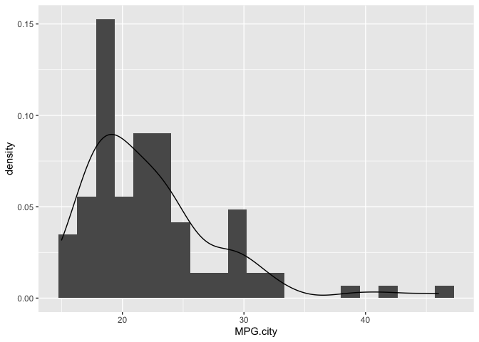<!-- -->

``` r
samp <- rgamma(500, 2, 2)

ggplot() +
  aes(x = samp) +
  geom_histogram(aes(y = ..density..), bins = 10) +
  geom_density()
```

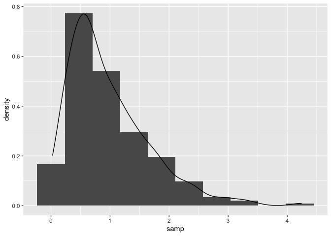<!-- -->

## 10.21 정규 분위수-분위수 도표 만들기

``` r
df <- data.frame(x = rnorm(100))

df %>%
  ggplot(aes(sample = x)) +
  stat_qq() +
  stat_qq_line()
```

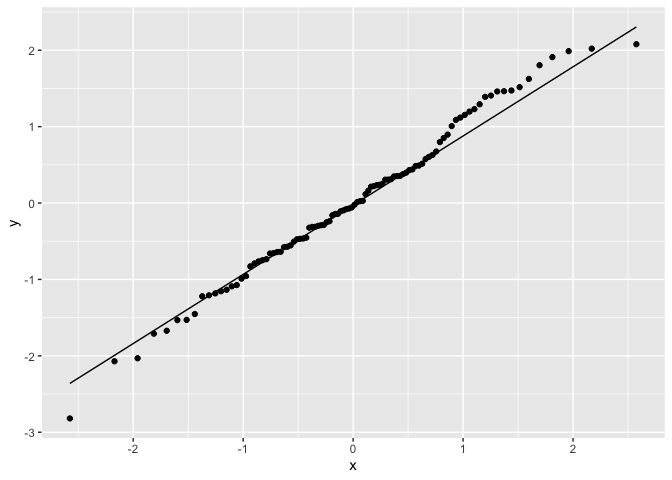<!-- -->

``` r
Cars93 %>%
  ggplot(aes(sample = Price)) +
  stat_qq() +
  stat_qq_line()
```

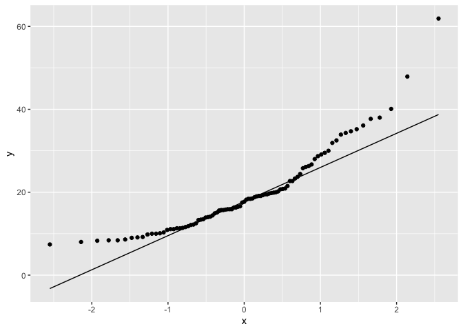<!-- -->

``` r
Cars93 %>%
  ggplot(aes(sample = log(Price))) +
  stat_qq() +
  stat_qq_line()
```

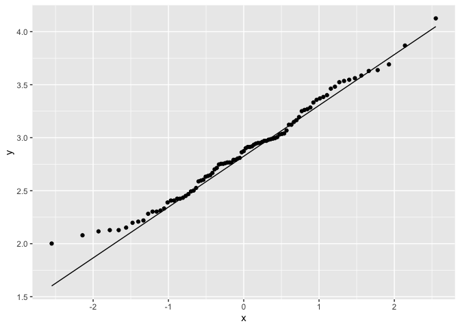<!-- -->

## 10.22 기타 분위수-분위수 플롯 생성

``` r
df_t <- data.frame(y = rt(100, 5))
```

``` r
est_df <- as.list(MASS::fitdistr(df_t$y, "t")$estimate)[["df"]]
est_df
```

    ## [1] 9.298844

``` r
ggplot(df_t) +
  aes(sample = y) +
  geom_qq(distribution = qt, dparams = est_df) +
  stat_qq_line(distribution = qt, dparams = est_df)
```

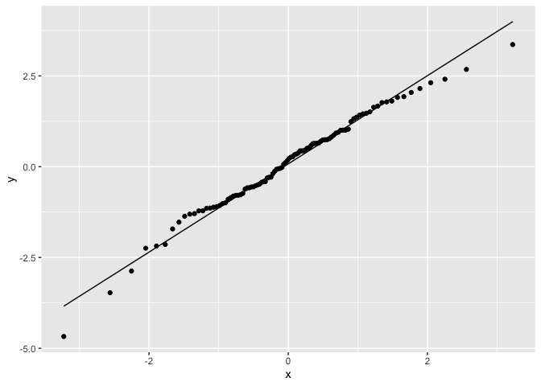<!-- -->

``` r
rate <- 1 / 10
n <- 1000
df_exp <- data.frame(y = rexp(n, rate = rate))
```

``` r
est_exp <- as.list(MASS::fitdistr(df_exp$y, "exponential")$estimate)[["rate"]]

df_exp %>%
  ggplot(aes(sample = y)) +
  geom_qq(distribution = qexp, dparams = est_exp) +
  stat_qq_line(distribution = qexp, dparams = est_exp)
```

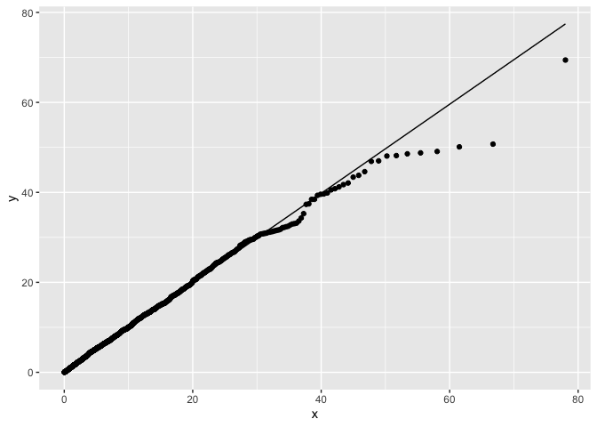<!-- -->

## 10.23 여러 색상으로 변수 그리기

``` r
df <- data.frame(x = rnorm(200), y = rnorm(200))

ggplot(df) +
  aes(x = x, y = y) +
  geom_point(color = "blue")
```

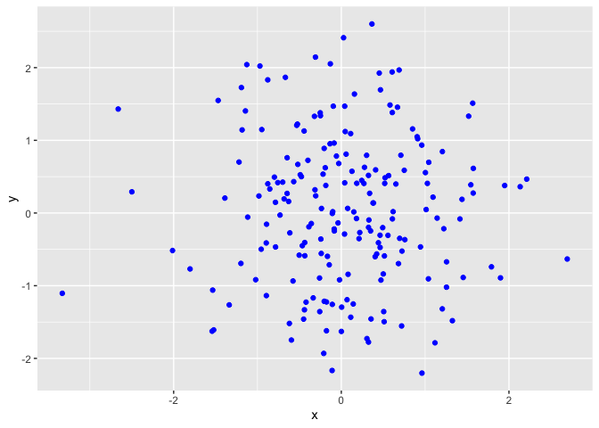<!-- -->

``` r
shade <- if_else(df$y >= 0, "black", "gray")

ggplot(df) +
  aes(x, y) +
  geom_point(color = shade)
```

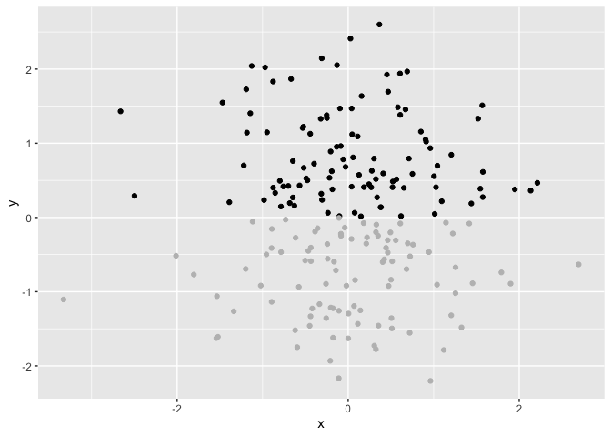<!-- -->

## 10.24 함수를 그래프로 나타내기

``` r
data.frame(x = c(-3, 3)) %>%
  ggplot(aes(x)) +
  stat_function(fun = sin)
```

<!-- -->

``` r
data.frame(x = c(-3.5, 3.5)) %>%
  ggplot(aes(x)) +
  stat_function(fun = dnorm) +
  ggtitle("Standard Normal Density")
```

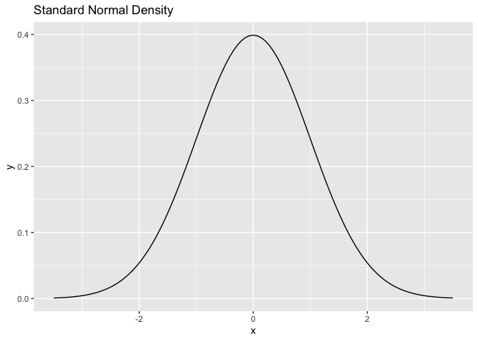<!-- -->

``` r
f <- function(x) exp(-abs(x)) * sin(2 * pi * x)
ggplot(data.frame(x = c(-3.5, 3.5))) +
  aes(x) +
  stat_function(fun = f, n = 1000) +
  ggtitle("Dampened Sine Wave")
```

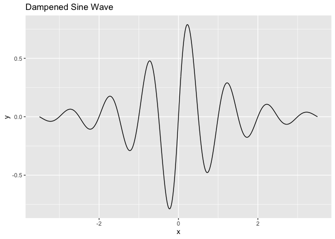<!-- -->

## 10.25 한 페이지에 여러 그림 표시하기

``` r
library(patchwork)
df <- data.frame(x = c(0, 1))

g1 <- ggplot(df, aes(x)) +
  stat_function(fun = function(x) dbeta(x, 2, 4)) +
  ggtitle("First")

g2 <- ggplot(df, aes(x)) +
  stat_function(fun = function(x) dbeta(x, 4, 1)) +
  ggtitle("Second")

g3 <- ggplot(df, aes(x)) +
  stat_function(fun = function(x) dbeta(x, 1, 1)) +
  ggtitle("Third")

g4 <- ggplot(df, aes(x)) +
  stat_function(fun = function(x) dbeta(x, .5, .5)) +
  ggtitle("First")

g1 + g2 + g3 + g4 + plot_layout(ncol = 2, byrow = TRUE)
```

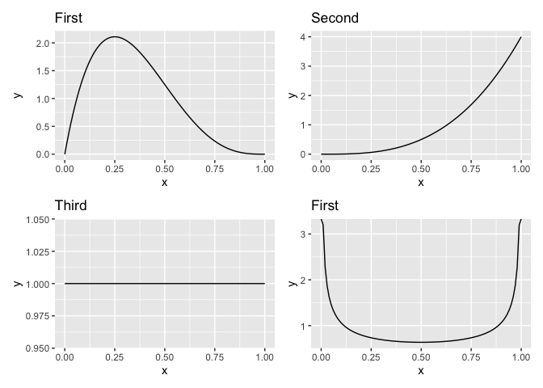<!-- -->

``` r
g1 + g2 + g3 + g4 + plot_layout(ncol = 2, byrow = FALSE)
```

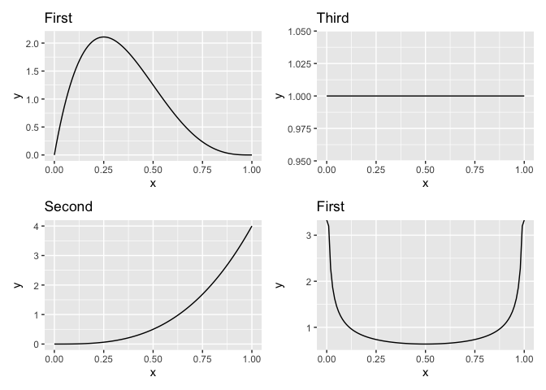<!-- -->

## 10.26 파일에 플롯 쓰기

``` r
ggsave("g1.png", plot = g1, units = "in", width = 5, height = 4)
```
