note14
================

# 14 시계열 분석

## 14.1 시계열 데이터 표현 하기

``` r
library(zoo)
```

    ## 
    ## Attaching package: 'zoo'

    ## The following objects are masked from 'package:base':
    ## 
    ##     as.Date, as.Date.numeric

``` r
x <- c(3, 4, 1, 4, 8)
dt <- seq(as.Date("2018-01-01"), as.Date("2018-01-05"), by = "days")
ts <- zoo(x, dt)
ts
```

    ## 2018-01-01 2018-01-02 2018-01-03 2018-01-04 2018-01-05 
    ##          3          4          1          4          8

``` r
library(xts)
```

    ## 
    ## Attaching package: 'xts'

    ## The following objects are masked from 'package:dplyr':
    ## 
    ##     first, last

``` r
ts <- xts(x, dt)
ts
```

    ##            [,1]
    ## 2018-01-01    3
    ## 2018-01-02    4
    ## 2018-01-03    1
    ## 2018-01-04    4
    ## 2018-01-05    8

``` r
prices <- c(132.45, 130.85, 130.00, 129.55, 130.85)
dates <- as.Date(c(
  "2010-01-04", "2010-01-05", "2010-01-06",
  "2010-01-07", "2010-01-08"
))
ibm.daily <- zoo(prices, dates)
ibm.daily
```

    ## 2010-01-04 2010-01-05 2010-01-06 2010-01-07 2010-01-08 
    ##     132.45     130.85     130.00     129.55     130.85

``` r
prices <- c(131.18, 131.20, 131.17, 131.15, 131.17)
seconds <- c(9.5, 9.500278, 9.500556, 9.500833, 9.501111)
ibm.sec <- zoo(prices, seconds)
print(ibm.sec)
```

    ##    9.5 9.5003 9.5006 9.5008 9.5011 
    ## 131.18 131.20 131.17 131.15 131.17

``` r
coredata(ibm.daily)
```

    ## [1] 132.45 130.85 130.00 129.55 130.85

``` r
index(ibm.daily)
```

    ## [1] "2010-01-04" "2010-01-05" "2010-01-06" "2010-01-07" "2010-01-08"

``` r
#vignette("zoo")
```

## 14.2 시계열 데이터 그리기

``` r
load("data/ibm.rdata")
library(xts)

main <- "IBM: Historical vs. Inflation-Adjusted"
lty <- c("dotted", "solid")

ibm.infl |> head()
```

    ##                 ibm  ibm.inf
    ## 2000-01-01 78.56247 75.74389
    ## 2000-01-03 81.97214 79.04673
    ## 2000-01-04 79.18969 76.37109
    ## 2000-01-05 81.97214 79.06234
    ## 2000-01-06 80.55885 77.70698
    ## 2000-01-07 80.20554 77.37399

``` r
plot(ibm.infl, lty = lty, main = main, legend.loc = "left")
```

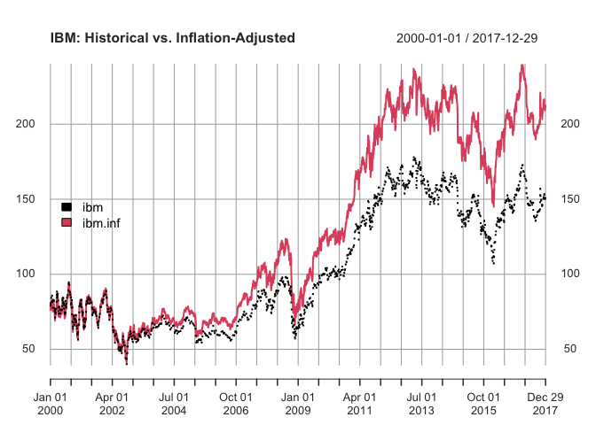<!-- -->

## 14.3 가장 오래된 또는 가장 최근의 관찰을 추출하기

``` r
ibm <- ibm.infl$ibm
head(ibm)
```

    ##                 ibm
    ## 2000-01-01 78.56247
    ## 2000-01-03 81.97214
    ## 2000-01-04 79.18969
    ## 2000-01-05 81.97214
    ## 2000-01-06 80.55885
    ## 2000-01-07 80.20554

``` r
tail(ibm)
```

    ##                 ibm
    ## 2017-12-21 148.3758
    ## 2017-12-22 149.3552
    ## 2017-12-26 149.6784
    ## 2017-12-27 149.9722
    ## 2017-12-28 150.8634
    ## 2017-12-29 150.2562

``` r
first(ibm, "2 week")
```

    ##                 ibm
    ## 2000-01-01 78.56247
    ## 2000-01-03 81.97214
    ## 2000-01-04 79.18969
    ## 2000-01-05 81.97214
    ## 2000-01-06 80.55885
    ## 2000-01-07 80.20554

``` r
last(ibm, "month")
```

    ##                 ibm
    ## 2017-12-01 151.5686
    ## 2017-12-04 153.2335
    ## 2017-12-05 152.1464
    ## 2017-12-06 150.9222
    ## 2017-12-07 150.4031
    ## 2017-12-08 151.6175
    ## 2017-12-11 152.2052
    ## 2017-12-12 153.5078
    ## 2017-12-13 150.7361
    ## 2017-12-14 150.8242
    ## 2017-12-15 149.3552
    ## 2017-12-18 150.1681
    ## 2017-12-19 150.0701
    ## 2017-12-20 149.7959
    ## 2017-12-21 148.3758
    ## 2017-12-22 149.3552
    ## 2017-12-26 149.6784
    ## 2017-12-27 149.9722
    ## 2017-12-28 150.8634
    ## 2017-12-29 150.2562

## 14.4 시계열의 부분 집합화

``` r
head(ibm)
```

    ##                 ibm
    ## 2000-01-01 78.56247
    ## 2000-01-03 81.97214
    ## 2000-01-04 79.18969
    ## 2000-01-05 81.97214
    ## 2000-01-06 80.55885
    ## 2000-01-07 80.20554

``` r
ibm[2]
```

    ##                 ibm
    ## 2000-01-03 81.97214

``` r
ibm[2:4]
```

    ##                 ibm
    ## 2000-01-03 81.97214
    ## 2000-01-04 79.18969
    ## 2000-01-05 81.97214

``` r
ibm[as.Date("2010-01-05")]
```

    ##                 ibm
    ## 2010-01-05 102.7994

``` r
ibm["2010-01-05"]
```

    ##                 ibm
    ## 2010-01-05 102.7994

``` r
dates <- seq(as.Date("2010-01-04"), as.Date("2010-01-08"), by = 2)
ibm[dates]
```

    ##                 ibm
    ## 2010-01-04 104.0564
    ## 2010-01-06 102.1316
    ## 2010-01-08 102.7994

``` r
window(ibm, start = as.Date("2010-01-05"), end = as.Date("2010-01-07"))
```

    ##                 ibm
    ## 2010-01-05 102.7994
    ## 2010-01-06 102.1316
    ## 2010-01-07 101.7781

``` r
ibm["201001"]
```

    ##                  ibm
    ## 2010-01-01 102.48058
    ## 2010-01-04 104.05641
    ## 2010-01-05 102.79940
    ## 2010-01-06 102.13160
    ## 2010-01-07 101.77809
    ## 2010-01-08 102.79940
    ## 2010-01-11 101.72307
    ## 2010-01-12 102.53228
    ## 2010-01-13 102.31229
    ## 2010-01-14 103.94640
    ## 2010-01-15 103.53001
    ## 2010-01-19 105.38412
    ## 2010-01-20 102.32800
    ## 2010-01-21 101.34597
    ## 2010-01-22  98.59631
    ## 2010-01-25  99.08340
    ## 2010-01-26  98.79268
    ## 2010-01-27  99.24834
    ## 2010-01-28  97.22141
    ## 2010-01-29  96.15299

``` r
ibm["2009/2011"] |> head()
```

    ##                 ibm
    ## 2009-01-01 66.10209
    ## 2009-01-02 67.29687
    ## 2009-01-05 66.87322
    ## 2009-01-06 68.72955
    ## 2009-01-07 67.62038
    ## 2009-01-08 67.15050

``` r
ibm["2009/201001"] |> head()
```

    ##                 ibm
    ## 2009-01-01 66.10209
    ## 2009-01-02 67.29687
    ## 2009-01-05 66.87322
    ## 2009-01-06 68.72955
    ## 2009-01-07 67.62038
    ## 2009-01-08 67.15050

``` r
ibm["200906/201005"] |> head()
```

    ##                 ibm
    ## 2009-06-01 84.36459
    ## 2009-06-02 83.16574
    ## 2009-06-03 82.90105
    ## 2009-06-04 82.77649
    ## 2009-06-05 83.48492
    ## 2009-06-08 83.67954

## 14.5 여러 시계열 병합

``` r
load(file = "./data/ibm.rdata")
head(ibm)
```

    ##                 ibm
    ## 1999-01-04 64.19360
    ## 1999-01-05 66.51756
    ## 1999-01-06 66.21059
    ## 1999-01-07 66.71487
    ## 1999-01-08 65.79404
    ## 1999-01-11 66.38599

``` r
head(cpi)
```

    ##                  cpi
    ## 1999-01-01 0.9379271
    ## 1999-02-01 0.9379271
    ## 1999-03-01 0.9384966
    ## 1999-04-01 0.9447608
    ## 1999-05-01 0.9453303
    ## 1999-06-01 0.9453303

``` r
merge(ibm, cpi) |> head()
```

    ##                 ibm       cpi
    ## 1999-01-01       NA 0.9379271
    ## 1999-01-04 64.19360        NA
    ## 1999-01-05 66.51756        NA
    ## 1999-01-06 66.21059        NA
    ## 1999-01-07 66.71487        NA
    ## 1999-01-08 65.79404        NA

``` r
na.locf(merge(ibm, cpi)) |> head()
```

    ##                 ibm       cpi
    ## 1999-01-01       NA 0.9379271
    ## 1999-01-04 64.19360 0.9379271
    ## 1999-01-05 66.51756 0.9379271
    ## 1999-01-06 66.21059 0.9379271
    ## 1999-01-07 66.71487 0.9379271
    ## 1999-01-08 65.79404 0.9379271

``` r
head(merge(ibm, cpi, all = FALSE))
```

    ##                 ibm       cpi
    ## 1999-02-01 63.05356 0.9379271
    ## 1999-03-01 59.22036 0.9384966
    ## 1999-04-01 62.25389 0.9447608
    ## 1999-06-01 78.96328 0.9453303
    ## 1999-07-01 92.35887 0.9493166
    ## 1999-09-01 89.80250 0.9555809

## 14.6 시계열 채우기 또는 채우기

``` r
head(cpi)
```

    ##                  cpi
    ## 1999-01-01 0.9379271
    ## 1999-02-01 0.9379271
    ## 1999-03-01 0.9384966
    ## 1999-04-01 0.9447608
    ## 1999-05-01 0.9453303
    ## 1999-06-01 0.9453303

``` r
max(index(cpi))
```

    ## [1] "2017-12-01"

``` r
dates <- seq(from = min(index(cpi)), to = max(index(cpi)), by = 1)
empty <- zoo(, dates)
head(empty)
```

    ## Data:
    ## numeric(0)
    ## 
    ## Index:
    ## Date of length 0

``` r
filled.cpi <- merge(cpi, empty, all = TRUE)
filled.cpi |> head()
```

    ##                  cpi
    ## 1999-01-01 0.9379271
    ## 1999-01-02        NA
    ## 1999-01-03        NA
    ## 1999-01-04        NA
    ## 1999-01-05        NA
    ## 1999-01-06        NA

``` r
filled.cpi <- na.locf(merge(cpi, empty, all = TRUE))
head(filled.cpi)
```

    ##                  cpi
    ## 1999-01-01 0.9379271
    ## 1999-01-02 0.9379271
    ## 1999-01-03 0.9379271
    ## 1999-01-04 0.9379271
    ## 1999-01-05 0.9379271
    ## 1999-01-06 0.9379271

``` r
tail(filled.cpi)
```

    ##                 cpi
    ## 2017-11-26 1.408946
    ## 2017-11-27 1.408946
    ## 2017-11-28 1.408946
    ## 2017-11-29 1.408946
    ## 2017-11-30 1.408946
    ## 2017-12-01 1.411788

``` r
filled.ibm <- na.locf(merge(ibm, zoo(, index(cpi))))
head(merge(filled.ibm, cpi, all = FALSE))
```

    ##                 ibm       cpi
    ## 1999-01-01       NA 0.9379271
    ## 1999-02-01 63.05356 0.9379271
    ## 1999-03-01 59.22036 0.9384966
    ## 1999-04-01 62.25389 0.9447608
    ## 1999-05-01 73.57480 0.9453303
    ## 1999-06-01 78.96328 0.9453303

``` r
filled_data <- merge(ibm, filled.cpi, all = FALSE)
head(filled_data)
```

    ##                 ibm       cpi
    ## 1999-01-04 64.19360 0.9379271
    ## 1999-01-05 66.51756 0.9379271
    ## 1999-01-06 66.21059 0.9379271
    ## 1999-01-07 66.71487 0.9379271
    ## 1999-01-08 65.79404 0.9379271
    ## 1999-01-11 66.38599 0.9379271

``` r
combined_data <- merge(ibm, cpi, all = TRUE)
head(combined_data)
```

    ##                 ibm       cpi
    ## 1999-01-01       NA 0.9379271
    ## 1999-01-04 64.19360        NA
    ## 1999-01-05 66.51756        NA
    ## 1999-01-06 66.21059        NA
    ## 1999-01-07 66.71487        NA
    ## 1999-01-08 65.79404        NA

``` r
combined_spline <- na.spline(combined_data)
```

## 14.7 시계열 지연

``` r
ibm.daily
```

    ## 2010-01-04 2010-01-05 2010-01-06 2010-01-07 2010-01-08 
    ##     132.45     130.85     130.00     129.55     130.85

``` r
lag(ibm.daily, k = 1, na.pad = TRUE)
```

    ## 2010-01-04 2010-01-05 2010-01-06 2010-01-07       <NA> 
    ##     132.45     130.85     130.00     129.55         NA

``` r
lag(ibm.daily, k = -1, na.pad = TRUE)
```

    ## 2010-01-04 2010-01-05 2010-01-06 2010-01-07       <NA> 
    ##     132.45     130.85     130.00     129.55         NA

## 14.8 연속적인 차이 계산하기

``` r
ibm.daily
```

    ## 2010-01-04 2010-01-05 2010-01-06 2010-01-07 2010-01-08 
    ##     132.45     130.85     130.00     129.55     130.85

``` r
diff(ibm.daily)
```

    ## 2010-01-05 2010-01-06 2010-01-07 2010-01-08 
    ##      -1.60      -0.85      -0.45       1.30

``` r
head(cpi, 24)
```

    ##                  cpi
    ## 1999-01-01 0.9379271
    ## 1999-02-01 0.9379271
    ## 1999-03-01 0.9384966
    ## 1999-04-01 0.9447608
    ## 1999-05-01 0.9453303
    ## 1999-06-01 0.9453303
    ## 1999-07-01 0.9493166
    ## 1999-08-01 0.9515945
    ## 1999-09-01 0.9555809
    ## 1999-10-01 0.9572893
    ## 1999-11-01 0.9589977
    ## 1999-12-01 0.9612756
    ## 2000-01-01 0.9641230
    ## 2000-02-01 0.9681093
    ## 2000-03-01 0.9738041
    ## 2000-04-01 0.9732346
    ## 2000-05-01 0.9749431
    ## 2000-06-01 0.9806378
    ## 2000-07-01 0.9834852
    ## 2000-08-01 0.9834852
    ## 2000-09-01 0.9886105
    ## 2000-10-01 0.9903189
    ## 2000-11-01 0.9920273
    ## 2000-12-01 0.9943052

``` r
head(diff(cpi, lag = 12), 24)
```

    ##                   cpi
    ## 1999-01-01         NA
    ## 1999-02-01         NA
    ## 1999-03-01         NA
    ## 1999-04-01         NA
    ## 1999-05-01         NA
    ## 1999-06-01         NA
    ## 1999-07-01         NA
    ## 1999-08-01         NA
    ## 1999-09-01         NA
    ## 1999-10-01         NA
    ## 1999-11-01         NA
    ## 1999-12-01         NA
    ## 2000-01-01 0.02619590
    ## 2000-02-01 0.03018223
    ## 2000-03-01 0.03530752
    ## 2000-04-01 0.02847380
    ## 2000-05-01 0.02961276
    ## 2000-06-01 0.03530752
    ## 2000-07-01 0.03416856
    ## 2000-08-01 0.03189066
    ## 2000-09-01 0.03302961
    ## 2000-10-01 0.03302961
    ## 2000-11-01 0.03302961
    ## 2000-12-01 0.03302961

## 14.9 시계열에 대한 계산 수행

``` r
ibm.daily
```

    ## 2010-01-04 2010-01-05 2010-01-06 2010-01-07 2010-01-08 
    ##     132.45     130.85     130.00     129.55     130.85

``` r
diff(ibm.daily)
```

    ## 2010-01-05 2010-01-06 2010-01-07 2010-01-08 
    ##      -1.60      -0.85      -0.45       1.30

``` r
diff(ibm.daily) / ibm.daily * 100
```

    ## 2010-01-05 2010-01-06 2010-01-07 2010-01-08 
    ## -1.2227742 -0.6538462 -0.3473562  0.9935040

``` r
log(ibm.daily)
```

    ## 2010-01-04 2010-01-05 2010-01-06 2010-01-07 2010-01-08 
    ##   4.886205   4.874052   4.867534   4.864067   4.874052

``` r
diff(log(ibm.daily))
```

    ##   2010-01-05   2010-01-06   2010-01-07   2010-01-08 
    ## -0.012153587 -0.006517179 -0.003467543  0.009984722

## 14.10 이동 평균 계산

``` r
ibm_year <- ibm["2016"]
ma_ibm <- rollmean(ibm_year, 7, align = "right")
ma_ibm <- merge(ma_ibm, ibm_year)
plot(ma_ibm)
```

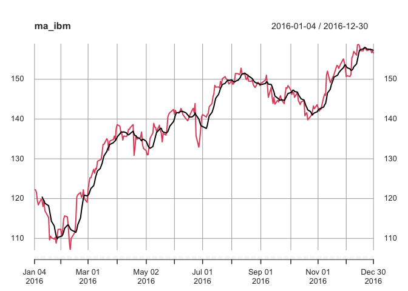<!-- -->

## 14.11 달력 기간별 기능 적용

``` r
ibm_5 <- ibm["2012/2017"]
head(ibm_5)
```

    ##                 ibm
    ## 2012-01-03 151.6854
    ## 2012-01-04 151.0666
    ## 2012-01-05 150.3501
    ## 2012-01-06 148.6240
    ## 2012-01-09 147.8505
    ## 2012-01-10 147.6225

``` r
tail(ibm_5)
```

    ##                 ibm
    ## 2017-12-21 148.3758
    ## 2017-12-22 149.3552
    ## 2017-12-26 149.6784
    ## 2017-12-27 149.9722
    ## 2017-12-28 150.8634
    ## 2017-12-29 150.2562

``` r
ibm_mm <- apply.monthly(ibm_5, mean)
head(ibm_mm)
```

    ##                 ibm
    ## 2012-01-31 151.2075
    ## 2012-02-29 158.4522
    ## 2012-03-30 166.4003
    ## 2012-04-30 166.7243
    ## 2012-05-31 163.7550
    ## 2012-06-29 159.1806

``` r
ibm_vol <- sqrt(251) * apply.monthly(as.xts(diff(log(ibm_5))), sd)
plot(ibm_vol, main = "IBM: Monthly Volatility")
```

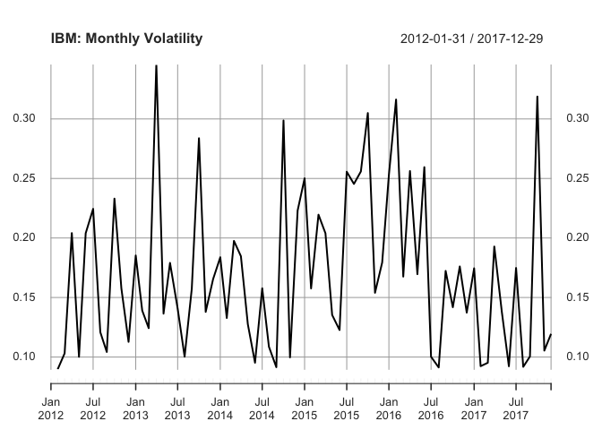<!-- -->

## 14.12 롤링 함수 적용하기

``` r
ibm_sds <- rollapply(ibm_5, width = 30, FUN = sd, by = 30, align = "right")
ibm_sds <- na.omit(ibm_sds)
head(ibm_sds)
```

    ##                 ibm
    ## 2012-02-14 4.338500
    ## 2012-03-28 3.974268
    ## 2012-05-10 2.622633
    ## 2012-06-22 2.645094
    ## 2012-08-06 3.647371
    ## 2012-09-18 3.222219

## 14.13 자기상관 함수의 플롯팅

``` r
load("data/ts_acf.rdata")
acf(ts1, main = "Significant Autocorrelations")
```

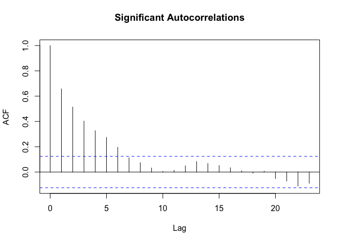<!-- -->

``` r
acf(ts2, main = "Insignificannt Autocorrelations")
```

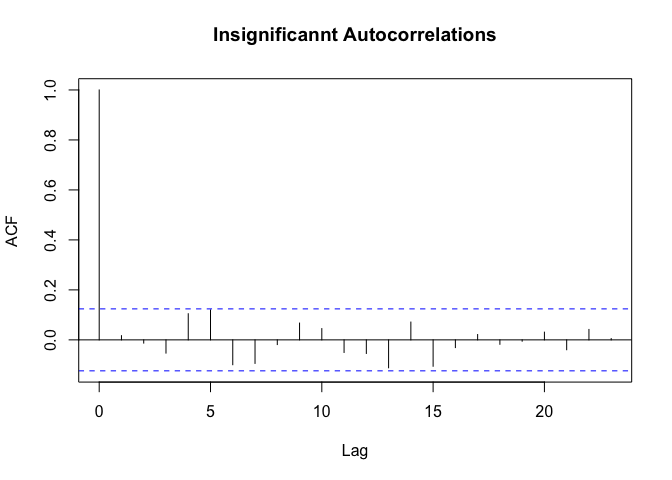<!-- -->

## 14.14 자기상관을 위한 시계열 테스트

``` r
Box.test(ts1)
```

    ## 
    ##  Box-Pierce test
    ## 
    ## data:  ts1
    ## X-squared = 108.04, df = 1, p-value < 2.2e-16

``` r
Box.test(ts2)
```

    ## 
    ##  Box-Pierce test
    ## 
    ## data:  ts2
    ## X-squared = 0.070288, df = 1, p-value = 0.7909

``` r
Box.test(ts1, type = "Ljung-Box")
```

    ## 
    ##  Box-Ljung test
    ## 
    ## data:  ts1
    ## X-squared = 109.34, df = 1, p-value < 2.2e-16

``` r
Box.test(ts2, type = "Ljung-Box")
```

    ## 
    ##  Box-Ljung test
    ## 
    ## data:  ts2
    ## X-squared = 0.071135, df = 1, p-value = 0.7897

## 14.15 부분 자기상관 함수 플롯하기

``` r
pacf(ts1, main = "Significant Partial Autocorrelations")
```

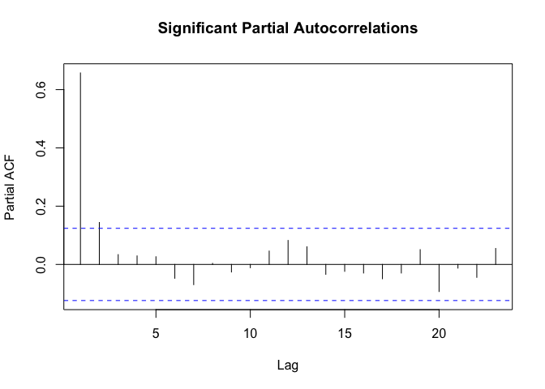<!-- -->

``` r
pacf(ts2, main = "Insignificant Partial Autocorrelations")
```

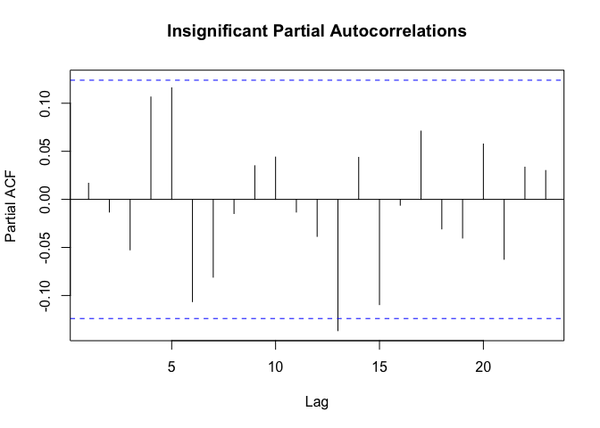<!-- -->

## 14.16 두 시계열 사이의 지연 상관 관계 찾기

``` r
library(forecast)
```

    ## This is forecast 8.17.0 
    ##   Need help getting started? Try the online textbook FPP:
    ##   http://otexts.com/fpp2/

``` r
load(file = "./data/bnd_cmty.Rdata")
b <- coredata(bonds)[, 1]
c <- coredata(cmdtys)[, 1]

Ccf(b, c, main = "Bonds vs. Commodities")
```

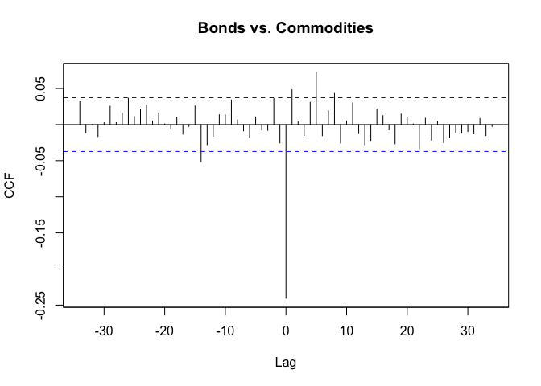<!-- -->

``` r
cor(b, c)
```

    ## [1] -0.2404758

## 14.17 시계열 추세 제거

``` r
# data("data/yield.Rdata")

x <- 1980:2020
y <- 120 + 2.5 * (x - 1990) + rnorm(length(x), 0, sd = 20)
years <- seq(as.Date("1980-01-01"), as.Date("2020-01-01"), by = "years")
yield <- zoo(y, years)
m <- lm(coredata(yield) ~ index(yield))
detr <- zoo(resid(m), index(yield))
autoplot(detr)
```

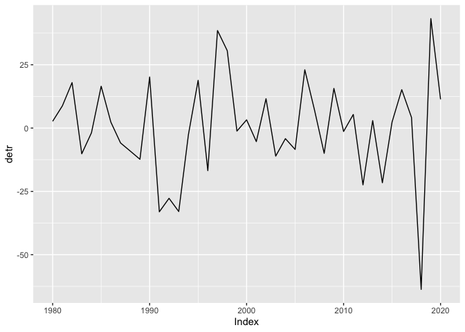<!-- -->

``` r
library(ggplot2)
library(patchwork)
d <- autoplot(detr, geom = "point") +
  labs(
    x = "Year",
    y = "Yield Dev (bu/ac)",
    title = "IL Corn Yield Deviation from Trend (bu/ac)"
  )

dp <- autoplot(detr / yield, geom = "point") +
  labs(
    x = "Year",
    y = "Yield Dev (bu/ac)",
    title = "IL Corn Yield Deviation from Trend (bu/ac)"
  )

d / dp
```

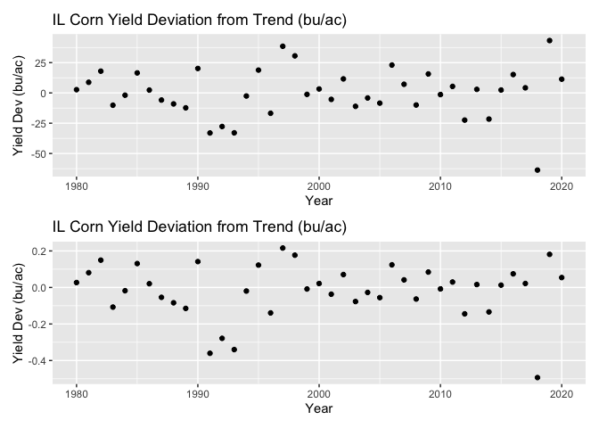<!-- -->

## 14.18 ARIMA 모델 맞추기

``` r
# install.packages("fpp2")
library(forecast)
library(fpp2)
```

    ## ── Attaching packages ───────────────────────────────────────────────────────────────────────────── fpp2 2.4 ──

    ## ✔ fma       2.4     ✔ expsmooth 2.3

    ## 

``` r
plot(ausbeer)
```

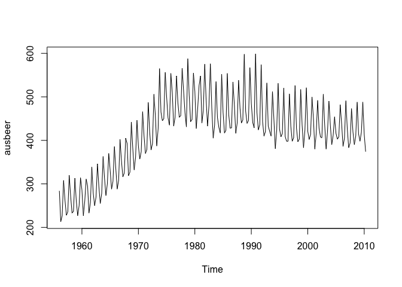<!-- -->

``` r
auto.arima(ausbeer)
```

    ## Series: ausbeer 
    ## ARIMA(1,1,2)(0,1,1)[4] 
    ## 
    ## Coefficients:
    ##          ar1      ma1     ma2     sma1
    ##       0.0495  -1.0091  0.3746  -0.7434
    ## s.e.  0.1959   0.1826  0.1530   0.0502
    ## 
    ## sigma^2 = 241.3:  log likelihood = -886.41
    ## AIC=1782.82   AICc=1783.11   BIC=1799.63

``` r
autoplot(ausbeer)
```

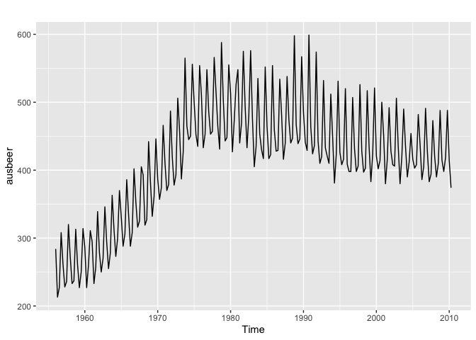<!-- -->

``` r
auto.arima(ausbeer, seasonal = FALSE)
```

    ## Series: ausbeer 
    ## ARIMA(3,2,2) 
    ## 
    ## Coefficients:
    ##           ar1      ar2      ar3      ma1     ma2
    ##       -0.9569  -0.9872  -0.9247  -1.0425  0.1416
    ## s.e.   0.0257   0.0184   0.0242   0.0619  0.0623
    ## 
    ## sigma^2 = 326.7:  log likelihood = -935.05
    ## AIC=1882.09   AICc=1882.5   BIC=1902.35

``` r
arima(ausbeer, order = c(3, 2, 2))
```

    ## 
    ## Call:
    ## arima(x = ausbeer, order = c(3, 2, 2))
    ## 
    ## Coefficients:
    ##           ar1      ar2      ar3      ma1     ma2
    ##       -0.9569  -0.9872  -0.9247  -1.0425  0.1416
    ## s.e.   0.0257   0.0184   0.0242   0.0619  0.0623
    ## 
    ## sigma^2 estimated as 319.1:  log likelihood = -935.05,  aic = 1882.09

``` r
m <- arima(x = ausbeer, order = c(3, 2, 2))
confint(m)
```

    ##           2.5 %     97.5 %
    ## ar1 -1.00718653 -0.9065561
    ## ar2 -1.02320900 -0.9511103
    ## ar3 -0.97212943 -0.8772812
    ## ma1 -1.16390381 -0.9211288
    ## ma2  0.01945967  0.2636564

## 14.19 중요하지 않은 ARIMA 계수 제거

``` r
m1 <- auto.arima(euretail)
m1
```

    ## Series: euretail 
    ## ARIMA(0,1,3)(0,1,1)[4] 
    ## 
    ## Coefficients:
    ##          ma1     ma2     ma3     sma1
    ##       0.2630  0.3694  0.4200  -0.6636
    ## s.e.  0.1237  0.1255  0.1294   0.1545
    ## 
    ## sigma^2 = 0.156:  log likelihood = -28.63
    ## AIC=67.26   AICc=68.39   BIC=77.65

``` r
confint(m1, level = .98)
```

    ##              1 %       99 %
    ## ma1  -0.02464397  0.5506748
    ## ma2   0.07737146  0.6614554
    ## ma3   0.11898386  0.7210643
    ## sma1 -1.02305928 -0.3040754

``` r
m2 <- arima(euretail,
  order = c(0, 1, 3), seasonal = c(0, 1, 1),
  fixed = c(0, NA, NA, NA)
)
m2
```

    ## 
    ## Call:
    ## arima(x = euretail, order = c(0, 1, 3), seasonal = c(0, 1, 1), fixed = c(0, 
    ##     NA, NA, NA))
    ## 
    ## Coefficients:
    ##       ma1     ma2     ma3     sma1
    ##         0  0.4039  0.2929  -0.7002
    ## s.e.    0  0.1285  0.1071   0.1349
    ## 
    ## sigma^2 estimated as 0.1559:  log likelihood = -30.75,  aic = 69.49

``` r
confint(m2, level = .98)
```

    ##              1 %       99 %
    ## ma1           NA         NA
    ## ma2   0.10494227  0.7029097
    ## ma3   0.04381683  0.5420585
    ## sma1 -1.01404430 -0.3863014

## 14.21 ARIMA 모델에서 예측하기

``` r
checkresiduals(m)
```

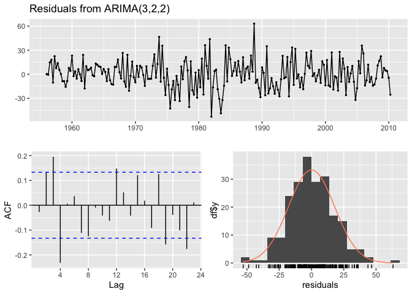<!-- -->

    ## 
    ##  Ljung-Box test
    ## 
    ## data:  Residuals from ARIMA(3,2,2)
    ## Q* = 31.309, df = 3, p-value = 7.319e-07
    ## 
    ## Model df: 5.   Total lags used: 8

``` r
checkresiduals(m1)
```

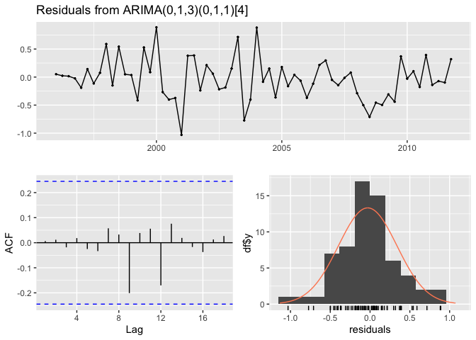<!-- -->

    ## 
    ##  Ljung-Box test
    ## 
    ## data:  Residuals from ARIMA(0,1,3)(0,1,1)[4]
    ## Q* = 0.51128, df = 4, p-value = 0.9724
    ## 
    ## Model df: 4.   Total lags used: 8

``` r
checkresiduals(m2)
```

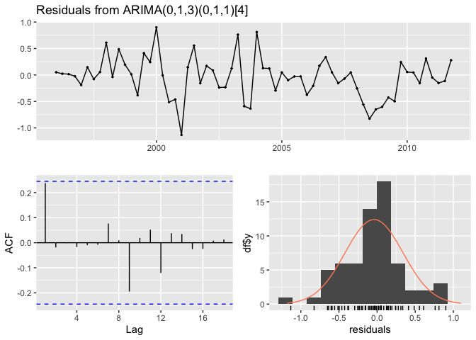<!-- -->

    ## 
    ##  Ljung-Box test
    ## 
    ## data:  Residuals from ARIMA(0,1,3)(0,1,1)[4]
    ## Q* = 4.2921, df = 4, p-value = 0.3679
    ## 
    ## Model df: 4.   Total lags used: 8

## 14.21 ARIMA 모델에서 예측하기

``` r
m <- arima(euretail, order = c(0, 1, 3), seasonal = c(0, 1, 1), fixed = c(0, NA, NA, NA))
fc_m <- forecast(m)
fc_m
```

    ##         Point Forecast    Lo 80    Hi 80    Lo 95    Hi 95
    ## 2012 Q1       95.09872 94.59279 95.60465 94.32496 95.87248
    ## 2012 Q2       95.18735 94.47185 95.90285 94.09309 96.28161
    ## 2012 Q3       95.24910 94.24090 96.25729 93.70720 96.79099
    ## 2012 Q4       95.25729 93.93310 96.58148 93.23212 97.28246
    ## 2013 Q1       94.47945 92.81393 96.14497 91.93225 97.02665
    ## 2013 Q2       94.51286 92.56492 96.46080 91.53375 97.49197
    ## 2013 Q3       94.51754 92.29437 96.74071 91.11749 97.91759
    ## 2013 Q4       94.52574 92.03822 97.01325 90.72141 98.33006

``` r
fc_m$mean
```

    ##          Qtr1     Qtr2     Qtr3     Qtr4
    ## 2012 95.09872 95.18735 95.24910 95.25729
    ## 2013 94.47945 94.51286 94.51754 94.52574

## 14.22 예측 그리기

``` r
autoplot(fc_m)
```

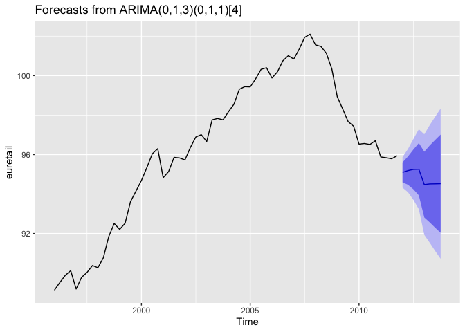<!-- -->

``` r
autoplot(fc_m) +
  ylab("Euro Index") +
  xlab("Year/Quarter") +
  ggtitle("Forecasted Retail Index") +
  theme_bw()
```

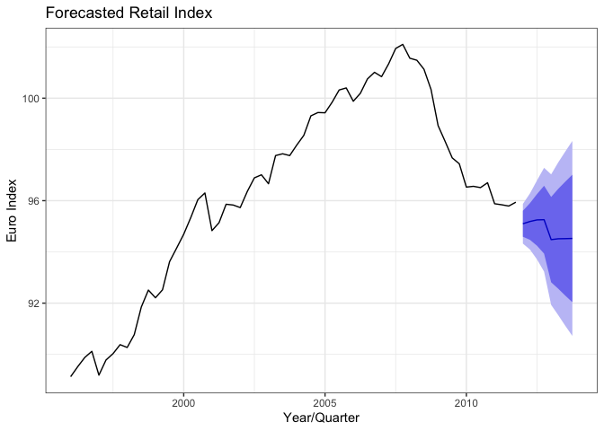<!-- -->

## 14.23 평균 회귀 테스트

``` r
library(tseries)
library(fpp2)
autoplot(goog200)
```

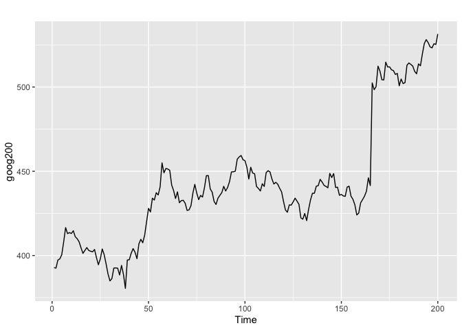<!-- -->

``` r
adf.test(goog200)
```

    ## 
    ##  Augmented Dickey-Fuller Test
    ## 
    ## data:  goog200
    ## Dickey-Fuller = -1.7775, Lag order = 5, p-value = 0.6693
    ## alternative hypothesis: stationary

``` r
autoplot(hsales)
```

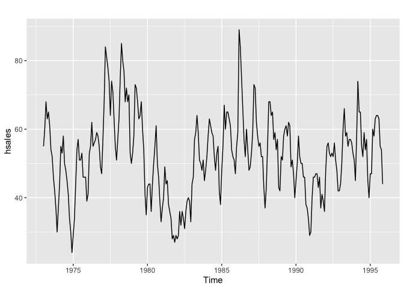<!-- -->

``` r
adf.test(hsales)
```

    ## 
    ##  Augmented Dickey-Fuller Test
    ## 
    ## data:  hsales
    ## Dickey-Fuller = -3.9397, Lag order = 6, p-value = 0.01247
    ## alternative hypothesis: stationary

``` r
library(xts)
data("sample_matrix")
xts_obj <- as.xts(sample_matrix, dateFormat = "Date")[, "Close"]
adf.test(coredata(xts_obj))
```

    ## 
    ##  Augmented Dickey-Fuller Test
    ## 
    ## data:  coredata(xts_obj)
    ## Dickey-Fuller = -2.6986, Lag order = 5, p-value = 0.2842
    ## alternative hypothesis: stationary

``` r
# install.packages("fUnitRoots")
library(fUnitRoots)
adfTest(coredata(ts1), type = "nc")
```

    ## Warning in adfTest(coredata(ts1), type = "nc"): p-value smaller than printed p-value

    ## 
    ## Title:
    ##  Augmented Dickey-Fuller Test
    ## 
    ## Test Results:
    ##   PARAMETER:
    ##     Lag Order: 1
    ##   STATISTIC:
    ##     Dickey-Fuller: -5.6117
    ##   P VALUE:
    ##     0.01 
    ## 
    ## Description:
    ##  Mon Sep  5 15:48:46 2022 by user:

## 14.24 시계열 평활화

``` r
library(KernSmooth)
```

    ## KernSmooth 2.23 loaded
    ## Copyright M. P. Wand 1997-2009

``` r
t <- seq(from = -10, to = 10, length.out = 201)
noise <- rnorm(201)
y <- sin(t) + noise
plot(t, y)
```

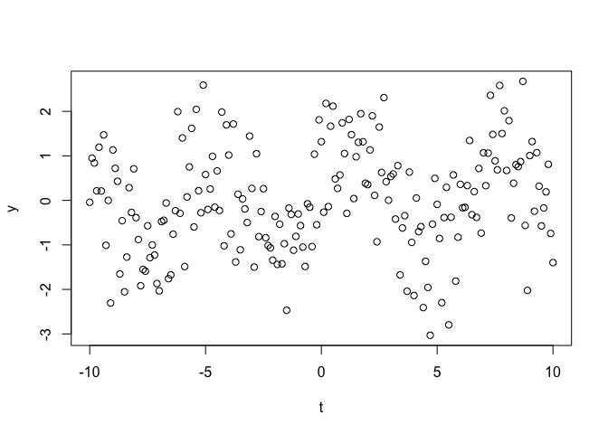<!-- -->

``` r
gridsize <- length(y)
bw <- dpill(t, y, gridsize = gridsize)
lp <- locpoly(x = t, y = y, bandwidth = bw, gridsize = gridsize)
smooth <- lp$y

ggplot() +
  geom_line(aes(t, y)) +
  geom_line(aes(t, smooth), linetype = 2)
```

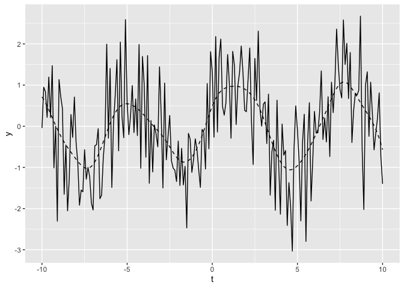<!-- -->
