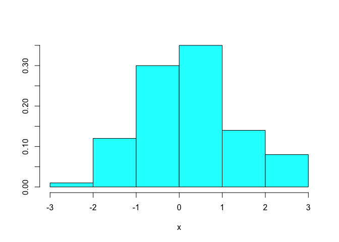

note02
================

# 2 몇 가지 기본 사항

## 2.1 화면에 무언가 인쇄하기

``` r
pi
```

    ## [1] 3.141593

``` r
sqrt(2)
```

    ## [1] 1.414214

``` r
print(pi)
```

    ## [1] 3.141593

``` r
print(sqrt(2))
```

    ## [1] 1.414214

``` r
print(matrix(c(1, 2, 3, 4), 2, 2))
```

    ##      [,1] [,2]
    ## [1,]    1    3
    ## [2,]    2    4

``` r
print(list("a", "b", "c"))
```

    ## [[1]]
    ## [1] "a"
    ## 
    ## [[2]]
    ## [1] "b"
    ## 
    ## [[3]]
    ## [1] "c"

``` r
cat("The zero occurs at", 2 * pi, "radians.", "\n")
```

    ## The zero occurs at 6.283185 radians.

``` r
fib <- c(0, 1, 1, 2, 3, 5, 8, 13, 21, 34)
cat("The first few Fibonacci numbers are:", fib, "...\n")
```

    ## The first few Fibonacci numbers are: 0 1 1 2 3 5 8 13 21 34 ...

## 2.2 Setting Variables

``` r
x <- 3
y <- 4
z <- sqrt(x^2 + y^2)
print(z)
```

    ## [1] 5

``` r
x <- 3
print(x)
```

    ## [1] 3

``` r
x <- c("fee", "fie", "foe", "fum")
print(x)
```

    ## [1] "fee" "fie" "foe" "fum"

``` r
x <<- 3
```

``` r
foo <- 3
print(foo)
```

    ## [1] 3

``` r
5 -> fum
print(fum)
```

    ## [1] 5

## 2.3 변수 나열

``` r
x <- 10
y <- 50
z <- c("thee", "blind", "mice")
f <- function(n, p) sqrt(p * (1 - p) / n)
ls()
```

    ## [1] "f"   "fib" "foo" "fum" "x"   "y"   "z"

``` r
ls.str()
```

    ## f : function (n, p)  
    ## fib :  num [1:10] 0 1 1 2 3 5 8 13 21 34
    ## foo :  num 3
    ## fum :  num 5
    ## x :  num 10
    ## y :  num 50
    ## z :  chr [1:3] "thee" "blind" "mice"

``` r
ls(all.names = TRUE)
```

    ## [1] "f"   "fib" "foo" "fum" "x"   "y"   "z"

## 2.4 변수 삭제

``` r
rm(x)
#x
```

``` r
rm(list = ls())
ls()
```

    ## character(0)

## 2.5 벡터 생성

``` r
c(1, 1, 2, 3, 5, 8, 13, 21)
```

    ## [1]  1  1  2  3  5  8 13 21

``` r
c(1 * pi, 2 * pi, 3 * pi, 4 * pi)
```

    ## [1]  3.141593  6.283185  9.424778 12.566371

``` r
c("My", "twitter", "handle", "is", "@cmastication")
```

    ## [1] "My"            "twitter"       "handle"        "is"           
    ## [5] "@cmastication"

``` r
c(TRUE, TRUE, FALSE, TRUE)
```

    ## [1]  TRUE  TRUE FALSE  TRUE

``` r
v1 <- c(1, 2, 3)
v2 <- c(4, 5, 6)
c(v1, v2)
```

    ## [1] 1 2 3 4 5 6

``` r
v3 <- c("A", "B", "C")
c(v1, v3)
```

    ## [1] "1" "2" "3" "A" "B" "C"

``` r
mode(3.1415)
```

    ## [1] "numeric"

``` r
mode("foo")
```

    ## [1] "character"

``` r
mode(c(3.1415, "foo"))
```

    ## [1] "character"

## 2.6 기초 통계 계산

``` r
x <- c(0, 1, 1, 2, 3, 5, 8, 13, 21, 34)
mean(x)
```

    ## [1] 8.8

``` r
median(x)
```

    ## [1] 4

``` r
sd(x)
```

    ## [1] 11.03328

``` r
var(x)
```

    ## [1] 121.7333

``` r
y <- log(x + 1)
cor(x, y)
```

    ## [1] 0.9068053

``` r
cov(x, y)
```

    ## [1] 11.49988

``` r
x <- c(0, 1, 1, 2, 3, NA)
mean(x)
```

    ## [1] NA

``` r
sd(x)
```

    ## [1] NA

``` r
mean(x, na.rm = TRUE)
```

    ## [1] 1.4

``` r
sd(x, na.rm = TRUE)
```

    ## [1] 1.140175

``` r
data(cars)
purrr::map_dbl(cars, mean)
```

    ## speed  dist 
    ## 15.40 42.98

``` r
purrr::map_dbl(cars, sd)
```

    ##     speed      dist 
    ##  5.287644 25.769377

``` r
purrr::map_dbl(cars, median)
```

    ## speed  dist 
    ##    15    36

``` r
var(cars)
```

    ##           speed     dist
    ## speed  27.95918 109.9469
    ## dist  109.94694 664.0608

``` r
cor(cars)
```

    ##           speed      dist
    ## speed 1.0000000 0.8068949
    ## dist  0.8068949 1.0000000

``` r
cov(cars)
```

    ##           speed     dist
    ## speed  27.95918 109.9469
    ## dist  109.94694 664.0608

## 2.7 시퀀스 생성

``` r
1:5
```

    ## [1] 1 2 3 4 5

``` r
seq(from = 1, to = 5, by = 2)
```

    ## [1] 1 3 5

``` r
rep(1, times = 5)
```

    ## [1] 1 1 1 1 1

``` r
0:9
```

    ##  [1] 0 1 2 3 4 5 6 7 8 9

``` r
10:19
```

    ##  [1] 10 11 12 13 14 15 16 17 18 19

``` r
9:0
```

    ##  [1] 9 8 7 6 5 4 3 2 1 0

``` r
10:20 |> mean()
```

    ## [1] 15

``` r
seq(from = 0, to = 20)
```

    ##  [1]  0  1  2  3  4  5  6  7  8  9 10 11 12 13 14 15 16 17 18 19 20

``` r
seq(from = 0, to = 20, by = 2)
```

    ##  [1]  0  2  4  6  8 10 12 14 16 18 20

``` r
seq(from = 0, to = 20, by = 5)
```

    ## [1]  0  5 10 15 20

``` r
seq(from = 1.0, to = 2.0, length.out = 5)
```

    ## [1] 1.00 1.25 1.50 1.75 2.00

``` r
rep(pi, times = 5)
```

    ## [1] 3.141593 3.141593 3.141593 3.141593 3.141593

## 2.8 벡터 비교

``` r
a <- 3
a == pi
```

    ## [1] FALSE

``` r
a != pi
```

    ## [1] TRUE

``` r
a < pi
```

    ## [1] TRUE

``` r
a > pi
```

    ## [1] FALSE

``` r
a <= pi
```

    ## [1] TRUE

``` r
a >= pi
```

    ## [1] FALSE

``` r
v <- c(3, pi, 4)
w <- c(pi, pi, pi)
v == w
```

    ## [1] FALSE  TRUE FALSE

``` r
v < w
```

    ## [1]  TRUE FALSE FALSE

``` r
v <= w
```

    ## [1]  TRUE  TRUE FALSE

``` r
v > w
```

    ## [1] FALSE FALSE  TRUE

``` r
v >= w
```

    ## [1] FALSE  TRUE  TRUE

``` r
v <- c(3, pi, 4)
v == pi
```

    ## [1] FALSE  TRUE FALSE

``` r
v != pi
```

    ## [1]  TRUE FALSE  TRUE

``` r
v <- c(3, pi, 4)
any(v == pi)
```

    ## [1] TRUE

``` r
all(v == 0)
```

    ## [1] FALSE

## 2.9 벡터 요소 선택

``` r
fib <- c(0, 1, 1, 2, 3, 5, 8, 13, 21, 34)
fib
```

    ##  [1]  0  1  1  2  3  5  8 13 21 34

``` r
fib[1]
```

    ## [1] 0

``` r
fib[2]
```

    ## [1] 1

``` r
fib[3]
```

    ## [1] 1

``` r
fib[4]
```

    ## [1] 2

``` r
fib[5]
```

    ## [1] 3

``` r
fib[1:3]
```

    ## [1] 0 1 1

``` r
fib[4:9]
```

    ## [1]  2  3  5  8 13 21

``` r
fib[c(1, 2, 4, 8)]
```

    ## [1]  0  1  2 13

``` r
fib[-1]
```

    ## [1]  1  1  2  3  5  8 13 21 34

``` r
fib[1:3]
```

    ## [1] 0 1 1

``` r
fib[-(1:3)]
```

    ## [1]  2  3  5  8 13 21 34

``` r
fib < 10
```

    ##  [1]  TRUE  TRUE  TRUE  TRUE  TRUE  TRUE  TRUE FALSE FALSE FALSE

``` r
fib[fib < 10]
```

    ## [1] 0 1 1 2 3 5 8

``` r
fib %% 2 == 0
```

    ##  [1]  TRUE FALSE FALSE  TRUE FALSE FALSE  TRUE FALSE FALSE  TRUE

``` r
fib[fib %% 2 == 0]
```

    ## [1]  0  2  8 34

``` r
v <- c(3, 6, 1, 9, 11, 16, 0, 3, 1, 45, 2, 8, 9, 6, -4)
v[v > median(v)]
```

    ## [1]  9 11 16 45  8  9

``` r
v[(v < quantile(v, 0.05)) | (v > quantile(v, 0.95))]
```

    ## [1] 45 -4

``` r
v[abs(v - mean(v)) > sd(v)]
```

    ## [1] 45 -4

``` r
v <- c(1, 2, 3, NA, 5)
v[is.na(v) & !is.null(v)]
```

    ## [1] NA

``` r
years <- c(1960, 1964, 1976, 1994)
names(years) <- c("Kennedy", "Johnson", "Carter", "Clinton")
years
```

    ## Kennedy Johnson  Carter Clinton 
    ##    1960    1964    1976    1994

``` r
years["Carter"]
```

    ## Carter 
    ##   1976

``` r
years["Clinton"]
```

    ## Clinton 
    ##    1994

``` r
years[c("Carter", "Clinton")]
```

    ##  Carter Clinton 
    ##    1976    1994

## 2.10 벡터 산술 수행

``` r
v <- c(11, 12, 13, 14, 15)
w <- c(1, 2, 3, 4, 5)
v + w
```

    ## [1] 12 14 16 18 20

``` r
v - w
```

    ## [1] 10 10 10 10 10

``` r
v * w
```

    ## [1] 11 24 39 56 75

``` r
v / w
```

    ## [1] 11.000000  6.000000  4.333333  3.500000  3.000000

``` r
w^v
```

    ## [1]           1        4096     1594323   268435456 30517578125

``` r
w
```

    ## [1] 1 2 3 4 5

``` r
w + 2
```

    ## [1] 3 4 5 6 7

``` r
w - 2
```

    ## [1] -1  0  1  2  3

``` r
w * 2
```

    ## [1]  2  4  6  8 10

``` r
w / 2
```

    ## [1] 0.5 1.0 1.5 2.0 2.5

``` r
2^w
```

    ## [1]  2  4  8 16 32

``` r
w
```

    ## [1] 1 2 3 4 5

``` r
mean(w)
```

    ## [1] 3

``` r
w - mean(w)
```

    ## [1] -2 -1  0  1  2

``` r
(w - mean(w)) / sd(w)
```

    ## [1] -1.2649111 -0.6324555  0.0000000  0.6324555  1.2649111

``` r
w <- 1:5
w
```

    ## [1] 1 2 3 4 5

``` r
sqrt(w)
```

    ## [1] 1.000000 1.414214 1.732051 2.000000 2.236068

``` r
log(w)
```

    ## [1] 0.0000000 0.6931472 1.0986123 1.3862944 1.6094379

``` r
sin(w)
```

    ## [1]  0.8414710  0.9092974  0.1411200 -0.7568025 -0.9589243

## 2.11 연산자 우선순위를 바로 잡기

``` r
n <- 10
0:n - 1
```

    ##  [1] -1  0  1  2  3  4  5  6  7  8  9

## 2.12 타이핑을 줄이고 더 많이 달성하기

## 2.13 함수 호출 파이프라인 생성

``` r
library(tidyverse)
```

    ## ── Attaching packages ─────────────────────────────────────── tidyverse 1.3.2 ──
    ## ✔ ggplot2 3.3.6     ✔ purrr   0.3.4
    ## ✔ tibble  3.1.8     ✔ dplyr   1.0.9
    ## ✔ tidyr   1.2.0     ✔ stringr 1.4.0
    ## ✔ readr   2.1.2     ✔ forcats 0.5.1
    ## ── Conflicts ────────────────────────────────────────── tidyverse_conflicts() ──
    ## ✖ dplyr::filter() masks stats::filter()
    ## ✖ dplyr::lag()    masks stats::lag()

``` r
data(mpg)
```

``` r
mpg %>%
  filter(cty > 21) %>%
  head(3) %>%
  print()
```

    ## # A tibble: 3 × 11
    ##   manufacturer model  displ  year   cyl trans      drv     cty   hwy fl    class
    ##   <chr>        <chr>  <dbl> <int> <int> <chr>      <chr> <int> <int> <chr> <chr>
    ## 1 chevrolet    malibu   2.4  2008     4 auto(l4)   f        22    30 r     mids…
    ## 2 honda        civic    1.6  1999     4 manual(m5) f        28    33 r     subc…
    ## 3 honda        civic    1.6  1999     4 auto(l4)   f        24    32 r     subc…

``` r
temp1 <- filter(mpg, cty > 21)
temp2 <- head(temp1, 3)
print(temp2)
```

    ## # A tibble: 3 × 11
    ##   manufacturer model  displ  year   cyl trans      drv     cty   hwy fl    class
    ##   <chr>        <chr>  <dbl> <int> <int> <chr>      <chr> <int> <int> <chr> <chr>
    ## 1 chevrolet    malibu   2.4  2008     4 auto(l4)   f        22    30 r     mids…
    ## 2 honda        civic    1.6  1999     4 manual(m5) f        28    33 r     subc…
    ## 3 honda        civic    1.6  1999     4 auto(l4)   f        24    32 r     subc…

``` r
filtered_mpg <- filter(mpg, cty > 21)
selected_mpg <- select(filtered_mpg, cty, hwy)
ggplot(selected_mpg, aes(cty, hwy)) +
  geom_point()
```

<!-- -->

``` r
ggplot(select(filter(mpg, cty > 21), cty, hwy), aes(cty, hwy)) +
  geom_point()
```

<!-- -->

``` r
mpg %>%
  filter(cty > 21) %>%
  select(cty, hwy) %>%
  ggplot(aes(cty, hwy)) +
  geom_point()
```

<!-- -->

``` r
iris %>% head(3)
```

    ##   Sepal.Length Sepal.Width Petal.Length Petal.Width Species
    ## 1          5.1         3.5          1.4         0.2  setosa
    ## 2          4.9         3.0          1.4         0.2  setosa
    ## 3          4.7         3.2          1.3         0.2  setosa

## 2.14 몇 가지 일반적인 실수 피하기

``` r
ls
```

    ## function (name, pos = -1L, envir = as.environment(pos), all.names = FALSE, 
    ##     pattern, sorted = TRUE) 
    ## {
    ##     if (!missing(name)) {
    ##         pos <- tryCatch(name, error = function(e) e)
    ##         if (inherits(pos, "error")) {
    ##             name <- substitute(name)
    ##             if (!is.character(name)) 
    ##                 name <- deparse(name)
    ##             warning(gettextf("%s converted to character string", 
    ##                 sQuote(name)), domain = NA)
    ##             pos <- name
    ##         }
    ##     }
    ##     all.names <- .Internal(ls(envir, all.names, sorted))
    ##     if (!missing(pattern)) {
    ##         if ((ll <- length(grep("[", pattern, fixed = TRUE))) && 
    ##             ll != length(grep("]", pattern, fixed = TRUE))) {
    ##             if (pattern == "[") {
    ##                 pattern <- "\\["
    ##                 warning("replaced regular expression pattern '[' by  '\\\\['")
    ##             }
    ##             else if (length(grep("[^\\\\]\\[<-", pattern))) {
    ##                 pattern <- sub("\\[<-", "\\\\\\[<-", pattern)
    ##                 warning("replaced '[<-' by '\\\\[<-' in regular expression pattern")
    ##             }
    ##         }
    ##         grep(pattern, all.names, value = TRUE)
    ##     }
    ##     else all.names
    ## }
    ## <bytecode: 0x133c32f88>
    ## <environment: namespace:base>

``` r
x <- pi
x < -pi
```

    ## [1] FALSE

``` r
total <- 1 + 2 + 3
+4 + 5
```

    ## [1] 9

``` r
total
```

    ## [1] 6

``` r
v <- 1
v == 0
```

    ## [1] FALSE

``` r
v <- 0
print(v)
```

    ## [1] 0

``` r
n <- 5
1:n + 1
```

    ## [1] 2 3 4 5 6

``` r
1:(n + 1)
```

    ## [1] 1 2 3 4 5 6

``` r
x <- rnorm(100)
n <- 5
MASS::truehist(x, n)
```

<!-- -->
