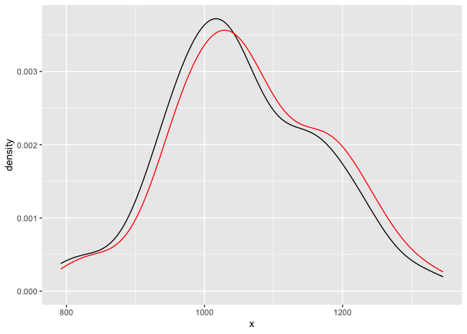
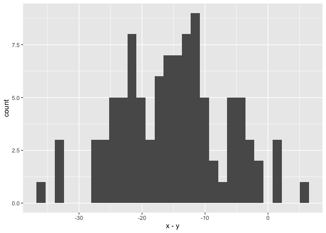
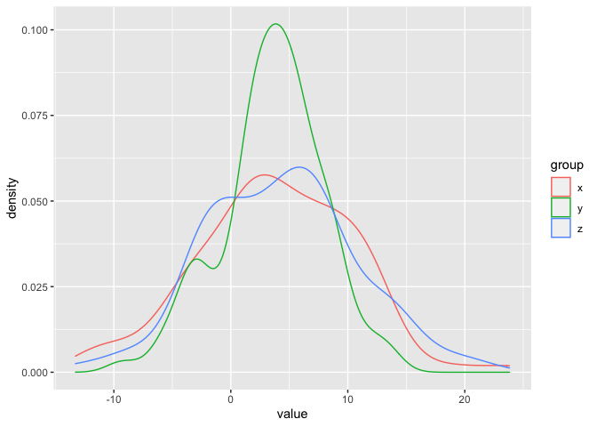

note09
================

# 9 일반 통계

## 9.1 데이터 요약

``` r
summary(cars)
```

    ##      speed           dist       
    ##  Min.   : 4.0   Min.   :  2.00  
    ##  1st Qu.:12.0   1st Qu.: 26.00  
    ##  Median :15.0   Median : 36.00  
    ##  Mean   :15.4   Mean   : 42.98  
    ##  3rd Qu.:19.0   3rd Qu.: 56.00  
    ##  Max.   :25.0   Max.   :120.00

``` r
sapply(as.list(cars), summary)
```

    ##         speed   dist
    ## Min.      4.0   2.00
    ## 1st Qu.  12.0  26.00
    ## Median   15.0  36.00
    ## Mean     15.4  42.98
    ## 3rd Qu.  19.0  56.00
    ## Max.     25.0 120.00

## 9.2 상대 빈도 계산

``` r
x <- rnorm(100)
mean(x > 0)
```

    ## [1] 0.55

## 9.3 요인을 도표화하고 분할표 만들기

``` r
set.seed(42)
initial <- factor(sample(c("Yes", "No", "Maybe"), 100, replace = TRUE))
outcome <- factor(sample(c("Pass", "Fail"), 100, replace = TRUE))
table(initial)
```

    ## initial
    ## Maybe    No   Yes 
    ##    21    39    40

``` r
table(outcome)
```

    ## outcome
    ## Fail Pass 
    ##   56   44

``` r
table(initial, outcome)
```

    ##        outcome
    ## initial Fail Pass
    ##   Maybe   12    9
    ##   No      22   17
    ##   Yes     22   18

``` r
xtabs(~ initial + outcome, data = data.frame(initial, outcome))
```

    ##        outcome
    ## initial Fail Pass
    ##   Maybe   12    9
    ##   No      22   17
    ##   Yes     22   18

## 9.4 독립성을 위한 범주형 변수 테스트

``` r
summary(table(initial, outcome))
```

    ## Number of cases in table: 100 
    ## Number of factors: 2 
    ## Test for independence of all factors:
    ##  Chisq = 0.030029, df = 2, p-value = 0.9851

## 9.5 데이터 세트의 분위수(및 사분위수) 계산

``` r
vec <- runif(1000)
quantile(vec, .05)
```

    ##         5% 
    ## 0.04138986

``` r
quantile(vec, c(.05, .95))
```

    ##         5%        95% 
    ## 0.04138986 0.94410831

``` r
quantile(vec)
```

    ##           0%          25%          50%          75%         100% 
    ## 0.0004050434 0.2243651351 0.4760676761 0.7441304817 0.9993790323

## 9.6 분위수 반전

``` r
mean(vec < 0.5)
```

    ## [1] 0.535

## 9.7 데이터를 z-점수로 변환

``` r
str(scale(x))
```

    ##  num [1:100, 1] -1.704 -0.683 -1.269 -0.771 0.208 ...
    ##  - attr(*, "scaled:center")= num 0.0702
    ##  - attr(*, "scaled:scale")= num 1.02

``` r
(x - mean(x)) / sd(x)
```

    ##   [1] -1.70364618 -0.68330815 -1.26940074 -0.77124945  0.20803892
    ##   [6]  1.32091707  1.44582714 -0.18291692 -1.28279125 -0.55436569
    ##  [11] -1.95847503  1.79749639 -0.19661381 -0.32822898 -1.41901797
    ##  [16] -1.76915736  0.64010298 -0.44008107  2.26158947 -0.65348646
    ##  [21]  1.87173856 -0.27441230  0.44261726  0.16676861  0.08896202
    ##  [26]  1.56018922  0.72205844 -1.83572142 -0.60832361  1.36873714
    ##  [31]  0.78719014  1.03369279  0.04252615  1.42539764 -0.17665633
    ##  [36]  1.11027758  0.26002038  0.66606212  1.05501682 -0.74890014
    ##  [41] -1.81182606 -0.03016073 -0.55428630 -0.21754310  0.91722315
    ##  [46] -0.57289894 -1.78511680 -1.07869252 -1.54106548  0.81014006
    ##  [51]  0.44164578 -1.36218546 -1.96814721 -0.36769797 -0.66234956
    ##  [56]  0.04581522  0.41029136  0.30964980  0.53493234  0.75821218
    ##  [61]  1.75372307 -0.83844641 -0.02013129 -0.46882140 -0.01616626
    ##  [66] -0.27955211 -0.05664122  1.47424011 -0.16678627  0.72324282
    ##  [71] -0.92482690  0.45855370  0.02146176 -0.62801012  0.61981713
    ##  [76]  0.43433545  0.62118968 -0.44301817 -0.84387753 -0.45337290
    ##  [81] -1.64761370  0.53305533 -0.78427085  1.41881875  0.05374516
    ##  [86]  0.19571168 -1.78428171  0.60930930 -0.22680783  0.03904009
    ##  [91]  0.59695847  1.03857198  1.06461216  0.02398705  2.35197001
    ##  [96] -0.31730712 -1.09734414  0.71264944  0.20684031  0.35102874

## 9.8 표본의 평균 검정(t 검정)

``` r
set.seed(100)
x <- rnorm(75, mean = 100, sd = 15)
t.test(x, mu = 95)
```

    ## 
    ##  One Sample t-test
    ## 
    ## data:  x
    ## t = 3.3396, df = 74, p-value = 0.001317
    ## alternative hypothesis: true mean is not equal to 95
    ## 95 percent confidence interval:
    ##   97.29249 104.07472
    ## sample estimates:
    ## mean of x 
    ##  100.6836

``` r
t.test(x, mu = 100)
```

    ## 
    ##  One Sample t-test
    ## 
    ## data:  x
    ## t = 0.40167, df = 74, p-value = 0.6891
    ## alternative hypothesis: true mean is not equal to 100
    ## 95 percent confidence interval:
    ##   97.29249 104.07472
    ## sample estimates:
    ## mean of x 
    ##  100.6836

## 9.9 평균에 대한 신뢰 구간 형성

``` r
t.test(x)
```

    ## 
    ##  One Sample t-test
    ## 
    ## data:  x
    ## t = 59.159, df = 74, p-value < 2.2e-16
    ## alternative hypothesis: true mean is not equal to 0
    ## 95 percent confidence interval:
    ##   97.29249 104.07472
    ## sample estimates:
    ## mean of x 
    ##  100.6836

``` r
t.test(x, conf.level = 0.99)
```

    ## 
    ##  One Sample t-test
    ## 
    ## data:  x
    ## t = 59.159, df = 74, p-value < 2.2e-16
    ## alternative hypothesis: true mean is not equal to 0
    ## 99 percent confidence interval:
    ##   96.18392 105.18329
    ## sample estimates:
    ## mean of x 
    ##  100.6836

## 9.10 중앙값에 대한 신뢰 구간 형성

``` r
wilcox.test(x, conf.int = TRUE)
```

    ## 
    ##  Wilcoxon signed rank test with continuity correction
    ## 
    ## data:  x
    ## V = 2850, p-value = 5.388e-14
    ## alternative hypothesis: true location is not equal to 0
    ## 95 percent confidence interval:
    ##   97.25891 103.69556
    ## sample estimates:
    ## (pseudo)median 
    ##       100.3401

``` r
median(x)
```

    ## [1] 99.56025

## 9.11 샘플 비율 테스트

컵스는 20경기를 치렀고 그 중 11경기를 이겼으며, 이는 전체 경기의
55%입니다. 그 증거를 바탕으로 팬은 컵스가 올해 경기의 절반 이상을 이길
것이라고 “매우 확신합니다”. 그가 그렇게 자신감이 있어야 합니까?

``` r
prop.test(11, 20, 0.5, alternative = "greater")
```

    ## 
    ##  1-sample proportions test with continuity correction
    ## 
    ## data:  11 out of 20, null probability 0.5
    ## X-squared = 0.05, df = 1, p-value = 0.4115
    ## alternative hypothesis: true p is greater than 0.5
    ## 95 percent confidence interval:
    ##  0.349615 1.000000
    ## sample estimates:
    ##    p 
    ## 0.55

## 9.12 비율에 대한 신뢰 구간 형성

``` r
prop.test(6, 9)
```

    ## Warning in prop.test(6, 9): Chi-squared approximation may be incorrect

    ## 
    ##  1-sample proportions test with continuity correction
    ## 
    ## data:  6 out of 9, null probability 0.5
    ## X-squared = 0.44444, df = 1, p-value = 0.505
    ## alternative hypothesis: true p is not equal to 0.5
    ## 95 percent confidence interval:
    ##  0.3091761 0.9095817
    ## sample estimates:
    ##         p 
    ## 0.6666667

``` r
prop.test(6, 9, conf.level = 0.99)
```

    ## Warning in prop.test(6, 9, conf.level = 0.99): Chi-squared approximation
    ## may be incorrect

    ## 
    ##  1-sample proportions test with continuity correction
    ## 
    ## data:  6 out of 9, null probability 0.5
    ## X-squared = 0.44444, df = 1, p-value = 0.505
    ## alternative hypothesis: true p is not equal to 0.5
    ## 99 percent confidence interval:
    ##  0.2429060 0.9345588
    ## sample estimates:
    ##         p 
    ## 0.6666667

## 9.13 정규성 테스트

``` r
x <- runif(100)
shapiro.test(x)
```

    ## 
    ##  Shapiro-Wilk normality test
    ## 
    ## data:  x
    ## W = 0.94958, p-value = 0.0007788

``` r
y <- rnorm(100)
shapiro.test(y)
```

    ## 
    ##  Shapiro-Wilk normality test
    ## 
    ## data:  y
    ## W = 0.98197, p-value = 0.1886

## 9.14 실행 테스트

``` r
s <- sample(c(0, 1), 100, replace = T)
tseries::runs.test(as.factor(s))
```

    ## Registered S3 method overwritten by 'quantmod':
    ##   method            from
    ##   as.zoo.data.frame zoo

    ## 
    ##  Runs Test
    ## 
    ## data:  as.factor(s)
    ## Standard Normal = -1.3933, p-value = 0.1635
    ## alternative hypothesis: two.sided

``` r
s <- c(0, 0, 0, 0, 1, 1, 1, 1, 0, 0, 0, 0)
tseries::runs.test(as.factor(s))
```

    ## 
    ##  Runs Test
    ## 
    ## data:  as.factor(s)
    ## Standard Normal = -2.2997, p-value = 0.02147
    ## alternative hypothesis: two.sided

## 9.15 두 표본의 평균 비교

``` r
load("./data/sat.rdata")
df <- data.frame(x, y)
```

``` r
library(ggplot2)
df |>
  ggplot() +
  geom_density(aes(x)) +
  geom_density(aes(y), color = "red")
```

<!-- -->

``` r
t.test(x, y)
```

    ## 
    ##  Welch Two Sample t-test
    ## 
    ## data:  x and y
    ## t = -0.95364, df = 197.97, p-value = 0.3414
    ## alternative hypothesis: true difference in means is not equal to 0
    ## 95 percent confidence interval:
    ##  -46.42359  16.15942
    ## sample estimates:
    ## mean of x mean of y 
    ##  1053.733  1068.865

``` r
df |>
  ggplot(aes(x - y)) +
  geom_histogram()
```

    ## `stat_bin()` using `bins = 30`. Pick better value with `binwidth`.

<!-- -->

``` r
t.test(x, y, paired = TRUE)
```

    ## 
    ##  Paired t-test
    ## 
    ## data:  x and y
    ## t = -18.08, df = 99, p-value < 2.2e-16
    ## alternative hypothesis: true mean difference is not equal to 0
    ## 95 percent confidence interval:
    ##  -16.79278 -13.47139
    ## sample estimates:
    ## mean difference 
    ##       -15.13208

## 9.16 두 표본의 위치를 비모수적으로 비교하기

``` r
load(file = "./data/workers.rdata")
wilcox.test(fav, unfav, paired = TRUE)
```

    ## 
    ##  Wilcoxon signed rank exact test
    ## 
    ## data:  fav and unfav
    ## V = 12, p-value = 0.0001335
    ## alternative hypothesis: true location shift is not equal to 0

## 9.17 유의미한 상관관계 테스트

``` r
x <- rnorm(20)
y <- rnorm(20)
cor(x, y)
```

    ## [1] 0.09565709

``` r
cor.test(x, y)
```

    ## 
    ##  Pearson's product-moment correlation
    ## 
    ## data:  x and y
    ## t = 0.40771, df = 18, p-value = 0.6883
    ## alternative hypothesis: true correlation is not equal to 0
    ## 95 percent confidence interval:
    ##  -0.3621955  0.5163218
    ## sample estimates:
    ##        cor 
    ## 0.09565709

``` r
cor.test(x, y, method = "spearman")
```

    ## 
    ##  Spearman's rank correlation rho
    ## 
    ## data:  x and y
    ## S = 1410, p-value = 0.8016
    ## alternative hypothesis: true rho is not equal to 0
    ## sample estimates:
    ##         rho 
    ## -0.06015038

## 9.18 동일한 비율에 대한 테스트 그룹

``` r
sucesses <- c(14, 10)
trials <- c(38, 40)
prop.test(sucesses, trials)
```

    ## 
    ##  2-sample test for equality of proportions with continuity
    ##  correction
    ## 
    ## data:  sucesses out of trials
    ## X-squared = 0.7872, df = 1, p-value = 0.3749
    ## alternative hypothesis: two.sided
    ## 95 percent confidence interval:
    ##  -0.1110245  0.3478666
    ## sample estimates:
    ##    prop 1    prop 2 
    ## 0.3684211 0.2500000

## 9.19 그룹 평균 간의 쌍별 비교 수행

``` r
freshmen <- c(1, 2, 1, 1, 5)
sophomores <- c(3, 2, 3, 3, 5)
juniors <- c(5, 3, 4, 3, 3)

comb <- stack(list(fresh = freshmen, soph = sophomores, jrs = juniors))
print(comb)
```

    ##    values   ind
    ## 1       1 fresh
    ## 2       2 fresh
    ## 3       1 fresh
    ## 4       1 fresh
    ## 5       5 fresh
    ## 6       3  soph
    ## 7       2  soph
    ## 8       3  soph
    ## 9       3  soph
    ## 10      5  soph
    ## 11      5   jrs
    ## 12      3   jrs
    ## 13      4   jrs
    ## 14      3   jrs
    ## 15      3   jrs

``` r
pairwise.t.test(comb$values, comb$ind)
```

    ## 
    ##  Pairwise comparisons using t tests with pooled SD 
    ## 
    ## data:  comb$values and comb$ind 
    ## 
    ##      fresh soph
    ## soph 0.33  -   
    ## jrs  0.22  0.63
    ## 
    ## P value adjustment method: holm

## 9.20 같은 분포에 대해 두 개의 표본 테스트하기

``` r
x <- rnorm(100, mean = 4, sd = 6)
y <- rnorm(100, mean = 4, sd = 4)
z <- rnorm(100, mean = 4, sd = 6)
```

``` r
ks.test(x, y)
```

    ## 
    ##  Asymptotic two-sample Kolmogorov-Smirnov test
    ## 
    ## data:  x and y
    ## D = 0.17, p-value = 0.1111
    ## alternative hypothesis: two-sided

``` r
ks.test(x, z)
```

    ## 
    ##  Asymptotic two-sample Kolmogorov-Smirnov test
    ## 
    ## data:  x and z
    ## D = 0.08, p-value = 0.9062
    ## alternative hypothesis: two-sided

``` r
rbind(
  data.frame(group = "x", value = x),
  data.frame(group = "y", value = y),
  data.frame(group = "z", value = z)
) |>
  ggplot(aes(value, color = group)) +
  geom_density()
```

<!-- -->
