note11
================

# 11 선형 회귀 및 분산 분석

## 11.1 단순 선형 회귀 수행하기

``` r
set.seed(42)
x <- rnorm(100)
e <- rnorm(100, mean = 0, sd = 5)
y <- 5 + 15 * x + e

lm(y ~ x)
```

    ## 
    ## Call:
    ## lm(formula = y ~ x)
    ## 
    ## Coefficients:
    ## (Intercept)            x  
    ##       4.558       15.136

``` r
df <- data.frame(x, y)
lm(y ~ x, data = df)
```

    ## 
    ## Call:
    ## lm(formula = y ~ x, data = df)
    ## 
    ## Coefficients:
    ## (Intercept)            x  
    ##       4.558       15.136

## 11.2 다중 선형 회귀 수행하기

``` r
set.seed(42)
u <- rnorm(100)
v <- rnorm(100, mean = 3, sd = 2)
w <- rnorm(100, mean = -3, sd = 1)
e <- rnorm(100, mean = 0, sd = 3)
y <- 5 + 4 * u + 3 * v + 2 * w + e
```

``` r
lm(y ~ u + v + w)
```

    ## 
    ## Call:
    ## lm(formula = y ~ u + v + w)
    ## 
    ## Coefficients:
    ## (Intercept)            u            v            w  
    ##       4.770        4.173        3.013        1.905

``` r
df <- data.frame(y, u, v, w)
lm(y ~ u + v + w, data = df)
```

    ## 
    ## Call:
    ## lm(formula = y ~ u + v + w, data = df)
    ## 
    ## Coefficients:
    ## (Intercept)            u            v            w  
    ##       4.770        4.173        3.013        1.905

## 11.3 회귀 통계 얻기

``` r
m <- lm(y ~ u + v + w)
summary(m)
```

    ## 
    ## Call:
    ## lm(formula = y ~ u + v + w)
    ## 
    ## Residuals:
    ##     Min      1Q  Median      3Q     Max 
    ## -5.3832 -1.7601 -0.3115  1.8565  6.9840 
    ## 
    ## Coefficients:
    ##             Estimate Std. Error t value Pr(>|t|)    
    ## (Intercept)   4.7703     0.9691   4.922 3.55e-06 ***
    ## u             4.1733     0.2597  16.069  < 2e-16 ***
    ## v             3.0132     0.1484  20.311  < 2e-16 ***
    ## w             1.9052     0.2665   7.150 1.71e-10 ***
    ## ---
    ## Signif. codes:  0 '***' 0.001 '**' 0.01 '*' 0.05 '.' 0.1 ' ' 1
    ## 
    ## Residual standard error: 2.66 on 96 degrees of freedom
    ## Multiple R-squared:  0.8851, Adjusted R-squared:  0.8815 
    ## F-statistic: 246.6 on 3 and 96 DF,  p-value: < 2.2e-16

``` r
coef(m)
```

    ## (Intercept)           u           v           w 
    ##    4.770280    4.173262    3.013244    1.905167

``` r
confint(m)
```

    ##                2.5 %   97.5 %
    ## (Intercept) 2.846622 6.693939
    ## u           3.657753 4.688771
    ## v           2.718762 3.307726
    ## w           1.376234 2.434101

``` r
resid(m)
```

    ##           1           2           3           4           5           6 
    ## -0.56747105  2.28803716  0.09719916  2.14740500 -0.71688199 -0.36171794 
    ##           7           8           9          10          11          12 
    ##  1.03495927  2.80400382 -4.24963443 -0.20484262 -0.64673080 -2.57715137 
    ##          13          14          15          16          17          18 
    ## -2.93387274 -1.93302285  1.78001250 -1.43998837 -2.39887037  0.92448198 
    ##          19          20          21          22          23          24 
    ## -3.36631495  2.68902334 -1.41903066  0.78712300  0.03550952 -0.38058349 
    ##          25          26          27          28          29          30 
    ##  5.04594297 -2.50106882  3.45163338  0.33710226 -2.70985131 -0.07610591 
    ##          31          32          33          34          35          36 
    ##  2.02608607 -1.39023547 -2.70405128  0.39534037  2.72010944 -0.02540898 
    ##          37          38          39          40          41          42 
    ## -3.98866378 -3.90109157 -1.94580315 -1.77007062 -0.26135548  2.09770391 
    ##          43          44          45          46          47          48 
    ## -1.39859792 -3.19102607  1.84391208  0.82178224  3.62728794 -5.38322002 
    ##          49          50          51          52          53          54 
    ##  0.29046722  3.78783896  1.91936090 -2.41061043  1.68549007 -2.79641208 
    ##          55          56          57          58          59          60 
    ## -1.33479747  3.35493092 -1.15246322  2.40117746 -0.53197500 -4.94341180 
    ##          61          62          63          64          65          66 
    ## -2.48991423 -3.27182922 -1.61611118 -1.51194409 -0.44932034 -0.98689884 
    ##          67          68          69          70          71          72 
    ##  5.62731823 -4.46257657 -1.75679992  0.80989421  5.03204632  0.16886524 
    ##          73          74          75          76          77          78 
    ##  3.57606086 -4.86679075  4.27809940 -2.13863250 -0.97390956 -3.63799681 
    ##          79          80          81          82          83          84 
    ##  0.57878900  5.56644767  6.98402323 -3.51188419  1.28423254  4.14446484 
    ##          85          86          87          88          89          90 
    ## -0.46300546 -0.78667310 -0.75653327  1.63836456  3.75781677  1.89415984 
    ##          91          92          93          94          95          96 
    ##  0.55421813 -0.86617701  1.20412400 -1.74009673 -0.72614713  3.27014630 
    ##          97          98          99         100 
    ##  1.40115444  0.94762951 -0.91404098  2.42783988

``` r
deviance(m)
```

    ## [1] 679.3473

``` r
anova(m)
```

    ## Analysis of Variance Table
    ## 
    ## Response: y
    ##           Df  Sum Sq Mean Sq F value    Pr(>F)    
    ## u          1 1776.24 1776.24 251.005 < 2.2e-16 ***
    ## v          1 3097.08 3097.08 437.655 < 2.2e-16 ***
    ## w          1  361.74  361.74  51.118 1.707e-10 ***
    ## Residuals 96  679.35    7.08                      
    ## ---
    ## Signif. codes:  0 '***' 0.001 '**' 0.01 '*' 0.05 '.' 0.1 ' ' 1

``` r
vcov(m)
```

    ##             (Intercept)            u            v            w
    ## (Intercept)  0.93916517  0.033111865 -0.071239444  0.221973747
    ## u            0.03311187  0.067446266 -0.001623653  0.010204066
    ## v           -0.07123944 -0.001623653  0.022009122 -0.003028118
    ## w            0.22197375  0.010204066 -0.003028118  0.071004935

``` r
summary(m)
```

    ## 
    ## Call:
    ## lm(formula = y ~ u + v + w)
    ## 
    ## Residuals:
    ##     Min      1Q  Median      3Q     Max 
    ## -5.3832 -1.7601 -0.3115  1.8565  6.9840 
    ## 
    ## Coefficients:
    ##             Estimate Std. Error t value Pr(>|t|)    
    ## (Intercept)   4.7703     0.9691   4.922 3.55e-06 ***
    ## u             4.1733     0.2597  16.069  < 2e-16 ***
    ## v             3.0132     0.1484  20.311  < 2e-16 ***
    ## w             1.9052     0.2665   7.150 1.71e-10 ***
    ## ---
    ## Signif. codes:  0 '***' 0.001 '**' 0.01 '*' 0.05 '.' 0.1 ' ' 1
    ## 
    ## Residual standard error: 2.66 on 96 degrees of freedom
    ## Multiple R-squared:  0.8851, Adjusted R-squared:  0.8815 
    ## F-statistic: 246.6 on 3 and 96 DF,  p-value: < 2.2e-16

## 11.4 회귀 요약의 이해

``` r
summary(m)$call
```

    ## lm(formula = y ~ u + v + w)

## 11.5 절편 없이 선형 회귀 수행하기

``` r
m2 <- lm(y ~ x + 0)
summary(m2)
```

    ## 
    ## Call:
    ## lm(formula = y ~ x + 0)
    ## 
    ## Residuals:
    ##    Min     1Q Median     3Q    Max 
    ## -4.000  2.718  6.288 11.608 28.442 
    ## 
    ## Coefficients:
    ##   Estimate Std. Error t value Pr(>|t|)    
    ## x   4.2960     0.9614   4.468  2.1e-05 ***
    ## ---
    ## Signif. codes:  0 '***' 0.001 '**' 0.01 '*' 0.05 '.' 0.1 ' ' 1
    ## 
    ## Residual standard error: 9.967 on 99 degrees of freedom
    ## Multiple R-squared:  0.1678, Adjusted R-squared:  0.1594 
    ## F-statistic: 19.97 on 1 and 99 DF,  p-value: 2.099e-05

``` r
confint(m2)
```

    ##      2.5 %   97.5 %
    ## x 2.388318 6.203734

## 11.6 종속 변수와 상관관계가 높은 변수만 회귀

``` r
library(tidyverse)
load("./data/pred.rdata")
best_pred <-
  pred %>%
  select(-resp) %>%
  map_dbl(cor, y = pred$resp) %>%
  sort(decreasing = TRUE) %>%
  .[1:4] %>%
  names() %>%
  pred[.]
```

``` r
mod <- lm(pred$resp ~ as.matrix(best_pred))
summary(mod)
```

    ## 
    ## Call:
    ## lm(formula = pred$resp ~ as.matrix(best_pred))
    ## 
    ## Residuals:
    ##     Min      1Q  Median      3Q     Max 
    ## -1.4848 -0.6191  0.1893  0.5623  1.3979 
    ## 
    ## Coefficients:
    ##                           Estimate Std. Error t value Pr(>|t|)   
    ## (Intercept)                 1.1167     0.3404   3.281  0.00505 **
    ## as.matrix(best_pred)pred4   0.5230     0.2066   2.531  0.02305 * 
    ## as.matrix(best_pred)pred3  -0.6928     0.8698  -0.796  0.43819   
    ## as.matrix(best_pred)pred6   1.1598     0.6817   1.701  0.10953   
    ## as.matrix(best_pred)pred1   0.3426     0.3589   0.955  0.35494   
    ## ---
    ## Signif. codes:  0 '***' 0.001 '**' 0.01 '*' 0.05 '.' 0.1 ' ' 1
    ## 
    ## Residual standard error: 0.9269 on 15 degrees of freedom
    ## Multiple R-squared:  0.838,  Adjusted R-squared:  0.7948 
    ## F-statistic:  19.4 on 4 and 15 DF,  p-value: 8.586e-06

## 11.7 상호작용 항으로 선형 회귀 수행하기

## 11.8 최상의 회귀 변수 선택

``` r
set.seed(4)
n <- 150
x1 <- rnorm(n)
x2 <- rnorm(n, 1, 2)
x3 <- rnorm(n, 3, 1)
x4 <- rnorm(n, -2, 2)
e <- rnorm(n, 0, 3)
y <- 4 + x1 + 5 * x3 + e
```

``` r
full.model <- lm(y ~ x1 + x2 + x3 + x4)
summary(full.model)
```

    ## 
    ## Call:
    ## lm(formula = y ~ x1 + x2 + x3 + x4)
    ## 
    ## Residuals:
    ##     Min      1Q  Median      3Q     Max 
    ## -8.0321 -1.7739  0.1579  2.0325  6.6264 
    ## 
    ## Coefficients:
    ##              Estimate Std. Error t value Pr(>|t|)    
    ## (Intercept)  3.402245   0.807665   4.212 4.42e-05 ***
    ## x1           0.539366   0.259346   2.080   0.0393 *  
    ## x2           0.168305   0.122915   1.369   0.1730    
    ## x3           5.174102   0.239831  21.574  < 2e-16 ***
    ## x4          -0.009818   0.129541  -0.076   0.9397    
    ## ---
    ## Signif. codes:  0 '***' 0.001 '**' 0.01 '*' 0.05 '.' 0.1 ' ' 1
    ## 
    ## Residual standard error: 2.924 on 145 degrees of freedom
    ## Multiple R-squared:  0.7696, Adjusted R-squared:  0.7633 
    ## F-statistic: 121.1 on 4 and 145 DF,  p-value: < 2.2e-16

``` r
reduced.model <- step(full.model, direction = "backward")
```

    ## Start:  AIC=326.79
    ## y ~ x1 + x2 + x3 + x4
    ## 
    ##        Df Sum of Sq    RSS    AIC
    ## - x4    1       0.0 1239.7 324.80
    ## - x2    1      16.0 1255.7 326.72
    ## <none>              1239.6 326.79
    ## - x1    1      37.0 1276.6 329.20
    ## - x3    1    3979.1 5218.7 540.41
    ## 
    ## Step:  AIC=324.8
    ## y ~ x1 + x2 + x3
    ## 
    ##        Df Sum of Sq    RSS    AIC
    ## - x2    1      16.1 1255.8 324.73
    ## <none>              1239.7 324.80
    ## - x1    1      37.2 1276.9 327.23
    ## - x3    1    3988.3 5227.9 538.67
    ## 
    ## Step:  AIC=324.73
    ## y ~ x1 + x3
    ## 
    ##        Df Sum of Sq    RSS    AIC
    ## <none>              1255.8 324.73
    ## - x1    1      44.5 1300.3 327.95
    ## - x3    1    3974.0 5229.8 536.72

``` r
summary(reduced.model)
```

    ## 
    ## Call:
    ## lm(formula = y ~ x1 + x3)
    ## 
    ## Residuals:
    ##     Min      1Q  Median      3Q     Max 
    ## -8.1478 -1.8497 -0.0554  2.0257  6.5499 
    ## 
    ## Coefficients:
    ##             Estimate Std. Error t value Pr(>|t|)    
    ## (Intercept)   3.6481     0.7510   4.857 3.01e-06 ***
    ## x1            0.5824     0.2552   2.282   0.0239 *  
    ## x3            5.1469     0.2386  21.568  < 2e-16 ***
    ## ---
    ## Signif. codes:  0 '***' 0.001 '**' 0.01 '*' 0.05 '.' 0.1 ' ' 1
    ## 
    ## Residual standard error: 2.923 on 147 degrees of freedom
    ## Multiple R-squared:  0.7666, Adjusted R-squared:  0.7635 
    ## F-statistic: 241.5 on 2 and 147 DF,  p-value: < 2.2e-16

``` r
min.model <- lm(y ~ 1)
fwd.model <- step(
  min.model,
  direction = "forward",
  scope = (~ x1 + x2 + x3 + x4),
  trace = 0
)
summary(fwd.model)
```

    ## 
    ## Call:
    ## lm(formula = y ~ x3 + x1)
    ## 
    ## Residuals:
    ##     Min      1Q  Median      3Q     Max 
    ## -8.1478 -1.8497 -0.0554  2.0257  6.5499 
    ## 
    ## Coefficients:
    ##             Estimate Std. Error t value Pr(>|t|)    
    ## (Intercept)   3.6481     0.7510   4.857 3.01e-06 ***
    ## x3            5.1469     0.2386  21.568  < 2e-16 ***
    ## x1            0.5824     0.2552   2.282   0.0239 *  
    ## ---
    ## Signif. codes:  0 '***' 0.001 '**' 0.01 '*' 0.05 '.' 0.1 ' ' 1
    ## 
    ## Residual standard error: 2.923 on 147 degrees of freedom
    ## Multiple R-squared:  0.7666, Adjusted R-squared:  0.7635 
    ## F-statistic: 241.5 on 2 and 147 DF,  p-value: < 2.2e-16

``` r
full.model <- lm(y ~ (x1 + x2 + x3 + x4)^4)
summary(full.model)
```

    ## 
    ## Call:
    ## lm(formula = y ~ (x1 + x2 + x3 + x4)^4)
    ## 
    ## Residuals:
    ##     Min      1Q  Median      3Q     Max 
    ## -7.3916 -1.6768  0.1092  2.1712  6.7658 
    ## 
    ## Coefficients:
    ##              Estimate Std. Error t value Pr(>|t|)    
    ## (Intercept)  3.335443   1.465130   2.277   0.0244 *  
    ## x1           1.348277   1.716890   0.785   0.4337    
    ## x2           0.186064   0.853302   0.218   0.8277    
    ## x3           5.160005   0.481352  10.720   <2e-16 ***
    ## x4          -0.027128   0.595320  -0.046   0.9637    
    ## x1:x2       -0.112337   1.176877  -0.095   0.9241    
    ## x1:x3       -0.288803   0.544249  -0.531   0.5965    
    ## x1:x4        0.550244   0.672988   0.818   0.4150    
    ## x2:x3       -0.102032   0.279249  -0.365   0.7154    
    ## x2:x4        0.017228   0.294717   0.058   0.9535    
    ## x3:x4       -0.005444   0.188148  -0.029   0.9770    
    ## x1:x2:x3     0.229918   0.361314   0.636   0.5256    
    ## x1:x2:x4     0.155655   0.452621   0.344   0.7315    
    ## x1:x3:x4    -0.186838   0.213374  -0.876   0.3828    
    ## x2:x3:x4    -0.027853   0.094319  -0.295   0.7682    
    ## x1:x2:x3:x4 -0.008510   0.138837  -0.061   0.9512    
    ## ---
    ## Signif. codes:  0 '***' 0.001 '**' 0.01 '*' 0.05 '.' 0.1 ' ' 1
    ## 
    ## Residual standard error: 2.923 on 134 degrees of freedom
    ## Multiple R-squared:  0.7872, Adjusted R-squared:  0.7634 
    ## F-statistic: 33.04 on 15 and 134 DF,  p-value: < 2.2e-16

``` r
reduced.model <- step(full.model, direction = "backward")
```

    ## Start:  AIC=336.9
    ## y ~ (x1 + x2 + x3 + x4)^4
    ## 
    ##               Df Sum of Sq    RSS    AIC
    ## - x1:x2:x3:x4  1  0.032108 1145.2 334.91
    ## <none>                     1145.2 336.90
    ## 
    ## Step:  AIC=334.91
    ## y ~ x1 + x2 + x3 + x4 + x1:x2 + x1:x3 + x1:x4 + x2:x3 + x2:x4 + 
    ##     x3:x4 + x1:x2:x3 + x1:x2:x4 + x1:x3:x4 + x2:x3:x4
    ## 
    ##            Df Sum of Sq    RSS    AIC
    ## - x2:x3:x4  1    0.7569 1146.0 333.01
    ## - x1:x3:x4  1    8.3683 1153.6 334.00
    ## <none>                  1145.2 334.91
    ## - x1:x2:x4  1   20.9535 1166.2 335.63
    ## - x1:x2:x3  1   25.1802 1170.4 336.17
    ## 
    ## Step:  AIC=333.01
    ## y ~ x1 + x2 + x3 + x4 + x1:x2 + x1:x3 + x1:x4 + x2:x3 + x2:x4 + 
    ##     x3:x4 + x1:x2:x3 + x1:x2:x4 + x1:x3:x4
    ## 
    ##            Df Sum of Sq    RSS    AIC
    ## - x1:x3:x4  1    8.7393 1154.7 332.15
    ## <none>                  1146.0 333.01
    ## - x1:x2:x4  1   21.7159 1167.7 333.82
    ## - x1:x2:x3  1   26.5070 1172.5 334.44
    ## 
    ## Step:  AIC=332.15
    ## y ~ x1 + x2 + x3 + x4 + x1:x2 + x1:x3 + x1:x4 + x2:x3 + x2:x4 + 
    ##     x3:x4 + x1:x2:x3 + x1:x2:x4
    ## 
    ##            Df Sum of Sq    RSS    AIC
    ## - x3:x4     1    0.2881 1155.0 330.19
    ## <none>                  1154.7 332.15
    ## - x1:x2:x4  1   23.2394 1178.0 333.14
    ## - x1:x2:x3  1   31.1139 1185.8 334.14
    ## 
    ## Step:  AIC=330.19
    ## y ~ x1 + x2 + x3 + x4 + x1:x2 + x1:x3 + x1:x4 + x2:x3 + x2:x4 + 
    ##     x1:x2:x3 + x1:x2:x4
    ## 
    ##            Df Sum of Sq    RSS    AIC
    ## <none>                  1155.0 330.19
    ## - x1:x2:x4  1    23.358 1178.4 331.19
    ## - x1:x2:x3  1    31.520 1186.5 332.22

``` r
summary(reduced.model)
```

    ## 
    ## Call:
    ## lm(formula = y ~ x1 + x2 + x3 + x4 + x1:x2 + x1:x3 + x1:x4 + 
    ##     x2:x3 + x2:x4 + x1:x2:x3 + x1:x2:x4)
    ## 
    ## Residuals:
    ##    Min     1Q Median     3Q    Max 
    ## -7.933 -1.770  0.157  2.220  6.823 
    ## 
    ## Coefficients:
    ##             Estimate Std. Error t value Pr(>|t|)    
    ## (Intercept)  3.27344    0.88242   3.710   0.0003 ***
    ## x1           0.13632    0.94325   0.145   0.8853    
    ## x2          -0.04601    0.43371  -0.106   0.9157    
    ## x3           5.18404    0.27093  19.134   <2e-16 ***
    ## x4          -0.03134    0.15519  -0.202   0.8402    
    ## x1:x2       -0.22227    0.45474  -0.489   0.6258    
    ## x1:x3        0.11347    0.28704   0.395   0.6932    
    ## x1:x4       -0.01450    0.14950  -0.097   0.9229    
    ## x2:x3       -0.02440    0.13040  -0.187   0.8519    
    ## x2:x4       -0.06272    0.07980  -0.786   0.4332    
    ## x1:x2:x3     0.27541    0.14192   1.941   0.0543 .  
    ## x1:x2:x4     0.13491    0.08075   1.671   0.0971 .  
    ## ---
    ## Signif. codes:  0 '***' 0.001 '**' 0.01 '*' 0.05 '.' 0.1 ' ' 1
    ## 
    ## Residual standard error: 2.893 on 138 degrees of freedom
    ## Multiple R-squared:  0.7854, Adjusted R-squared:  0.7682 
    ## F-statistic:  45.9 on 11 and 138 DF,  p-value: < 2.2e-16

## 11.9 데이터의 하위 집합에 대한 회귀

``` r
n <- 1000
x <- rnorm(n)
e <- rnorm(n, 0, .5)
y <- 3 + 2 * x + e
lm(y ~ x, subset = 1:500)
```

    ## 
    ## Call:
    ## lm(formula = y ~ x, subset = 1:500)
    ## 
    ## Coefficients:
    ## (Intercept)            x  
    ##       2.999        1.996

``` r
lm(y ~ x, subset = 1:floor(length(x) / 2))
```

    ## 
    ## Call:
    ## lm(formula = y ~ x, subset = 1:floor(length(x)/2))
    ## 
    ## Coefficients:
    ## (Intercept)            x  
    ##       2.999        1.996

``` r
load("./data/lab_df.rdata")
lm(y ~ x, data = lab_df, subset = (lab == "NJ"))
```

    ## 
    ## Call:
    ## lm(formula = y ~ x, data = lab_df, subset = (lab == "NJ"))
    ## 
    ## Coefficients:
    ## (Intercept)            x  
    ##       2.582        5.025

## 11.10 회귀 공식 내에서 표현식 사용하기

``` r
load("./data/df_squared.rdata")
m <- lm(y ~ u + I(u^2), data = df_squared)
predict(m, newdata = data.frame(u = 13.4))
```

    ##        1 
    ## 877.1426

## 11.11 다항식 회귀

``` r
m <- lm(y ~ poly(x, 3, raw = TRUE))
summary(m)
```

    ## 
    ## Call:
    ## lm(formula = y ~ poly(x, 3, raw = TRUE))
    ## 
    ## Residuals:
    ##      Min       1Q   Median       3Q      Max 
    ## -1.32996 -0.33679 -0.00486  0.34430  1.57218 
    ## 
    ## Coefficients:
    ##                         Estimate Std. Error t value Pr(>|t|)    
    ## (Intercept)             3.012843   0.019532 154.248   <2e-16 ***
    ## poly(x, 3, raw = TRUE)1 2.003017   0.026323  76.095   <2e-16 ***
    ## poly(x, 3, raw = TRUE)2 0.004027   0.011734   0.343    0.732    
    ## poly(x, 3, raw = TRUE)3 0.005733   0.007261   0.790    0.430    
    ## ---
    ## Signif. codes:  0 '***' 0.001 '**' 0.01 '*' 0.05 '.' 0.1 ' ' 1
    ## 
    ## Residual standard error: 0.5009 on 996 degrees of freedom
    ## Multiple R-squared:  0.9409, Adjusted R-squared:  0.9408 
    ## F-statistic:  5288 on 3 and 996 DF,  p-value: < 2.2e-16

``` r
summary(lm(y ~ x + I(x^2) + I(x^3)))
```

    ## 
    ## Call:
    ## lm(formula = y ~ x + I(x^2) + I(x^3))
    ## 
    ## Residuals:
    ##      Min       1Q   Median       3Q      Max 
    ## -1.32996 -0.33679 -0.00486  0.34430  1.57218 
    ## 
    ## Coefficients:
    ##             Estimate Std. Error t value Pr(>|t|)    
    ## (Intercept) 3.012843   0.019532 154.248   <2e-16 ***
    ## x           2.003017   0.026323  76.095   <2e-16 ***
    ## I(x^2)      0.004027   0.011734   0.343    0.732    
    ## I(x^3)      0.005733   0.007261   0.790    0.430    
    ## ---
    ## Signif. codes:  0 '***' 0.001 '**' 0.01 '*' 0.05 '.' 0.1 ' ' 1
    ## 
    ## Residual standard error: 0.5009 on 996 degrees of freedom
    ## Multiple R-squared:  0.9409, Adjusted R-squared:  0.9408 
    ## F-statistic:  5288 on 3 and 996 DF,  p-value: < 2.2e-16

## 11.12 변환된 데이터에 대한 회귀

``` r
load("./data/df_decay.rdata")
z <- df_decay$z
t <- df_decay$time

plot(t, z)
```

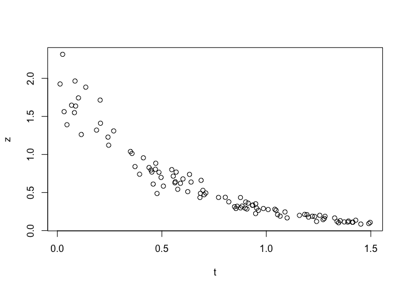<!-- -->

``` r
plot(t, log(z))
```

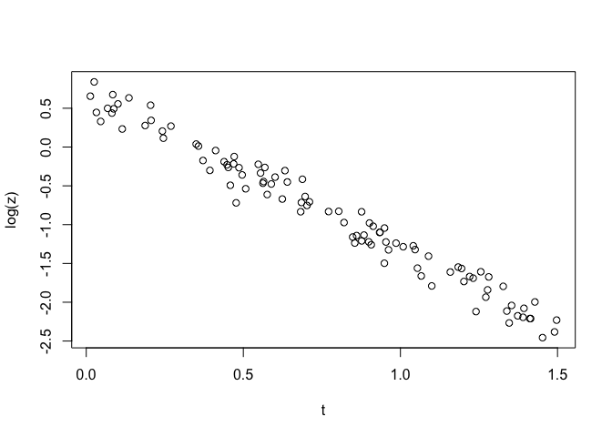<!-- -->

``` r
m <- lm(log(z) ~ t)
summary(m)
```

    ## 
    ## Call:
    ## lm(formula = log(z) ~ t)
    ## 
    ## Residuals:
    ##      Min       1Q   Median       3Q      Max 
    ## -0.44790 -0.09926  0.00487  0.09784  0.28022 
    ## 
    ## Coefficients:
    ##             Estimate Std. Error t value Pr(>|t|)    
    ## (Intercept)  0.68868    0.03065   22.47   <2e-16 ***
    ## t           -2.01179    0.03513  -57.27   <2e-16 ***
    ## ---
    ## Signif. codes:  0 '***' 0.001 '**' 0.01 '*' 0.05 '.' 0.1 ' ' 1
    ## 
    ## Residual standard error: 0.148 on 98 degrees of freedom
    ## Multiple R-squared:  0.971,  Adjusted R-squared:  0.9707 
    ## F-statistic:  3280 on 1 and 98 DF,  p-value: < 2.2e-16

## 11.13 최적의 전력 변환 찾기(Box-Cox 절차)

``` r
library(MASS)
```

    ## 
    ## Attaching package: 'MASS'

    ## The following object is masked from 'package:patchwork':
    ## 
    ##     area

    ## The following object is masked from 'package:dplyr':
    ## 
    ##     select

``` r
set.seed(9)
x <- 10:100
eps <- rnorm(length(x), sd = 5)
y <- (x + eps)^(-1 / 1.5)
```

``` r
plot(x, y)
```

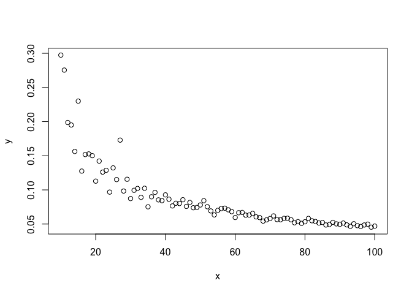<!-- -->

``` r
m <- lm(y ~ x)
summary(m)
```

    ## 
    ## Call:
    ## lm(formula = y ~ x)
    ## 
    ## Residuals:
    ##       Min        1Q    Median        3Q       Max 
    ## -0.040315 -0.016332 -0.007921  0.009962  0.145160 
    ## 
    ## Coefficients:
    ##               Estimate Std. Error t value Pr(>|t|)    
    ## (Intercept)  0.1668848  0.0070779   23.58   <2e-16 ***
    ## x           -0.0014653  0.0001161  -12.62   <2e-16 ***
    ## ---
    ## Signif. codes:  0 '***' 0.001 '**' 0.01 '*' 0.05 '.' 0.1 ' ' 1
    ## 
    ## Residual standard error: 0.0291 on 89 degrees of freedom
    ## Multiple R-squared:  0.6414, Adjusted R-squared:  0.6374 
    ## F-statistic: 159.2 on 1 and 89 DF,  p-value: < 2.2e-16

``` r
library(broom)
augmented_m <- augment(m)
augmented_m %>%
  ggplot(aes(.fitted, .resid)) +
  geom_point()
```

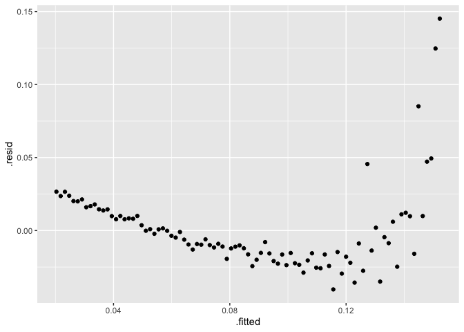<!-- -->

``` r
plot(m)
```

<!-- -->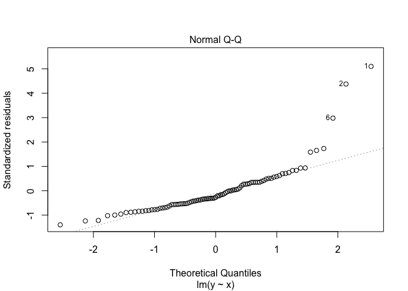<!-- -->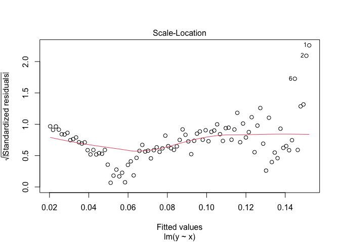<!-- -->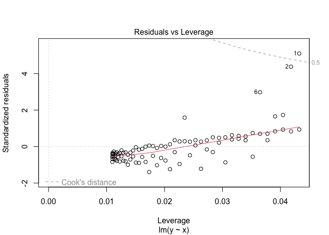<!-- -->

``` r
plot(m, which = 1)
```

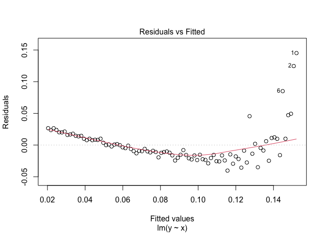<!-- -->

``` r
library(MASS)
bc <- boxcox(m)
```

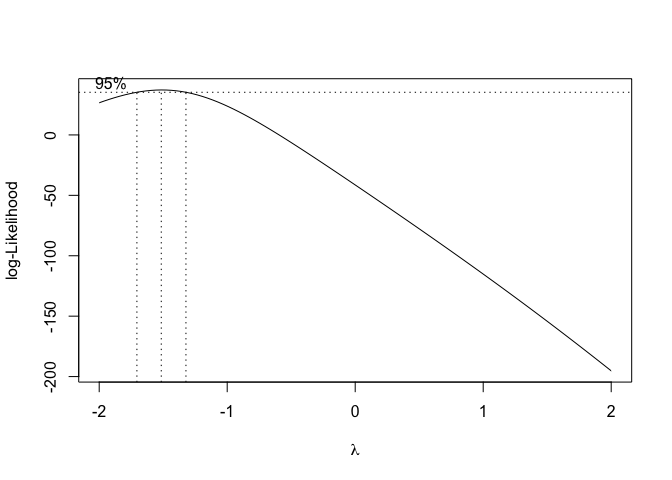<!-- -->

``` r
lambda <- bc$x[which.max(bc$y)]
lambda
```

    ## [1] -1.515152

``` r
z <- y^lambda
m2 <- lm(z ~ x)
summary(m2)
```

    ## 
    ## Call:
    ## lm(formula = z ~ x)
    ## 
    ## Residuals:
    ##      Min       1Q   Median       3Q      Max 
    ## -13.4589  -3.7111  -0.2282   2.2061  14.1882 
    ## 
    ## Coefficients:
    ##             Estimate Std. Error t value Pr(>|t|)    
    ## (Intercept) -0.64263    1.25167  -0.513    0.609    
    ## x            1.05140    0.02054  51.199   <2e-16 ***
    ## ---
    ## Signif. codes:  0 '***' 0.001 '**' 0.01 '*' 0.05 '.' 0.1 ' ' 1
    ## 
    ## Residual standard error: 5.146 on 89 degrees of freedom
    ## Multiple R-squared:  0.9672, Adjusted R-squared:  0.9668 
    ## F-statistic:  2621 on 1 and 89 DF,  p-value: < 2.2e-16

``` r
m2 <- lm(I(y^lambda) ~ x)
```

``` r
augmented_m2 <- augment(m2)
augmented_m2 %>%
  ggplot(aes(.fitted, .resid)) +
  geom_point()
```

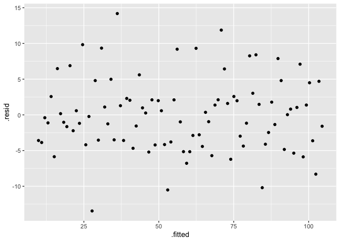<!-- -->

## 11.14 회귀 계수에 대한 신뢰 구간 형성

``` r
load("./data/conf.rdata")
m <- lm(y ~ x1 + x2)
confint(m)
```

    ##                 2.5 %   97.5 %
    ## (Intercept) -3.900153 6.467837
    ## x1          -2.577005 6.242123
    ## x2           4.666749 5.168024

``` r
confint(m, level = 0.99)
```

    ##                 0.5 %   99.5 %
    ## (Intercept) -5.716350 8.284034
    ## x1          -4.121882 7.787000
    ## x2           4.578939 5.255834

## 11.15 회귀 잔차 플로팅

``` r
m <- lm(y ~ x1 + x2)
augmented_m <- augment(m)
augmented_m %>%
  ggplot(aes(.fitted, .resid)) +
  geom_point()
```

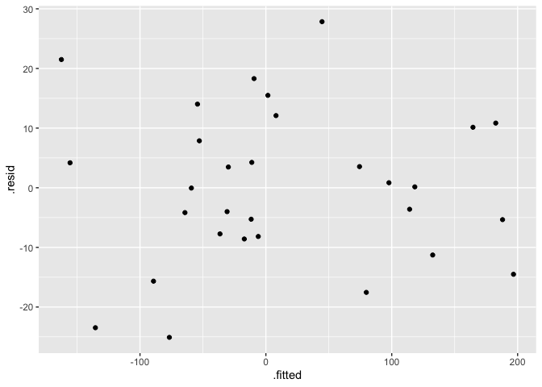<!-- -->

## 11.16 선형 회귀 진단하기

``` r
m <- lm(y ~ x1 + x2)
plot(m)
```

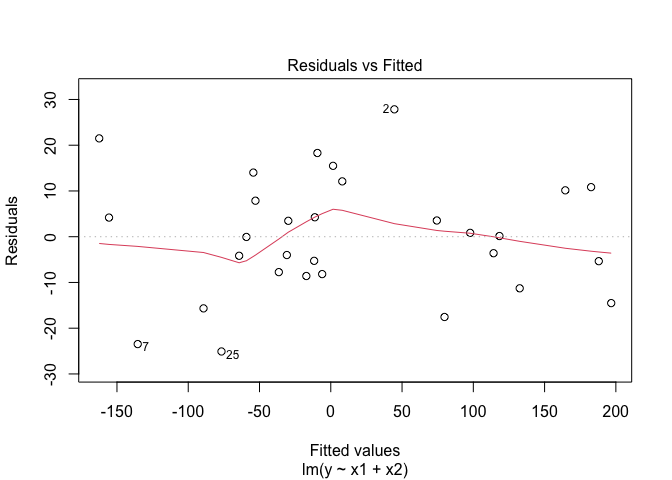<!-- -->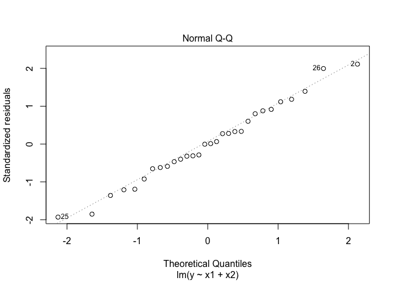<!-- -->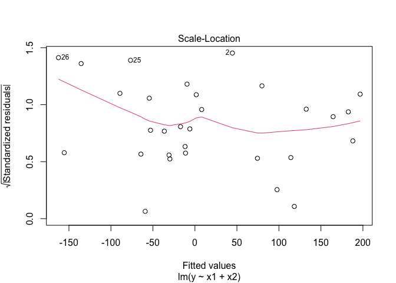<!-- -->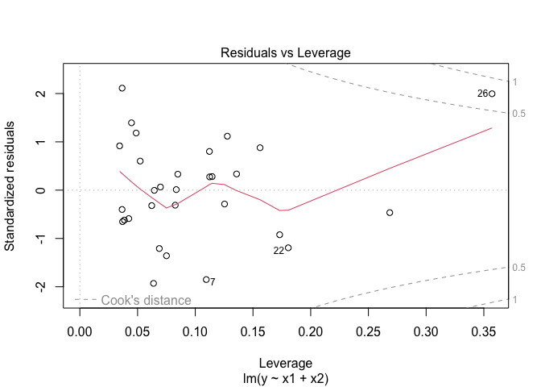<!-- -->

``` r
car::outlierTest(m)
```

    ## No Studentized residuals with Bonferroni p < 0.05
    ## Largest |rstudent|:
    ##   rstudent unadjusted p-value Bonferroni p
    ## 2 2.267887           0.031878      0.95633

``` r
par(mfrow = c(2, 2))
plot(m)
```

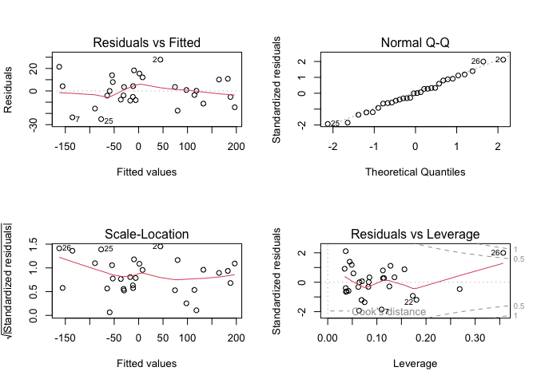<!-- -->

``` r
load(file = "./data/bad.rdata")
m <- lm(y2 ~ x3 + x4)
par(mfrow = (c(2, 2))) # this gives us a 2x2 plot
plot(m)
```

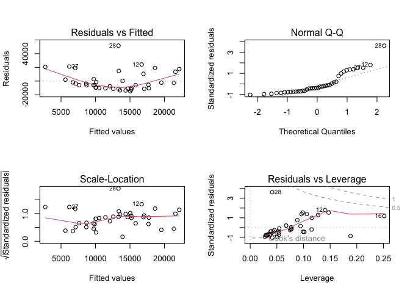<!-- -->

``` r
car::outlierTest(m)
```

    ##    rstudent unadjusted p-value Bonferroni p
    ## 28 4.458436         7.7554e-05    0.0031022

## 11.17 영향력 있는 관찰 식별

``` r
influence.measures(m)
```

    ## Influence measures of
    ##   lm(formula = y2 ~ x3 + x4) :
    ## 
    ##      dfb.1_   dfb.x3   dfb.x4    dffit cov.r   cook.d    hat inf
    ## 1  -0.18784  0.15174  0.07081 -0.22344 1.059 1.67e-02 0.0506    
    ## 2   0.27637 -0.04367 -0.39042  0.45416 1.027 6.71e-02 0.0964    
    ## 3  -0.01775 -0.02786  0.01088 -0.03876 1.175 5.15e-04 0.0772    
    ## 4   0.15922 -0.14322  0.25615  0.35766 1.133 4.27e-02 0.1156    
    ## 5  -0.10537  0.00814 -0.06368 -0.13175 1.078 5.87e-03 0.0335    
    ## 6   0.16942  0.07465  0.42467  0.48572 1.034 7.66e-02 0.1062    
    ## 7  -0.10128 -0.05936  0.01661 -0.13021 1.078 5.73e-03 0.0333    
    ## 8  -0.15696  0.04801  0.01441 -0.15827 1.038 8.38e-03 0.0276    
    ## 9  -0.04582 -0.12089 -0.01032 -0.14010 1.188 6.69e-03 0.0995    
    ## 10 -0.01901  0.00624  0.01740 -0.02416 1.147 2.00e-04 0.0544    
    ## 11 -0.06725 -0.01214  0.04382 -0.08174 1.113 2.28e-03 0.0381    
    ## 12  0.17580  0.35102  0.62952  0.74889 0.961 1.75e-01 0.1406    
    ## 13 -0.14288  0.06667  0.06786 -0.15451 1.071 8.04e-03 0.0372    
    ## 14 -0.02784  0.02366 -0.02727 -0.04790 1.173 7.85e-04 0.0767    
    ## 15  0.01934  0.03440 -0.01575  0.04729 1.197 7.66e-04 0.0944    
    ## 16  0.35521 -0.53827 -0.44441  0.68457 1.294 1.55e-01 0.2515   *
    ## 17 -0.09184 -0.07199  0.01456 -0.13057 1.089 5.77e-03 0.0381    
    ## 18 -0.05807 -0.00534 -0.05725 -0.08825 1.119 2.66e-03 0.0433    
    ## 19  0.00288  0.00438  0.00511  0.00761 1.176 1.99e-05 0.0770    
    ## 20  0.08795  0.06854  0.19526  0.23490 1.136 1.86e-02 0.0884    
    ## 21  0.22148  0.42533 -0.33557  0.64699 1.047 1.34e-01 0.1471    
    ## 22  0.20974 -0.19946  0.36117  0.49631 1.085 8.06e-02 0.1275    
    ## 23 -0.03333 -0.05436  0.01568 -0.07316 1.167 1.83e-03 0.0747    
    ## 24 -0.04534 -0.12827 -0.03282 -0.14844 1.189 7.51e-03 0.1016    
    ## 25 -0.11334  0.00112 -0.05748 -0.13580 1.067 6.22e-03 0.0307    
    ## 26 -0.23215  0.37364  0.16153 -0.41638 1.258 5.82e-02 0.1883   *
    ## 27  0.29815  0.01963 -0.43678  0.51616 0.990 8.55e-02 0.0986    
    ## 28  0.83069 -0.50577 -0.35404  0.92249 0.303 1.88e-01 0.0411   *
    ## 29 -0.09920 -0.07828 -0.02499 -0.14292 1.077 6.89e-03 0.0361    
    ## 30 -0.06440 -0.00352  0.04502 -0.07706 1.116 2.03e-03 0.0391    
    ## 31 -0.04034 -0.01952  0.02869 -0.05618 1.131 1.08e-03 0.0454    
    ## 32 -0.11122 -0.03203 -0.04491 -0.13525 1.064 6.16e-03 0.0292    
    ## 33 -0.08651 -0.09483 -0.00552 -0.14306 1.097 6.93e-03 0.0450    
    ## 34 -0.13427  0.03897 -0.04952 -0.15255 1.056 7.82e-03 0.0313    
    ## 35 -0.18901  0.13485  0.02355 -0.21439 1.038 1.53e-02 0.0414    
    ## 36 -0.10287  0.06496  0.07423 -0.12524 1.122 5.33e-03 0.0539    
    ## 37 -0.03795  0.04984 -0.03073 -0.07159 1.223 1.75e-03 0.1153    
    ## 38 -0.12395  0.09508 -0.06710 -0.17250 1.099 1.00e-02 0.0539    
    ## 39 -0.05975  0.02824 -0.05422 -0.09063 1.132 2.80e-03 0.0529    
    ## 40  0.03950 -0.01671 -0.04145  0.05383 1.160 9.92e-04 0.0675

## 11.18 자기상관에 대한 잔차 검정(Durbin-Watson 검정)

``` r
load(file = "./data/ac.rdata")
```

``` r
m1 <- lm(y1 ~ x)
lmtest::dwtest(m1)
```

    ## 
    ##  Durbin-Watson test
    ## 
    ## data:  m1
    ## DW = 1.9391, p-value = 0.3794
    ## alternative hypothesis: true autocorrelation is greater than 0

``` r
acf(resid(m1))
```

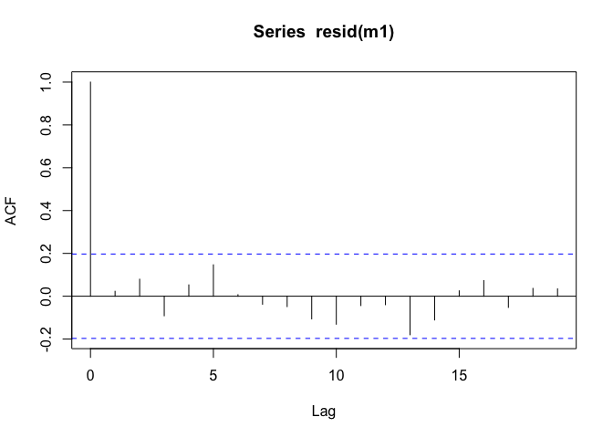<!-- -->

``` r
m2 <- lm(y2 ~ x)
lmtest::dwtest(m2)
```

    ## 
    ##  Durbin-Watson test
    ## 
    ## data:  m2
    ## DW = 1.5381, p-value = 0.009704
    ## alternative hypothesis: true autocorrelation is greater than 0

``` r
acf(resid(m2))
```

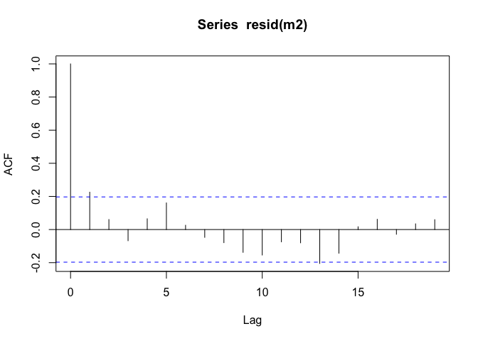<!-- -->

``` r
lmtest::dwtest(m2, alternative = "two.sided")
```

    ## 
    ##  Durbin-Watson test
    ## 
    ## data:  m2
    ## DW = 1.5381, p-value = 0.01941
    ## alternative hypothesis: true autocorrelation is not 0

## 11.19 새로운 가치 예측

``` r
load("./data/pred2.rdata")
m <- lm(y ~ u + v + w)
preds <- data.frame(u = 3.1, v = 4.0, w = 5.5)
predict(m, newdata = preds)
```

    ##        1 
    ## 45.04128

``` r
preds <- data.frame(
  u = c(3.0, 3.1, 3.2, 3.3),
  v = c(3.9, 4.0, 4.1, 4.2),
  w = c(5.3, 5.5, 5.7, 5.9)
)
predict(m, newdata = preds)
```

    ##        1        2        3        4 
    ## 43.81461 45.04128 46.26795 47.49463

## 11.20 예측 구간 형성

``` r
predict(m, newdata = preds, interval = "prediction")
```

    ##        fit      lwr      upr
    ## 1 43.81461 38.18799 49.44123
    ## 2 45.04128 39.40696 50.67560
    ## 3 46.26795 40.62002 51.91589
    ## 4 47.49463 41.82719 53.16206

## 11.21 일원 분산 분석 수행

``` r
month.abb
```

    ##  [1] "Jan" "Feb" "Mar" "Apr" "May" "Jun" "Jul" "Aug" "Sep" "Oct" "Nov"
    ## [12] "Dec"

``` r
load("./data/anova.rdata")
GSPC_df %>%
  mutate(month = factor(mon, levels = month.abb)) %>%
  group_by(month) %>%
  summarize(r_mean = mean(r)) %>%
  ggplot(aes(month, r_mean)) +
  geom_point()
```

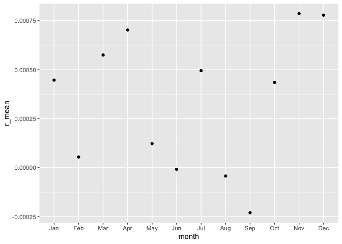<!-- -->

``` r
oneway.test(r ~ mon, data = GSPC_df)
```

    ## 
    ##  One-way analysis of means (not assuming equal variances)
    ## 
    ## data:  r and mon
    ## F = 1.974, num df = 11.0, denom df = 6723.3, p-value = 0.02686

``` r
oneway.test(r ~ mon, data = GSPC_df, subset = tail(seq_along(r), 2500))
```

    ## 
    ##  One-way analysis of means (not assuming equal variances)
    ## 
    ## data:  r and mon
    ## F = 0.67758, num df = 11.00, denom df = 976.29, p-value =
    ## 0.7608

``` r
oneway.test(r ~ mon, data = GSPC_df, subset = tail(seq_along(r), 2500), var.equal = TRUE)
```

    ## 
    ##  One-way analysis of means
    ## 
    ## data:  r and mon
    ## F = 0.51162, num df = 11, denom df = 2488, p-value = 0.8968

``` r
m <- aov(r ~ mon, data = GSPC_df)
summary(m)
```

    ##                Df Sum Sq   Mean Sq F value Pr(>F)  
    ## mon            11 0.0019 1.723e-04   1.867 0.0386 *
    ## Residuals   17098 1.5774 9.226e-05                 
    ## ---
    ## Signif. codes:  0 '***' 0.001 '**' 0.01 '*' 0.05 '.' 0.1 ' ' 1

## 11.22 교호 작용도 만들기

``` r
library(faraway)
data(rats)
interaction.plot(rats$poison, rats$treat, rats$time)
```

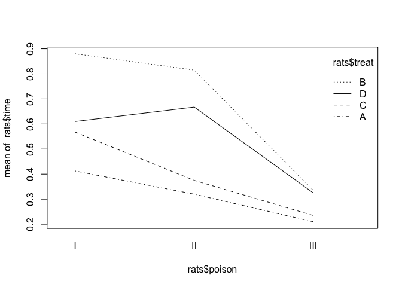<!-- -->

## 11.23 그룹 평균 간의 차이 찾기

``` r
load(file = "./data/anova.rdata")
oneway.test(r ~ wday, subset = 1:2500, data = GSPC_df)
```

    ## 
    ##  One-way analysis of means (not assuming equal variances)
    ## 
    ## data:  r and wday
    ## F = 12.566, num df = 4.0, denom df = 1242.7, p-value = 5.02e-10

``` r
m <- aov(r ~ wday, subset = 1:2500, data = GSPC_df)
TukeyHSD(m)
```

    ##   Tukey multiple comparisons of means
    ##     95% family-wise confidence level
    ## 
    ## Fit: aov(formula = r ~ wday, data = GSPC_df, subset = 1:2500)
    ## 
    ## $wday
    ##                  diff           lwr           upr     p adj
    ## Mon-Fri -0.0031531581 -4.395617e-03 -0.0019106990 0.0000000
    ## Thu-Fri -0.0009339369 -2.171391e-03  0.0003035172 0.2378876
    ## Tue-Fri -0.0018546506 -3.091489e-03 -0.0006178122 0.0004217
    ## Wed-Fri -0.0007830961 -2.014488e-03  0.0004482955 0.4119430
    ## Thu-Mon  0.0022192212  9.786177e-04  0.0034598248 0.0000110
    ## Tue-Mon  0.0012985076  5.851828e-05  0.0025384969 0.0347889
    ## Wed-Mon  0.0023700621  1.135506e-03  0.0036046185 0.0000017
    ## Tue-Thu -0.0009207137 -2.155688e-03  0.0003142606 0.2494423
    ## Wed-Thu  0.0001508408 -1.078678e-03  0.0013803600 0.9972929
    ## Wed-Tue  0.0010715545 -1.573450e-04  0.0023004539 0.1210129

``` r
plot(TukeyHSD(m))
```

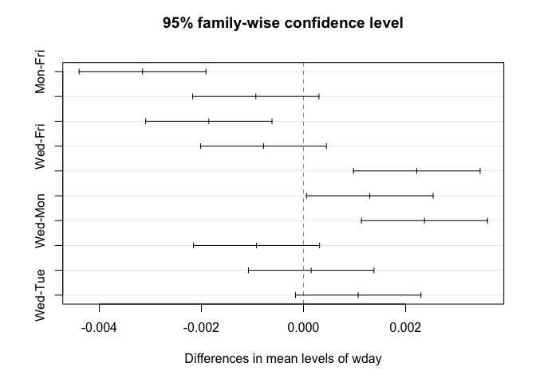<!-- -->

## 11.24 강력한 ANOVA 수행(Kruskal-Wallis 검정)

``` r
load(file = "./data/student_data.rdata")
student_data
```

    ## # A tibble: 94 × 4
    ##    att.fact hw.mean midterm hw   
    ##    <fct>      <dbl>   <dbl> <fct>
    ##  1 3          0.808   0.818 4    
    ##  2 3          0.830   0.682 4    
    ##  3 3          0.444   0.511 2    
    ##  4 3          0.663   0.670 3    
    ##  5 2          0.9     0.682 4    
    ##  6 3          0.948   0.954 4    
    ##  7 3          0.993   0.909 4    
    ##  8 3          0.531   0.966 3    
    ##  9 3          0.956   1     4    
    ## 10 2          0.647   0.727 4    
    ## # … with 84 more rows
    ## # ℹ Use `print(n = ...)` to see more rows

``` r
hist(student_data$midterm)
```

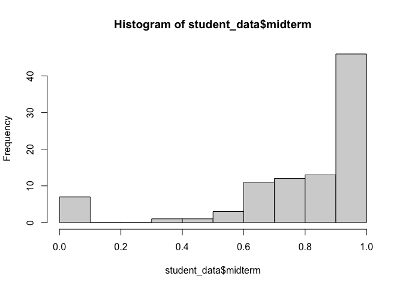<!-- -->

``` r
kruskal.test(midterm ~ hw, data = student_data)
```

    ## 
    ##  Kruskal-Wallis rank sum test
    ## 
    ## data:  midterm by hw
    ## Kruskal-Wallis chi-squared = 25.681, df = 4, p-value =
    ## 3.669e-05

## 11.25 ANOVA를 이용한 모델 비교

``` r
load(file = "./data/anova2.rdata")
m1 <- lm(y ~ u)
m2 <- lm(y ~ u + v)
m3 <- lm(y ~ u + v + w)
```

``` r
anova(m1, m2, m3)
```

    ## Analysis of Variance Table
    ## 
    ## Model 1: y ~ u
    ## Model 2: y ~ u + v
    ## Model 3: y ~ u + v + w
    ##   Res.Df    RSS Df Sum of Sq      F   Pr(>F)   
    ## 1     18 196.69                                
    ## 2     17 130.26  1    66.430 10.339 0.005399 **
    ## 3     16 102.80  1    27.461  4.274 0.055272 . 
    ## ---
    ## Signif. codes:  0 '***' 0.001 '**' 0.01 '*' 0.05 '.' 0.1 ' ' 1
