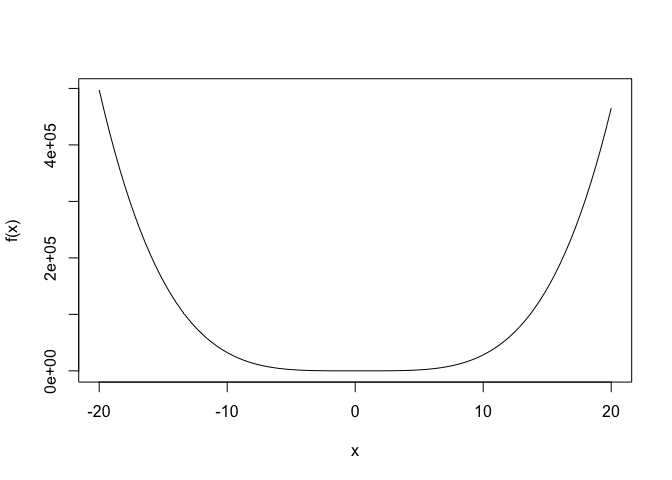
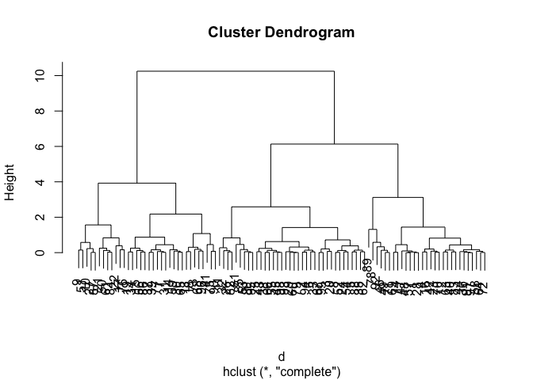
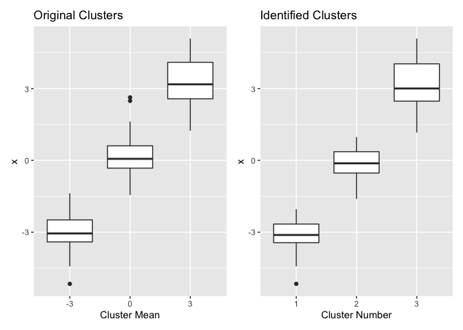
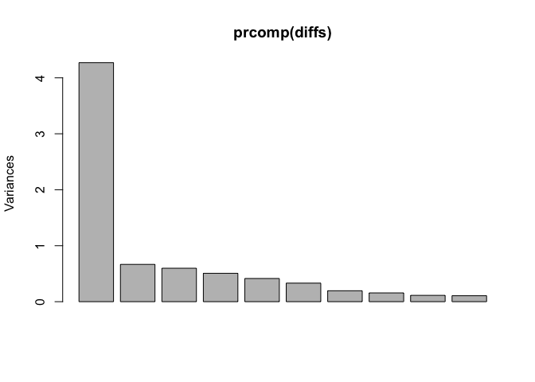

note13
================

# 13 기본 수치와 통계를 넘어

## 13.1 단일 매개변수 함수의 최소화 또는 최대화

``` r
f <- function(x) {
  3 * x^4 - 2 * x^3 + 3 * x^2 - 4 * x + 5
}
curve(f, -20, 20)
```

<!-- -->

``` r
optimize(f, lower = -20, upper = 20)
```

    ## $minimum
    ## [1] 0.5972778
    ## 
    ## $objective
    ## [1] 3.636756

## 13.2 다중 매개변수 기능의 최소화 또는 최대화

``` r
load(file = "./data/opt.rdata") # loads x, y, z
f <- function(v) {
  a <- v[1]
  b <- v[2]
  sum(abs(z - ((x + a)^b)))
}

optim(c(1, 1), f)
```

    ## $par
    ## [1] 10.0072591  0.6997801
    ## 
    ## $value
    ## [1] 1.26311
    ## 
    ## $counts
    ## function gradient 
    ##      485       NA 
    ## 
    ## $convergence
    ## [1] 0
    ## 
    ## $message
    ## NULL

## 13.3 고유값과 고유벡터 계산하기

``` r
fibmat <- matrix(c(0, 1, 1, 1), ncol = 2, nrow = 2)
fibmat
```

    ##      [,1] [,2]
    ## [1,]    0    1
    ## [2,]    1    1

``` r
eigen(fibmat)
```

    ## eigen() decomposition
    ## $values
    ## [1]  1.618034 -0.618034
    ## 
    ## $vectors
    ##           [,1]       [,2]
    ## [1,] 0.5257311 -0.8506508
    ## [2,] 0.8506508  0.5257311

## 13.4 주성분 분석 수행

``` r
r <- prcomp(~ x + y + z)
summary(r)
```

    ## Importance of components:
    ##                           PC1     PC2     PC3
    ## Standard deviation     1.8935 0.11821 0.04459
    ## Proportion of Variance 0.9956 0.00388 0.00055
    ## Cumulative Proportion  0.9956 0.99945 1.00000

``` r
load("data/pca.rdata")
r <- prcomp(~ x + y)
r
```

    ## Standard deviations (1, .., p=2):
    ## [1] 0.3925333 0.1631690
    ## 
    ## Rotation (n x k) = (2 x 2):
    ##          PC1        PC2
    ## x -0.5530396  0.8331550
    ## y -0.8331550 -0.5530396

``` r
summary(r)
```

    ## Importance of components:
    ##                           PC1    PC2
    ## Standard deviation     0.3925 0.1632
    ## Proportion of Variance 0.8527 0.1473
    ## Cumulative Proportion  0.8527 1.0000

``` r
plot(r)
```

<!-- -->

``` r
predict(r)
```

    ##            PC1          PC2
    ## 1  -0.28069755 -0.119844158
    ## 2  -0.27871209 -0.081630833
    ## 3  -0.16991687  0.141845375
    ## 4  -0.09574678 -0.306191251
    ## 5   0.24484511  0.094454645
    ## 6   0.78126223  0.016052718
    ## 7   0.36764766 -0.134179512
    ## 8   0.26356596  0.135847813
    ## 9  -0.97645751 -0.139531325
    ## 10 -0.12259968  0.249176906
    ## 11 -0.54410900  0.023097509
    ## 12 -0.23683147  0.253581930
    ## 13 -0.32988941  0.201135666
    ## 14  0.15306431 -0.009912086
    ## 15  0.14741542  0.064561229
    ## 16  0.50447071 -0.101370288
    ## 17 -0.04602546 -0.046692001
    ## 18  0.06983821 -0.016675663
    ## 19 -0.04501676 -0.214839553
    ## 20  0.11359001  0.212362444
    ## 21 -0.56483244  0.070496960
    ## 22  0.57267556 -0.162564152
    ## 23  0.44138609  0.031198956
    ## 24 -0.02958925 -0.205341561
    ## 25 -0.49922389  0.062345659
    ## 26  0.57134690  0.167246926
    ## 27 -0.30820086 -0.179710693
    ## 28  0.07389584 -0.289361347
    ## 29 -0.11688580  0.271802749
    ## 30  0.33973076  0.012636936

## 13.5 단순 직교 회귀 수행하기

``` r
load("data/pca.rdata")
r <- prcomp(~ x + y)
slope <- r$rotation[2, 1] / r$rotation[1, 1]
intercept <- r$center[2] - slope * r$center[1]
```

``` r
par(pty = "s")
plot(x, y)
abline(intercept, slope, col = "red")
```

<!-- -->

## 13.6 데이터에서 클러스터 찾기

``` r
means <- sample(c(-3, 0, 3), 99, replace = TRUE)
x <- rnorm(99, mean = means)
tapply(x, factor(means), mean)
```

    ##         -3          0          3 
    ## -3.0491956  0.1231763  3.2647070

``` r
d <- dist(x)
hc <- hclust(d)
```

``` r
plot(hc)
```

<!-- -->

``` r
clust <- cutree(hc, k = 3)
clust
```

    ##  [1] 1 2 2 1 2 2 3 2 3 3 2 1 3 3 3 1 3 3 3 2 3 3 1 2 2 2 3 1 2 3 3 2 2 3
    ## [35] 2 1 3 2 3 1 3 1 2 1 2 1 1 1 1 3 3 2 2 2 2 3 1 1 3 2 3 2 1 1 3 2 2 3
    ## [69] 1 1 1 1 3 1 3 3 3 1 2 2 2 2 1 3 2 3 3 2 1 3 1 1 2 2 2 3 1 2 2

``` r
tapply(x, clust, mean)
```

    ##          1          2          3 
    ## -3.1564468 -0.1724265  3.1129752

``` r
library(ggplot2)
library(patchwork)

df_cluster <- data.frame(x, means = factor(means), clust = factor(clust))

g1 <-
  df_cluster |>
  ggplot(aes(means, x)) +
  geom_boxplot() +
  labs(title = "Original Clusters", x = "Cluster Mean")

g2 <-
  df_cluster |>
  ggplot(aes(clust, x)) +
  geom_boxplot() +
  labs(title = "Identified Clusters", x = "Cluster Number")

g1 + g2
```

<!-- -->

## 13.7 이진 값 변수 예측(로지스틱 회귀)

``` r
data(pima, package = "faraway")
pima
```

    ##     pregnant glucose diastolic triceps insulin  bmi diabetes age test
    ## 1          6     148        72      35       0 33.6    0.627  50    1
    ## 2          1      85        66      29       0 26.6    0.351  31    0
    ## 3          8     183        64       0       0 23.3    0.672  32    1
    ## 4          1      89        66      23      94 28.1    0.167  21    0
    ## 5          0     137        40      35     168 43.1    2.288  33    1
    ## 6          5     116        74       0       0 25.6    0.201  30    0
    ## 7          3      78        50      32      88 31.0    0.248  26    1
    ## 8         10     115         0       0       0 35.3    0.134  29    0
    ## 9          2     197        70      45     543 30.5    0.158  53    1
    ## 10         8     125        96       0       0  0.0    0.232  54    1
    ## 11         4     110        92       0       0 37.6    0.191  30    0
    ## 12        10     168        74       0       0 38.0    0.537  34    1
    ## 13        10     139        80       0       0 27.1    1.441  57    0
    ## 14         1     189        60      23     846 30.1    0.398  59    1
    ## 15         5     166        72      19     175 25.8    0.587  51    1
    ## 16         7     100         0       0       0 30.0    0.484  32    1
    ## 17         0     118        84      47     230 45.8    0.551  31    1
    ## 18         7     107        74       0       0 29.6    0.254  31    1
    ## 19         1     103        30      38      83 43.3    0.183  33    0
    ## 20         1     115        70      30      96 34.6    0.529  32    1
    ## 21         3     126        88      41     235 39.3    0.704  27    0
    ## 22         8      99        84       0       0 35.4    0.388  50    0
    ## 23         7     196        90       0       0 39.8    0.451  41    1
    ## 24         9     119        80      35       0 29.0    0.263  29    1
    ## 25        11     143        94      33     146 36.6    0.254  51    1
    ## 26        10     125        70      26     115 31.1    0.205  41    1
    ## 27         7     147        76       0       0 39.4    0.257  43    1
    ## 28         1      97        66      15     140 23.2    0.487  22    0
    ## 29        13     145        82      19     110 22.2    0.245  57    0
    ## 30         5     117        92       0       0 34.1    0.337  38    0
    ## 31         5     109        75      26       0 36.0    0.546  60    0
    ## 32         3     158        76      36     245 31.6    0.851  28    1
    ## 33         3      88        58      11      54 24.8    0.267  22    0
    ## 34         6      92        92       0       0 19.9    0.188  28    0
    ## 35        10     122        78      31       0 27.6    0.512  45    0
    ## 36         4     103        60      33     192 24.0    0.966  33    0
    ## 37        11     138        76       0       0 33.2    0.420  35    0
    ## 38         9     102        76      37       0 32.9    0.665  46    1
    ## 39         2      90        68      42       0 38.2    0.503  27    1
    ## 40         4     111        72      47     207 37.1    1.390  56    1
    ## 41         3     180        64      25      70 34.0    0.271  26    0
    ## 42         7     133        84       0       0 40.2    0.696  37    0
    ## 43         7     106        92      18       0 22.7    0.235  48    0
    ## 44         9     171       110      24     240 45.4    0.721  54    1
    ## 45         7     159        64       0       0 27.4    0.294  40    0
    ## 46         0     180        66      39       0 42.0    1.893  25    1
    ## 47         1     146        56       0       0 29.7    0.564  29    0
    ## 48         2      71        70      27       0 28.0    0.586  22    0
    ## 49         7     103        66      32       0 39.1    0.344  31    1
    ## 50         7     105         0       0       0  0.0    0.305  24    0
    ## 51         1     103        80      11      82 19.4    0.491  22    0
    ## 52         1     101        50      15      36 24.2    0.526  26    0
    ## 53         5      88        66      21      23 24.4    0.342  30    0
    ## 54         8     176        90      34     300 33.7    0.467  58    1
    ## 55         7     150        66      42     342 34.7    0.718  42    0
    ## 56         1      73        50      10       0 23.0    0.248  21    0
    ## 57         7     187        68      39     304 37.7    0.254  41    1
    ## 58         0     100        88      60     110 46.8    0.962  31    0
    ## 59         0     146        82       0       0 40.5    1.781  44    0
    ## 60         0     105        64      41     142 41.5    0.173  22    0
    ## 61         2      84         0       0       0  0.0    0.304  21    0
    ## 62         8     133        72       0       0 32.9    0.270  39    1
    ## 63         5      44        62       0       0 25.0    0.587  36    0
    ## 64         2     141        58      34     128 25.4    0.699  24    0
    ## 65         7     114        66       0       0 32.8    0.258  42    1
    ## 66         5      99        74      27       0 29.0    0.203  32    0
    ## 67         0     109        88      30       0 32.5    0.855  38    1
    ## 68         2     109        92       0       0 42.7    0.845  54    0
    ## 69         1      95        66      13      38 19.6    0.334  25    0
    ## 70         4     146        85      27     100 28.9    0.189  27    0
    ## 71         2     100        66      20      90 32.9    0.867  28    1
    ## 72         5     139        64      35     140 28.6    0.411  26    0
    ## 73        13     126        90       0       0 43.4    0.583  42    1
    ## 74         4     129        86      20     270 35.1    0.231  23    0
    ## 75         1      79        75      30       0 32.0    0.396  22    0
    ## 76         1       0        48      20       0 24.7    0.140  22    0
    ## 77         7      62        78       0       0 32.6    0.391  41    0
    ## 78         5      95        72      33       0 37.7    0.370  27    0
    ## 79         0     131         0       0       0 43.2    0.270  26    1
    ## 80         2     112        66      22       0 25.0    0.307  24    0
    ## 81         3     113        44      13       0 22.4    0.140  22    0
    ## 82         2      74         0       0       0  0.0    0.102  22    0
    ## 83         7      83        78      26      71 29.3    0.767  36    0
    ## 84         0     101        65      28       0 24.6    0.237  22    0
    ## 85         5     137       108       0       0 48.8    0.227  37    1
    ## 86         2     110        74      29     125 32.4    0.698  27    0
    ## 87        13     106        72      54       0 36.6    0.178  45    0
    ## 88         2     100        68      25      71 38.5    0.324  26    0
    ## 89        15     136        70      32     110 37.1    0.153  43    1
    ## 90         1     107        68      19       0 26.5    0.165  24    0
    ## 91         1      80        55       0       0 19.1    0.258  21    0
    ## 92         4     123        80      15     176 32.0    0.443  34    0
    ## 93         7      81        78      40      48 46.7    0.261  42    0
    ## 94         4     134        72       0       0 23.8    0.277  60    1
    ## 95         2     142        82      18      64 24.7    0.761  21    0
    ## 96         6     144        72      27     228 33.9    0.255  40    0
    ## 97         2      92        62      28       0 31.6    0.130  24    0
    ## 98         1      71        48      18      76 20.4    0.323  22    0
    ## 99         6      93        50      30      64 28.7    0.356  23    0
    ## 100        1     122        90      51     220 49.7    0.325  31    1
    ## 101        1     163        72       0       0 39.0    1.222  33    1
    ## 102        1     151        60       0       0 26.1    0.179  22    0
    ## 103        0     125        96       0       0 22.5    0.262  21    0
    ## 104        1      81        72      18      40 26.6    0.283  24    0
    ## 105        2      85        65       0       0 39.6    0.930  27    0
    ## 106        1     126        56      29     152 28.7    0.801  21    0
    ## 107        1      96       122       0       0 22.4    0.207  27    0
    ## 108        4     144        58      28     140 29.5    0.287  37    0
    ## 109        3      83        58      31      18 34.3    0.336  25    0
    ## 110        0      95        85      25      36 37.4    0.247  24    1
    ## 111        3     171        72      33     135 33.3    0.199  24    1
    ##  [ reached 'max' / getOption("max.print") -- omitted 657 rows ]

``` r
b <- factor(pima$test)
m <- glm(b ~ diastolic + bmi, family = binomial, data = pima)
summary(m)
```

    ## 
    ## Call:
    ## glm(formula = b ~ diastolic + bmi, family = binomial, data = pima)
    ## 
    ## Deviance Residuals: 
    ##     Min       1Q   Median       3Q      Max  
    ## -1.9128  -0.9180  -0.6848   1.2336   2.7417  
    ## 
    ## Coefficients:
    ##              Estimate Std. Error z value Pr(>|z|)    
    ## (Intercept) -3.629553   0.468176  -7.753 9.01e-15 ***
    ## diastolic   -0.001096   0.004432  -0.247    0.805    
    ## bmi          0.094130   0.012298   7.654 1.95e-14 ***
    ## ---
    ## Signif. codes:  0 '***' 0.001 '**' 0.01 '*' 0.05 '.' 0.1 ' ' 1
    ## 
    ## (Dispersion parameter for binomial family taken to be 1)
    ## 
    ##     Null deviance: 993.48  on 767  degrees of freedom
    ## Residual deviance: 920.65  on 765  degrees of freedom
    ## AIC: 926.65
    ## 
    ## Number of Fisher Scoring iterations: 4

``` r
m.red <- glm(b ~ bmi, family = binomial, data = pima)
summary(m.red)
```

    ## 
    ## Call:
    ## glm(formula = b ~ bmi, family = binomial, data = pima)
    ## 
    ## Deviance Residuals: 
    ##     Min       1Q   Median       3Q      Max  
    ## -1.9209  -0.9178  -0.6838   1.2351   2.7244  
    ## 
    ## Coefficients:
    ##             Estimate Std. Error z value Pr(>|z|)    
    ## (Intercept) -3.68641    0.40896  -9.014  < 2e-16 ***
    ## bmi          0.09353    0.01205   7.761 8.45e-15 ***
    ## ---
    ## Signif. codes:  0 '***' 0.001 '**' 0.01 '*' 0.05 '.' 0.1 ' ' 1
    ## 
    ## (Dispersion parameter for binomial family taken to be 1)
    ## 
    ##     Null deviance: 993.48  on 767  degrees of freedom
    ## Residual deviance: 920.71  on 766  degrees of freedom
    ## AIC: 924.71
    ## 
    ## Number of Fisher Scoring iterations: 4

``` r
newdata <- data.frame(bmi = seq(1, 100, length.out = 100))
plot(newdata$bmi, predict(m.red, newdata = newdata, type = "response"))
```

<!-- -->

``` r
newdata <- data.frame(bmi = quantile(pima$bmi, .90))
predict(m.red, type = "response", newdata = newdata)
```

    ##       90% 
    ## 0.5486215

## 13.8 통계 부트스트랩

``` r
stat <- function(data, indices) {
  r <- prcomp(~ x + y, data = data, subset = indices)
  slope <- r$rotation[2, 1] / r$rotation[1, 1]
  return(slope)
}
```

``` r
load(file = "./data/pca.rdata")
library(boot)
```

    ## 
    ## Attaching package: 'boot'

    ## The following objects are masked from 'package:faraway':
    ## 
    ##     logit, melanoma

``` r
set.seed(3) # for reproducability

boot.data <- data.frame(x = x, y = y)
reps <- boot(boot.data, stat, R = 999)
```

``` r
boot.ci(reps, type = c("perc", "bca"))
```

    ## BOOTSTRAP CONFIDENCE INTERVAL CALCULATIONS
    ## Based on 999 bootstrap replicates
    ## 
    ## CALL : 
    ## boot.ci(boot.out = reps, type = c("perc", "bca"))
    ## 
    ## Intervals : 
    ## Level     Percentile            BCa          
    ## 95%   ( 1.032,  2.070 )   ( 1.058,  2.098 )  
    ## Calculations and Intervals on Original Scale

## 13.9 요인 분석

``` r
load("data/diffs.rdata")
str(diffs)
```

    ##  num [1:251, 1:11] 0.27 1.94 -0.02 0.1 -0.35 ...
    ##  - attr(*, "dimnames")=List of 2
    ##   ..$ : NULL
    ##   ..$ : chr [1:11] "APC" "BP" "BRY" "CVX" ...

``` r
plot(prcomp(diffs))
```

<!-- -->

``` r
factanal(diffs, factors = 2)
```

    ## 
    ## Call:
    ## factanal(x = diffs, factors = 2)
    ## 
    ## Uniquenesses:
    ##   APC    BP   BRY   CVX   HES   MRO   NBL   OXY   ETP   VLO   XOM 
    ## 0.307 0.652 0.997 0.308 0.440 0.358 0.363 0.556 0.902 0.786 0.285 
    ## 
    ## Loadings:
    ##     Factor1 Factor2
    ## APC 0.773   0.309  
    ## BP  0.317   0.497  
    ## BRY                
    ## CVX 0.439   0.707  
    ## HES 0.640   0.389  
    ## MRO 0.707   0.377  
    ## NBL 0.749   0.276  
    ## OXY 0.562   0.358  
    ## ETP 0.283   0.134  
    ## VLO 0.303   0.350  
    ## XOM 0.355   0.767  
    ## 
    ##                Factor1 Factor2
    ## SS loadings      2.975   2.072
    ## Proportion Var   0.270   0.188
    ## Cumulative Var   0.270   0.459
    ## 
    ## Test of the hypothesis that 2 factors are sufficient.
    ## The chi square statistic is 62.92 on 34 degrees of freedom.
    ## The p-value is 0.00184

``` r
factanal(diffs, factors = 3)
```

    ## 
    ## Call:
    ## factanal(x = diffs, factors = 3)
    ## 
    ## Uniquenesses:
    ##   APC    BP   BRY   CVX   HES   MRO   NBL   OXY   ETP   VLO   XOM 
    ## 0.316 0.650 0.984 0.315 0.374 0.355 0.346 0.521 0.723 0.605 0.271 
    ## 
    ## Loadings:
    ##     Factor1 Factor2 Factor3
    ## APC  0.747   0.270   0.230 
    ## BP   0.298   0.459   0.224 
    ## BRY                  0.123 
    ## CVX  0.442   0.672   0.197 
    ## HES  0.589   0.299   0.434 
    ## MRO  0.703   0.350   0.167 
    ## NBL  0.760   0.249   0.124 
    ## OXY  0.592   0.357         
    ## ETP  0.194           0.489 
    ## VLO  0.198   0.264   0.535 
    ## XOM  0.355   0.753   0.190 
    ## 
    ##                Factor1 Factor2 Factor3
    ## SS loadings      2.814   1.774   0.951
    ## Proportion Var   0.256   0.161   0.086
    ## Cumulative Var   0.256   0.417   0.504
    ## 
    ## Test of the hypothesis that 3 factors are sufficient.
    ## The chi square statistic is 30.16 on 25 degrees of freedom.
    ## The p-value is 0.218
